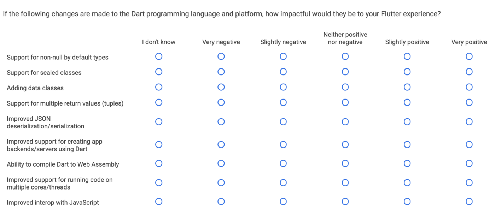

※このブログは、Mediumに投稿した[記事](https://medium.com/@itometeam/android%E3%83%8D%E3%82%A4%E3%83%86%E3%82%A3%E3%83%96%E3%82%A2%E3%83%97%E3%83%AA%E9%96%8B%E7%99%BA%E8%80%85%E3%81%8B%E3%82%89%E8%A6%8B%E3%81%9Fflutter-e85248b29ed1)を移行したものです。

先日行われたGoogle I/O 2019でFlutter for Webが発表されたこともあって、自分の周りにもFlutterに興味を持つ人が増えてきていると感じます。

> iOSネイティブアプリ開発者から見たFlutter
>
> https://medium.com/flutter-jp/flutter-ios-5b2178018d3e

monoさんの上の記事を読んでから半年ほどFlutterを触ってみて、ある程度知見がたまってきたので、普段Androidエンジニアとして働いている自分の目から見たFlutterについての感想を書きます。Flutterってなに？ということに関しては、上の記事とほとんど内容がかぶってしまうので省略します。

## Androidネイティブ開発との比較
Flutterの生産性はAndroidネイティブ開発と比べてもかなり高いと思います。Flutterは最近の開発トレンドを取り入れているため、再利用性が高く宣言的なViewの作成や、シンプルなライフサイクルなどを使うことができます。Androidエンジニアの自分ですら画面の作成であればFlutterのほうが早く終わるくらいです。
例えばAndroidでは角丸を表現するためにいちいち角丸の背景用のリソースを用意しなくてはいけませんが、FlutterではWidgetを一つ追加するだけで画像を含めて角丸にすることができます。便利なWidgetが多い分、数が多いので初めはどのWidgetを選択するかに迷いますが、慣れてくるにつれて急激に実装スピードが上がる印象です。

Flutterの採用を見送る理由の一つに、ネイティブの機能を完全に使うことができないことがあると思います。これはある意味事実で、確かにネイティブの機能に近づくほどFlutterだけではできないことが増えてきます。
しかし、ネイティブに近い機能であっても、カメラやセンサーなどのよく使う機能はFlutter経由で直接使うためのpluginが用意されているため、困ることは少ないです。下のリポジトリに公式サポートされているpluginが揃っているので、自分がほしい機能があるか一度確認してみてください。

>flutter/plugins
>
>https://github.com/flutter/plugins

逆にネイティブに近い機能で、Android/iOSのどちらかにしかなかったり、使っている人が少ない機能は公式サポートの優先度が低いようです。代表的なところだと

- Picture in Picture（Youtubeなどのように他のアプリ上に表示する機能）
- 音楽のバックグラウンド再生

などは公式にはサポートされていません。もしこういった機能を使う場合は自分でブリッジとなるコードを書くか、サードパーティのライブラリを使うことになります。

## React Nativeとの比較
以前に仕事でReact Nativeも使っていたのですが、ReactNativeとFlutterは同じマルチプラットフォームと言っても全く違う仕組みを使っています。最も大きな違いは画面のレンダリング方法です。
React NativeはJavascriptでコードを書きますが、描画しているのはネイティブの本来のViewです。 `View` タグをJavascript側でコードに追加すると、アプリにはAndroidであれば `android.view.View` 、iOSであれば `UIView` が描画されます。
それに対してFlutterは基本的にネイティブの描画を使っていません。ネイティブアプリ側からFlutterアプリは一枚のViewに見えていて、FlutterのエンジンがGPUを使って直接描画しています。
最初はネイティブのViewを使わないFlutterはパフォーマンスの面でReact Nativeに劣るのではないかと思っていましたが、実際にアプリを動かしてみると、Flutterはネイティブアプリと同等以上のパフォーマンスが出ていると思います。Unityなどのゲームエンジンも同様に自前でレンダリングしていることを考えると、Flutterのパフォーマンスの高さにも納得がいきます。下にFlutterパフォーマンスの高さがわかりやすいサンプルアプリを載せておきます。

>HistoryOfEverything
>
>https://github.com/2d-inc/HistoryOfEverything

FlutterとReact Nativeはどちらもレイアウトを木構造に組んでいくため、書き味はとても似ていますが、両者のもう一つ大きな違いは差分レンダリングの有無です。
React Native（実際にはReact）はReconciliationという差分計算の仕組みを持っているため、大きなレイアウトツリーに対してデータの更新を行っても必要な分しか再レンダリングされません。しかし、FlutterはReactのような差分更新の仕組みをもっていないので、基本的にデータの更新はそれ以降の全てのViewを再レンダリングしてしまいます。

このような違いから、Flutterでは `StreamBuilder` を使ってデータの更新の影響をレイアウトツリーの末端に追いやったり、再描画が不要な静的なViewに `const` をつけて更新を抑制したりなどの工夫が必要です。下の2記事を読むと効率的な方法がわかりやすく書いてあります。

>Flutter の Widget ツリーの裏側で起こっていること
>
>https://medium.com/flutter-jp/dive-into-flutter-4add38741d07

>Stateful Widget のパフォーマンスを考慮した正しい扱い方
>
>https://medium.com/flutter-jp/state-performance-7a5f67d62edd

また文化的な違いもあり、Flutterはかなりの数のWidgetが公式に用意されています。Materialデザイン用のライブラリはもちろん、iOSライクなCupertinoウィジェットまで揃っています。

>Widget catalog
>
>https://flutter.dev/docs/development/ui/widgets

それに対してReact Nativeは公式のライブラリこそ最低限ですが、サードパーティ製のライブラリが多く、便利なライブラリはガンガン使っていくスタイルです。このあたりはReactを使ったWebアプリの開発に似ていると思います。

## 開発環境について
自分は普段のFlutter開発にはEmacsを使っていますが、VSCodeとAndroidStudioが公式にサポートされているので、特にこだわりがなければどちらかを選べばいいと思います。一応両方使ってみた感想ですが、補完やコードジャンプなど、基本的なエディタの機能は使えるので困ることはないです。
Androidネイティブのレイアウト開発ではAndroid Studioのプレビュー機能を見ながら画面を作っていくことが多いですが、Flutterの場合そういった機能はなく、大まかなレイアウトを確認する機能しかありません。その代わり、FlutterにはHotReload・HotRestartという機能があります。これがものすごく便利で、ある程度の規模のアプリでもコードの変更を1秒とかからず実際のアプリに反映させることができます。
そのため、毎回確認のためにビルドが必要なネイティブ開発に比べて効率的に開発を進めることができます。
CIもBitriseが公式サポートしているため、簡単に組むことができるようになりました。ただし開発環境とプロダクション環境を分けてビルドしようとすると、どうしてもネイティブコードの理解が必要になるので、初心者の人には少しハードルが高いかもしれません。

>Flutter CI v.1.0がBitriseに登場！
>
>https://blog.bitrise.io/flutter-ci-v1-jp

## Dart言語について
知り合いのエンジニアにFlutterを勧めるときに一番よく聞かれるのが、Dart言語の実用性に関してのことです。実際に書いてみた印象は「JavaっぽいJavascript」という感じでした。Kotlinと比べると、確かにかゆいところに手が届かないことが多いです。例えば

- enumが本当にただの列挙型で、振る舞いをもたせられない
- data classがない
- null safetyでない
- etc…

コードの自動生成で足りない機能を補おうとするライブラリはありますが、やはりKotlinやSwift、Typescriptなどに比べて機能不足は否めません。
しかし、Flutterの開発チームは定期的にユーザーアンケートを取っていて、その中でDartの改善要求も集めているようなので、要望が多かった機能から実装されていくと思います。

反対にDart言語のいいと思ったところは

- ?. でnullableな値のunwrapができる
- Stream、Futureが言語レベルでサポートされている（async、await、yieldができる）
- cascade演算子が便利（Kotlinの .apply 相当のことができる）

足りないところを感じつつも、自分はかなり快適に書けるようになりました。Streamなどの新しい言語機能を持っていて、最近は開発も活発に行われているようなので、これからのDartに期待したいです。

## 総評
全体的にはとても満足しています。もちろんネイティブのこの機能がほしいけどない。。みたいなこともたまにありますが、個人で作るアプリは基本的にFlutterで始めるようになりました。
最近のAndroid開発は、DI、マルチモジュール化、公式ライブラリの増加などによって複雑さを増していて、初心者の参入障壁がかなり高くなっているように思います。特に人材に限りがあるスタートアップなどでFlutterを選択することはかなり有力な選択肢になりうると思います。
