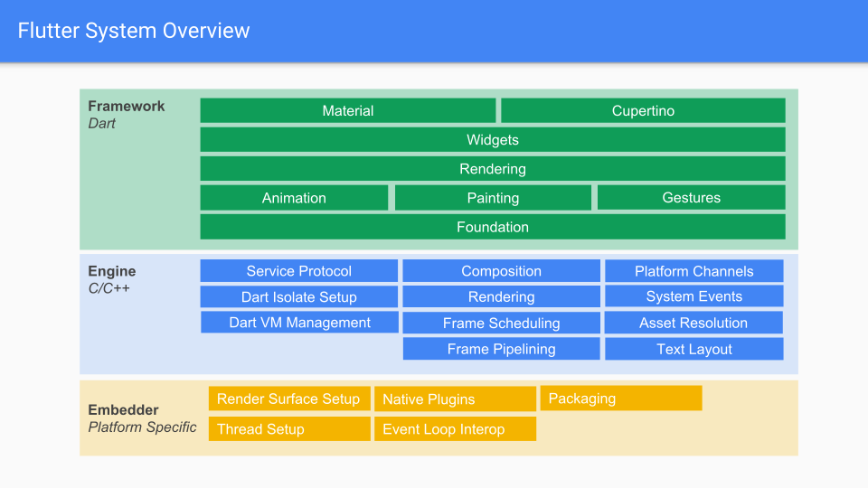

この記事は[Flutter 全部俺 Advent Calendar](https://adventar.org/calendars/4140) 1日目の記事です。

## このアドベントカレンダーについて
このアドベントカレンダーは [@itome](https://twitter.com/itometeam) が全て書いています。

基本的にFlutterの公式ドキュメントとソースコードを参照しながら書いていきます。誤植や編集依頼はTwitterにお願いします。

### 記事一覧
- **12月01日** Flutterとはなにか
- **12月02日** Flutterのツールを使いこなして開発効率を上げる
- **12月03日** すぐにFlutterを始めたい人のためのDart入門(前編)
- **12月04日** すぐにFlutterを始めたい人のためのDart入門(後編)
- **12月05日** FlutterのWidgetが画面に描画されるまでを理解する
- **12月06日** FlutterのBuildContextとInheritedWidgetを理解する
- **12月07日** FlutterのProviderパッケージを使いこなす
- **12月08日** Flutterのパフォーマンスを改善する
- **12月09日** FlutterのBoxConstraintsを理解する
- **12月10日** FlutterのNavigationとRoutingを理解する
- **12月11日** Flutterを既存のAndroid/iOSアプリに組み込む
- **12月12日** FlutterのThemeを理解する
- **12月13日** FlutterのPlatformViewを理解する
- **12月14日** FlutterでAndroid/iOSのネイティブのAPIを使う
- **12月15日** Flutterのアニメーションを理解する(前編)
- **12月16日** Flutterのアニメーションを理解する(後編)
- **12月17日** FlutterのAnimatedWidgetを使いこなす
- **12月18日** Flutterのアクセシビリティを理解する
- **12月19日** FlutterのInternationalization対応
- **12月20日** Flutterのテスト
- **12月21日** Flutterのアプリ設計(Bloc)
- **12月22日** Flutterのアプリ設計(Redux)
- **12月23日** Flutterのアプリ設計(Mobx)
- **12月24日** Flutterの自作パッケージを作る
- **12月25日** Flutter for Webを理解する

## Flutterとは何か
Flutterは一つのソースコードから複数のプラットフォームのアプリを作ることができるクロスプラットフォームのフレームワークです。
Android/iOSアプリについては既にProduction Readyで、Web対応も進んでいます。Desktopで動くFlutterも開発中らしいので今後Flutterだけでできることがより増えてきそうです。
開発言語はAltJSのDartという言語です。Dartに関しては3日目、4日目の記事で詳しく解説します。

また、Googleが開発している新しいOSであるFuchsiaはアプリ開発にFlutterを採用しており、すでにFuchsiaが動いているGoogle Nest HubではFlutterでアプリが作られています。

このアドベントカレンダーではFlutterの中でも特にAndroid/iOSアプリについて書いていきます。

## Flutterの特徴

### ハイパフォーマンスな描画
FlutterはネイティブのViewを使わずに独自のレンダリングエンジンでGPUを使って画面を描画しています。そのためネイティブ並みかそれ以上のパフォーマンスを出すことができます。

### HotReloadによる高速な開発
Flutterは画面の状態を保存したまま、コードの変更を適用できるHotReloadという機能を持っているため、コード修正→実機で動作確認というイテレーションを高速に回すことができます。

### マテリアルデザインのコンポーネントが豊富
FlutterはGoogleが開発していることもあって、マテリアルデザインを基本としてWidgetが作られています。一方でiOSらしいデザインのサポートはまだ十分とは言えないので、多くの場合iOSアプリもマテリアルデザインで作られることが多いです。

### Googleが開発を主導しており、サポートが安定している
FlutterはGoogleが主導してOSSとして開発が進められており、新機能開発やバグ修正も盛んに行われています。執筆時のStableである1.9.1には、前のリリースから2ヶ月にもかかわらず1500以上のPull Requestがマージされています。

## Flutterの仕組み
FlutterのGitHubリポジトリはフレームワークのAPIを提供している[flutter/flutter](https://github.com/flutter/flutter)
と低レイヤーの描画やネイティブAPIとのバインディングを実装している[flutter/engine](https://github.com/flutter/engine)に分かれていますが、
アプリを開発しているときに意識するのは基本的にフレームワーク部分だけです。

Dartで書かれたアプリケーションコードは、フレームワークによる最適化を行われたのち、engineのコードを呼び出します。
engineは[Skia](https://skia.org/)という2Dレンダリングのライブラリを使ってディスプレイに画面を描画しています。

このとき、実際に描画される画面はAndroidでは[SurfaceView](https://developer.android.com/reference/android/view/SurfaceView)、iOSでは[UIView](https://developer.apple.com/documentation/uikit/uiview)です。
つまりAndroidやiOSから見ると、画面と同じサイズのViewが一枚だけ置かれていて、Flutterアプリは全てその上だけで動いていることになります。

## Dartはどこで動いているのか
Dartは現在ではAltJS言語として使われることが多いですが、Javascriptへのトランスパイラ以外にオリジナルのDartVMも持っており、Flutterではこちらが使われています。

DartVMはAndroid/iOSから与えられたスレッドプールの上で動いており、 `dart:ui` パッケージを通してengineに、 `Platform Channel` を通して各プラットフォームの機能にアクセスできます。
Dartのマルチスレッド機能である `isolate` はDartに割り当てられたスレッドプールを使って実現されています。
engineは自身のスレッドを管理しないので、スレッドの管理は各プラットフォームに任せられています。
これはスレッド管理をそれぞれのプラットフォームに最適な設定にできることを意図されていて、実際にAndroid/iOSとFuchsiaとWebとでは、Flutterのタスクランナーの割り当てられ方が異なります。

## AOTコンパイルとJITコンパイル
Dart言語はAOT(Ahead Of Time)コンパイルに対応しています。これは事前にスクリプトをコンパイルしておいて機械語にしておくことで実行時にかかるスクリプトのパースなどのコストを減らす最適化方法です。
FlutterでもAOTコンパイルがされていますが、AOTコンパイルするとFlutterのHotReloadができなくなるため、リリースビルドでのみAOTコンパイルが行われ、デバッグビルドではJIT(Just In Time)コンパイルされるようになっています。

コンパイル方式の違いによって挙動が変わることはないので普段意識することはありませんが、パフォーマンスに差が出るためデバッグビルド時にはカクついていたアニメーションがリリースビルドでは滑らかに動くようなことはよくあります。
リリース前には必ずリリースビルドしたアプリを触ってみることをおすすめします。

## 参考
- https://github.com/flutter/flutter/wiki/The-Engine-architecture

## 2日目の記事
> https://itome.team/blog/2019/12/flutter-advent-calendar-day2
