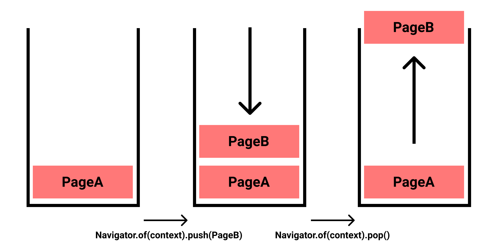
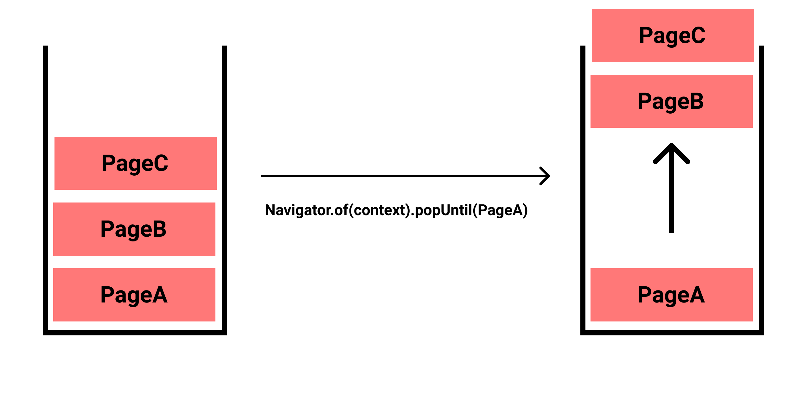
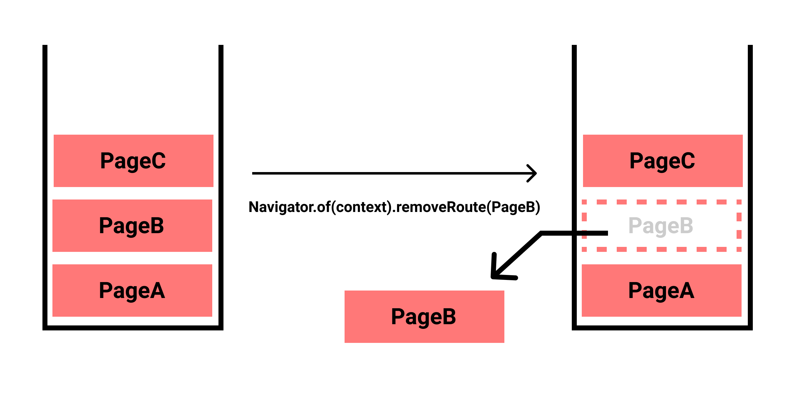
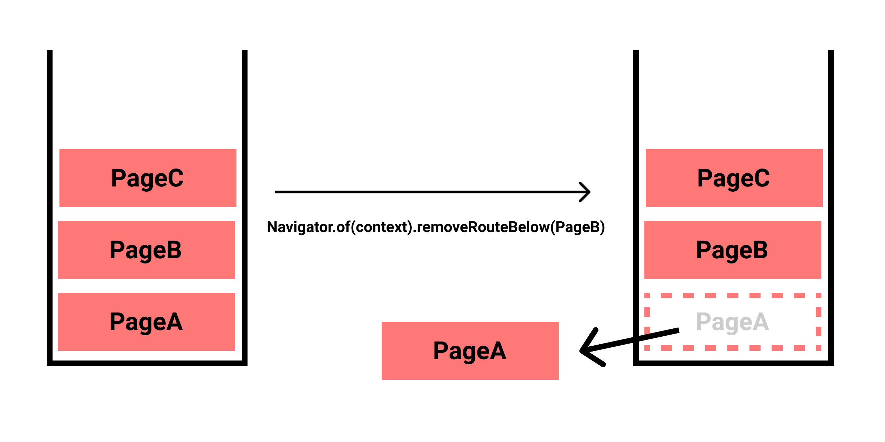
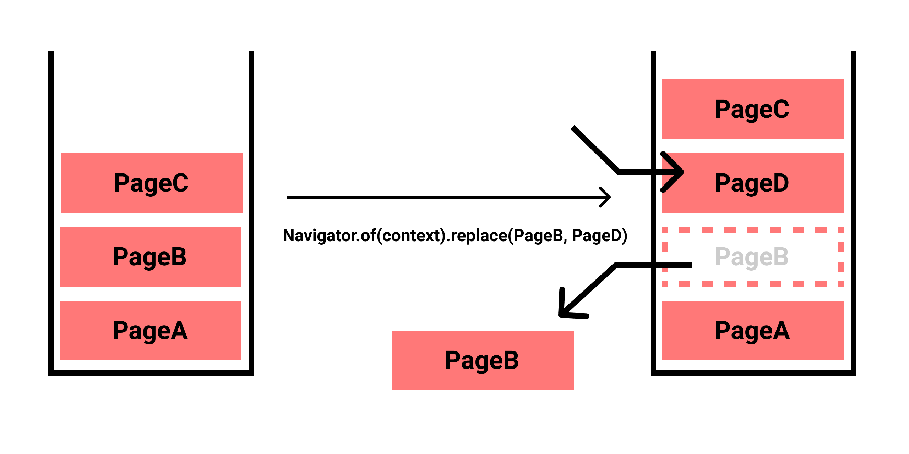
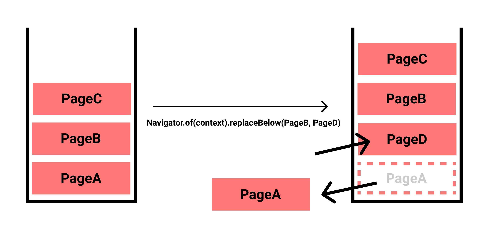
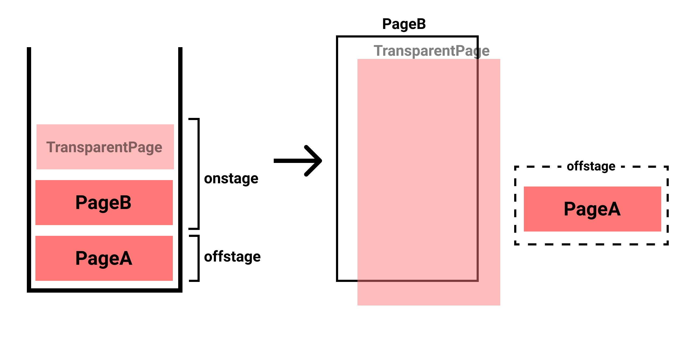

この記事は[Flutter 全部俺 Advent Calendar](https://adventar.org/calendars/4140) 10日目の記事です。


## このアドベントカレンダーについて
このアドベントカレンダーは [@itome](https://twitter.com/itometeam) が全て書いています。

基本的にFlutterの公式ドキュメントとソースコードを参照しながら書いていきます。誤植や編集依頼はTwitterにお願いします。

## Flutterの画面遷移
FlutterではすべてがWidgetなので画面もまたWidgetで、画面内の他のWidgetと明確な区別はありません。

`Route` というWidgetが一画面を表していて、 `Navigator` によって表示する `Route` を切り替えることによって画面遷移が実現されています。

## 使い方
内部の実装を詳しく紹介する前に基本的な使い方をみていきましょう。

ほとんどの場合 `MaterialApp` が持っている `Navigator` を使って画面遷移します。
`Navigator` を自分でインスタンス化して管理することはまれです。

`Navigator` の画面遷移の基本のイメージは `Stack` です。(後述しますが内部の実装で実際に `Stack` Widgetを使っています。)
`Stack` の一番上にある `Route` が現在の画面です。



<br/>

以下のように、 `Widget` を `MaterialPageRoute` に渡して `Route` を作って、
`Navigator` の `push` メソッドで画面として表示することができます。 `Navigator.of(context)` の部分は
`MaterialApp` Widgetより下の `BuildContext` でしか使えないので注意が必要です。
([6日目の記事](https://itome.team/blog/2019/12/flutter-advent-calendar-day6)参照)

```dart
Navigator.of(context).push(
  MaterialPageRoute<void>(
    builder: (BuildContext context) {
      return Scaffold(
        appBar: AppBar(title: Text('Hello')),
        body: ...,
      );
    },
  ),
);
```

`MaterialApp` に予め `Route` を登録しておくことによってさらにシンプルに書くことができます。

```dart
runApp(
  MaterialApp(
    initialRoute: '/',
    routes: <String, WidgetBuilder> {
      '/': (BuildContext context) => MyPage(title: 'initial page'),
      '/a': (BuildContext context) => MyPage(title: 'page A'),
      '/b': (BuildContext context) => MyPage(title: 'page B'),
    },
  ),
);
```

```dart
Navigator.of(context).pushNamed('/a');
```

`pushNamed` メソッドの第二引数には画面に渡したいパラメーターを渡すことができます。

```dart
Navigator.of(context).pushNamed('/a', arguments: 'Hello');
```

遷移先の画面でパラメーターを下のように取り出すことができます。

```dart
final args = ModalRoute.of(context).settings.arguments;

print(args); // 'Hello'
```

複数の値や複雑な構造のデータを渡したい時は、クラスを自作して使います。

```dart
class MyPageArguments {
  MyPageArguments({this.name, this.greeting});

  final String name;
  final String greeting;
}

final args = ModalRoute.of(context).settings.arguments;

print(args); // MyPageArguments { name: .., greeting: .. }
```


遷移先の画面から戻りたい時は、 `pop` メソッドを使います。

```dart
Navigator.of(context).pop();
```

遷移先から遷移元へ返却したい値を `pop` メソッドに渡すこともできます。

```dart
Navigator.of(context).pop('Hi!');
```

遷移元は、 `Navigator.push` メソッドが返す `Future` から
遷移先が返した値を取り出すことができます。
`Future` で値を返すのは他のフレームワークと比べても珍しいですが、ギャラリーを開いて画像を取得したり
外部サービスでログインしてからアプリに戻ってきたりなどのときにも使うFlutterの頻出パターンです。

```dart
final result = await Navigator.of(context).pushNamed('/a', arguments: 'Hello');

print(result); // 'Hi';
```

基本的なこれらのメソッドの他にいくつかの便利メソッドがあります。

### `canPop`

前の画面に戻れるかどうかを返します。例えば最初の画面だと `false` を返します。

```dart
Navigator.of(context).canPop(); // true or false
```

### `popUntil`

指定した `Route` まで戻ります。複数の画面を一気に戻りたいときに便利です。

```dart
Navigator.of(context).popUntil(PageA);
```



### `removeRoute`

指定した `Route` を削除します。

```dart
Navigator.of(context).removeRoute(PageB);
```



### `removeRouteBelow`

指定した `Route` の一つ前の `Route` を削除します。

```dart
Navigator.of(context).removeRouteBelow(PageB);
```



### `replace`

指定した `Route` を 新しい `Route` と取り替えます。
現在の `Route` を入れ替えたい場合は `pushReplacement` を使ってください。

```dart
Navigator.of(context).replace(oldRoute: PageB, newRoute: PageD);
```



### `replaceRouteBelow`

指定した `Route` の一つ前の `Route` を 新しい `Route` と取り替えます

```dart
Navigator.of(context).replaceRouteBelow(anchorRoute: PageB, newRoute: PageD);
```



### `pushReplacement`

現在の `Route` を新しい `Route` と入れ替えます。それ以外は `replace` と同じです。

### 組み合わせ系
- `popAndPushNamed`
- `pushAndRemoveUntil`
- `pushNamedAndRemoveUntil`

### 短縮系
それぞれのメソッドには、簡単に呼ぶためのstaticメソッドが用意されています。挙動は全く同じです。

```dart
Navigator.push(context, PageB); // == Navigator.of(context).push(PageB);
Navigator.pushNamed(context, '/a'); // == Navigator.of(context).pushNamed('/a');
Navigator.pop(context); // == Navigator.of(context).pop();
Navigator.removeRoute(context, PageB); // == Navigator.of(context).pop(PageB);
...
```

## 内部実装
先述したとおり、 `Navigator` は内部で `Stack` をラップした `Overlay` Widgetを使っています。

実際にはstackに積んである `Route` が全て `Stack` Widgetに含まれるわけではなく、
ユーザーに見えているWidget(onstageなWidget)だけが、 `Stack` に入れられ、それ以外の `Route` は
offstageなWidgetとして、状態を維持されたまま保管されています。

onstageなWidgetは通常1つだけですが、以下のように透明な `Route` を自作して使った場合は複数のonstageなWidgetが
`Stack` に含まれます。

```dart
class TransparentPageRoute extends PageRoute<void> {
  ...
  
  @override
  bool get opaque => false;

  @override
  Color get barrierColor => null;
}
```



画面遷移は `Overlay` の一番上にある `Route` の遷移アニメーションが終わった後に
`Navigator` が自身のstackを操作することで完了します。

また、 `Hero` アニメーションは `Overlay` が持つ `Stack` の一番上に対象のWidgetの補完アニメーション
を表示するレイヤーを追加することで実現されています。

## PageRouteBuilder
`MaterialApp` をルートにしていると、自動的に `MaterialPageRoute` が使われますが、背景を透明にしたかったり
アニメーションをカスタマイズしようとすると `PageRoute` を自作することになります。

`PageRoute` を直接overrideする方法もありますが、もっと簡単に実装するために `PageRouteBuilder` が用意されています。
たとえば、スライドで遷移する `PageRoute` は以下のように実装します。

```dart
class SlidePageRoute extends PageRouteBuilder {
  final Widget child;
  SlidePageRoute({this.child})
      : super(
          pageBuilder: (
            BuildContext context,
            Animation<double> animation,
            Animation<double> secondaryAnimation,
          ) {
            return child;
          },
          transitionsBuilder: (
            BuildContext context,
            Animation<double> animation,
            Animation<double> secondaryAnimation,
            Widget child,
          ) {
            return SlideTransition(
              position: Tween<Offset>(
                begin: const Offset(1, 0),
                end: Offset.zero,
              ).animate(animation),
              child: child,
            );
          },
        );
}
```


<br>

> **9日目: FlutterのBoxConstraintsを理解する** :
>
> https://itome.team/blog/2019/12/flutter-advent-calendar-day9
>
> **11日目: Flutterを既存のAndroid/iOSアプリに組み込む** :

> https://itome.team/blog/2019/12/flutter-advent-calendar-day11
