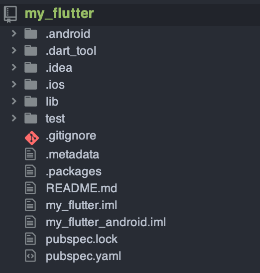
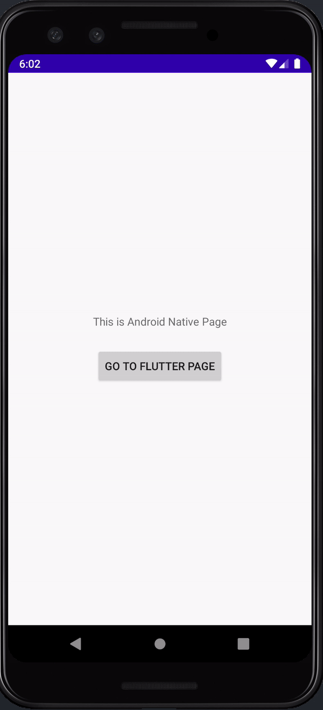
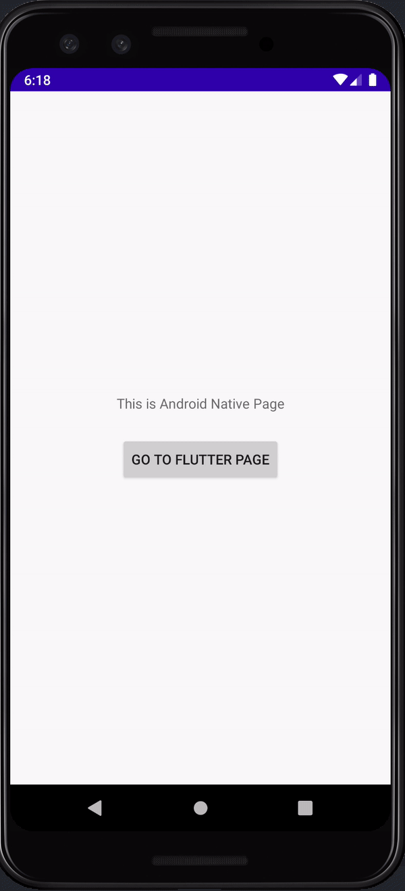

この記事は[Flutter 全部俺 Advent Calendar](https://adventar.org/calendars/4140) 11日目の記事です。


## このアドベントカレンダーについて
このアドベントカレンダーは [@itome](https://twitter.com/itometeam) が全て書いています。

基本的にFlutterの公式ドキュメントとソースコードを参照しながら書いていきます。誤植や編集依頼はTwitterにお願いします。

## Flutterを既存アプリに組み込む
Flutterのみで一からアプリ開発を行うのが基本的な方法ですが、
既存アプリが置き換えられないくらい大きかったりどうしてもFlutterのみでは賄いきれない機能があったりするときに、
Flutterをネイティブアプリと統合させて開発をすることができます。

統合には2つのパターンがあります。

1. Flutterアプリにネイティブ機能を追加する ([14日目の記事](https://itome.team/blog/2019/12/flutter-advent-calendar-day14)で紹介します)
2. 既存のネイティブアプリにFlutterを一部導入する (この記事で紹介する)

今回紹介するのは2番目の方法です。

## 統合機能の開発状況
既存アプリへのFlutter導入は https://github.com/flutter/flutter/wiki/Add-Flutter-to-existing-apps で紹介されていますが、
ドキュメントにもある通り開発段階のため破壊的変更があり得ます。リスクをしっかり理解してから採用するようにしましょう。

また、2019年11月現在は `master` チャンネルでしか動かないので、 `$ flutter channel master` コマンドで、開発版のFlutterを使う必要があります。
もちろん `stable` よりも安定性に欠けるので注意が必要です。

## Flutterライブラリモジュールを作る
Flutterで作った機能をAndroid/iOSで利用するために、ライブラリ化したFlutterアプリを、AndroidはGradle経由で、iOSはCocoapods経由でインポートします。

まず以下のコマンドでFlutterのライブラリを作ります。

```txt
$ flutter create -t module --org com.example flutter_sample
```

作成したプロジェクトのディレクトリ構成は以下のようになっています。



`lib` ディレクトリ以下にFlutterアプリを書いていくのは通常の開発と変わりませんが、
`android` ディレクトリが `.android` ディレクトリに、 `ios` ディレクトリが `.ios` ディレクトリなっています。
これらのディレクトリが `lib` ディレクトリのFlutterアプリを含めてビルドされてライブラリ化されます。

ここで作ったFlutterパッケージをAndroid/iOSそれぞれのプロジェクトに `git` の `submodule` として取り込んでおきます。

## 既存のAndroidアプリに統合する
ホストアプリ側の `build.gradle` でFlutterモジュールを取り込んでいきます。
今回は、ホストアプリのプロジェクトのルートに先ほど作成した `my_flutter` プロジェクトを置いています。

Flutterの取り込みにはJava8が必要なので `app` モジュールの `build.gradle` に以下の指定をします。

```dart
android {
  //...
  compileOptions {
    sourceCompatibility 1.8
    targetCompatibility 1.8
  }
}
```

次に `my_flutter` モジュールをAndroidライブラリとしてビルドします。

```txt
$ flutter build aar
```

ビルドが成功すると以下のようなメッセージが表示されるので、その通りに `build.gradle` を編集します。

```txt
Consuming the Module
  1. Open <host>/app/build.gradle
  2. Ensure you have the repositories configured, otherwise add them:

      repositories {
        maven {
            url '<path-to-host-project>/my_flutter/build/host/outputs/repo'
        }
        maven {
            url 'http://download.flutter.io'
        }
      }

  3. Make the host app depend on the Flutter module:

    dependencies {
      debugImplementation 'com.example.my_flutter:flutter_debug:1.0
      profileImplementation 'com.example.my_flutter:flutter_profile:1.0
      releaseImplementation 'com.example.my_flutter:flutter_release:1.0
    }


  4. Add the `profile` build type:

    android {
      buildTypes {
        profile {
          initWith debug
        }
      }
    }
```

これで、AndroidのホストアプリからFlutterを使うことができるようになりました。

<br/>

ちなみに、 `settings.gradle` を以下のように設定してAndroidのビルドに合わせてFlutterもビルドすることもできます。

```dart
rootProject.name='FlutterInAndorid'
include ':app'
setBinding(new Binding([gradle: this]))
evaluate(new File(
  settingsDir.path,
  'my_flutter/.android/include_flutter.groovy'
))
```

この場合は `app/build.gradle` で以下のようにインポートします。

```groovy
dependencies {
  implementation project(':flutter')
}
```

この方法はメンバー全員のPCにFlutter SDKが入っている必要がありますが、
ビルド済みの `aar` を配布したりしなくて済むため便利です。筆者自身もこちらのほうがいいと思っています。

## 既存のiOSアプリに統合する

Androidと同様にホストアプリのルートに `my_flutter` プロジェクトを置いています。

まずは `Podfile` を編集して `my_flutter` プロジェクトをインポートできるようにしましょう。

```ruby
target 'FlutterInApple' do
  ...
  
  flutter_application_path = './my_flutter'
  load File.join(flutter_application_path, '.ios', 'Flutter', 'podhelper.rb')

  target 'FlutterInAppleTests' do
    inherit! :search_paths
    install_all_flutter_pods(flutter_application_path)
  end

  target 'FlutterInAppleUITests' do
    install_all_flutter_pods(flutter_application_path)
  end
end
```

`Podfile` を編集して `$ pod install` をすることでFlutterモジュールがインポートできるようになります。

## AndroidからFlutterアプリを起動する
AndroidでFlutterモジュールを利用する方法は以下の3つが用意されています。

- Activityとして起動する
- Fragmentとして起動する
- Viewとして起動する

今回はActivityとして起動してみましょう。

まず `AndroidManifest.xml` に `FlutterActivity` を追加します。

```xml
    <activity
        android:name="io.flutter.embedding.android.FlutterActivity"
        android:theme="@style/LaunchTheme"
        android:configChanges="orientation|keyboardHidden|keyboard|screenSize|locale|layoutDirection|fontScale|screenLayout|density"
        android:hardwareAccelerated="true"
        android:windowSoftInputMode="adjustResize"
        android:exported="true"
        />
```

あとはAndroid側から通常のActivityのように `startActivity` するだけで起動できます。



しかし、実際に起動してみると `FlutterActivity` が表示されるまでに数秒何も表示されないのがわかると思います。
これはC++で書かれた `Flutter Engine` の起動にかかっている時間です。
デフォルトではActivityの起動ごとに `Flutter Engine` が再起動されてしまうため、毎回表示に時間がかかってしまいます。

これでは使い物にならないので、 `engine` をキャッシュできる仕組みが用意されています。

まず、ホストアプリが起動したタイミングで、 `FlutterEngine` を起動します( `executeDartEntrypoint` の部分)。
さらに、起動した `FlutterEngine` を `FlutterEngineCache` にID付きでキャッシュしておきます。

```kotlin
...
        val flutterEngine = FlutterEngine(this)
        flutterEngine.dartExecutor.executeDartEntrypoint(DartEntrypoint.createDefault())
        FlutterEngineCache.getInstance().put("my_engine_id", flutterEngine)
...
```

あとは、 `FlutterActivity` を起動するときに用意したIDのキャッシュを使うように指定するだけです。

```kotlin
        findViewById<Button>(R.id.button).setOnClickListener {
-            startActivity(FlutterActivity.createDefaultIntent(this))
+            startActivity(FlutterActivity.withCachedEngine("my_engine_id").build(this))
        }
```

これで、Activityの起動後すぐにFlutterの画面が表示されるようになりました。

| キャッシュなし | キャッシュあり |
| ---            | ---            |
|  ||

FragmentやViewで表示する際も基本的に同じような流れで表示されます。

## iOSからFlutterアプリを起動する
iOSでも `ViewController` としてFlutterの画面を表示してみましょう。

まず、 `AppDelegate.swift` の継承元を `FlutterAppDelegate` に変えます。

```swift
import UIKit
import Flutter

@UIApplicationMain
class AppDelegate: FlutterAppDelegate {
}
```

セットアップはこれだけです。

あとは、通常の `ViewController` と同様に呼び出すことができます。

```swift
let flutterViewController = FlutterViewController()
present(flutterViewController, animated: false, completion: nil)
```

## Add to app機能はどれくらい使えるか

現状 `Add to app` はあくまでpreviewで、 `master` チャンネルを使わないといけないなど制約も大きいです。
また、アプリ内に複数のFlutterの画面を埋め込んだ場合の `engine` の再利用など、解決できていない問題も多くあります。

もし部分的にFlutterを導入するとしても、 `engine` の再利用を気にしなくていいような使い方、たとえば画面丸々Flutterで作って
ホストアプリから画面遷移させるだけ、のような利用方法に限定されると思います。

もしくは、アリババが開発している [`FlutterBoost`](https://github.com/alibaba/flutter_boost)
というライブラリを使うという選択肢もあります。このライブラリは `engine` の共有問題を解決するために、
ホストとFlutterの間に抽象層を設けてくれます。

どのような方法をとるにせよ、まだまだクリアしないといけない課題が多い機能です。採用するときはぜひ慎重に。
