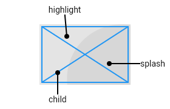

この記事は[Flutter 全部俺 Advent Calendar](https://adventar.org/calendars/4140) 12日目の記事です。


## このアドベントカレンダーについて
このアドベントカレンダーは [@itome](https://twitter.com/itometeam) が全て書いています。

基本的にFlutterの公式ドキュメントとソースコードを参照しながら書いていきます。誤植や編集依頼はTwitterにお願いします。

## FlutterのThemeとはなにか
Flutterは、アプリに統一的なデザインスタイルを提供するために、`Theme`クラスを提供しています。
`Theme`を適切に使えば、最小限のコストでアプリのデザインを変更したり、ダークモードに対応したりできます。

## `Theme` の基本的な使い方
`Theme`は基本的に`MaterialApp`とのセットで使います。`MaterialApp`の`theme: `に指定した`ThemeData`が
アプリ全体に適用されます。

```dart
...
    return MaterialApp(
      title: 'Flutter Demo',
      theme: ThemeData(
        primarySwatch: Colors.blue,
        ...
      ),
      home: Scaffold(
...
```

テーマを各Widgetに適用させたい時は、`Theme.of(context)`で取得した`ThemeData`からスタイルを取り出して使います。
(`Theme.of(context)`で共通の`ThemeData`が取得できる仕組みに関しては
[6日目の記事](https://itome.team/blog/2019/12/flutter-advent-calendar-day6)参照)

```dart
...
     Text(
       'Hello',
       style: Theme.of(context).textTheme.body1,
     ),
...
```

基本的にはこれだけです。

## `Theme`を切り替える
`Theme`の切り替えは通常の状態変更と同様に`MaterialApp`に渡す`ThemeData`を切り替えるだけでできます。
`MaterialApp`は内部で`AnimatedTheme`を使っているので、`Theme`の切り替え時に自動的にアニメーションも入れてくれます。

`Text`や`AppBar`などの多くのWidgetは色のデフォルト値を`Theme.of(context)`から取得して指定しているので、
`Theme`を切り替えるだけでそれに合わせてWidgetの色が変わります

```dart
import 'package:flutter/material.dart';

void main() => runApp(MyApp());

class MyApp extends StatefulWidget {
  MyAppState createState() => MyAppState();
}

class MyAppState extends State<MyApp> {
  bool dark = false;

  @override
  Widget build(BuildContext context) {
    return MaterialApp(
      title: 'Flutter Demo',
      theme: dark ? ThemeData.dark() : ThemeData.light(),
      home: Scaffold(
        appBar: AppBar(title: Text('Toggle theme sample')),
        body: Center(
          child: RaisedButton(
            onPressed: () {
              setState(() => dark = !dark);
            },
            child: Text('Toggle theme'),
          ),
        ),
      ),
    );
  }
}
```



## OSのダークモードに対応する
Andorid/iOSともに最新のOSではダークモードに対応していますが、
Flutterでは`Theme`を使って簡単にダークテーマに対応することができます。

`MaterialApp`に`theme: `に加えて`darkTheme: `を追加するだけです。

```dart
...
    return MaterialApp(
      title: 'Flutter Demo',
      theme: ThemeData.light(),
      darkTheme: ThemeData.dark(),
      home: Scaffold(
...
```



## `Theme` で設定できるプロパティ一覧
かなりたくさんあるので、全て手づから設定するのは現実的ではないです。
基本的にデフォルトの`Theme.light()`もしくは`Theme.dark()`をつかい、
デザインに合わせて必要なところだけ変更する運用にするのが最適だと思います。

| プロパティ                   | 説明                                                                                                                                                                                              |
|------------------------------|---------------------------------------------------------------------------------------------------------------------------------------------------------------------------------------------------|
| `brightness`                 | アプリの全体の明るさ。`Brightness.light`と `Brightness.dark`があります。                                                                                                                          |
| `primaryColor`               | アプリの基本色になります。`AppBar`や`TabBar`、`FloatingActionButton`など、アプリのメインとなるWidgetの背景色がこれになります                                                                      |
| `primaryColorBrightness`     | `primaryColor`にのみ適用される`brightness`です。下の`primaryColorLight`と`primaryColorDark`のどちらを使うかが決まります。                                                                         |
| `primaryColorLight`          | `Brightness.light`が指定されているときの `primaryColor`                                                                                                                                           |
| `primaryColorDark`           | `Brightness.dark`が指定されているときの `primaryColor`                                                                                                                                            |
| `canvasColor`                | `MaterialType`(`Material Design`の構成要素のこと、`button``card``circle`などがある)のうち `Material.canvas`に適用される色です。                                                                   |
| `accentColor`                | アプリのアクセントカラーです。`ScrollView`をいっぱいまでスクロールしたときにでる`overscroll edge effect`などの色になります                                                                        |
| `accentColorBrightness`      | `accentColor`にのみ適用される`brightness`です。下の`primaryColorLight`と`primaryColorDark`のどちらを使うかが決まります。                                                                          |
| `scaffoldBackgroundColor`    | `Scaffold`Widgetの背景色です。                                                                                                                                                                    |
| `bottomAppBarColor`          | `BottomAppBar`Widgetの背景色です。                                                                                                                                                                |
| `cardColor`                  | `Material`Widgetに`type: MaterialType.card`を指定したときや`Card`Widgetの背景色です。                                                                                                             |
| `dividerColor`               | `Divider`Widgetの色です。                                                                                                                                                                         |
| `focusColor`                 | Widgetがフォーカスされたときの色です。`TextField`の編集中の色などになります。                                                                                                                     |
| `hoverColor`                 | Widgetがホバーされたときの色です。                                                                                                                                                                |
| `splashColor`                | `InkWell`の`splash`の色です。                                                                                                                                           |
| `highlightColor`             | `InkWell`の`highlight`の色です。                                                                                                                                                                  |
| `splashFactory`              | `InkWell`の`splash`の効果をカスタマイズできるファクトリクラスを指定します。                                                                                                                       |
| `selectedRowColor`           | 選択行の背景色です。デフォルトでは特に使われていません。                                                                                                                                          |
| `unselectedWidgetColor`      | 選択されていないWidgetの色です。`CheckBox` などの非選択時の色として、`accentColor`との対で使われます。                                                                                            |
| `disabledColor`              | 非有効化されたWidgetの色です。押せない`CheckBox`の色などに使われます。                                                                                                                            |
| `buttonTheme`                | `RaisedButton`などの`Button`系Widgetのデフォルトの設定に使われます。サイズ、色、内部の`Text`Widgetのスタイルなど、さまざまな値が指定できます。                                                    |
| `toggleButtonsTheme`         | `ToggleButtons`版の`ButtonTheme`。                                                                                                                                                                |
| `buttonColor`                | `RaisedButton`などの`Button`系Widgetの背景色です。                                                                                                                                                |
| `secondaryHeaderColor`       | `PaginatedDataTable`のヘッダーの色です。                                                                                                                                                          |
| `textSelectionColor`         | `TextField`など選択可能な`Text`Widgetの選択時の色です。                                                                                                                                           |
| `cursorColor`                | `TextField`などのカーソルの色です。                                                                                                                                                               |
| `textSelectionHandleColor`   | `TextField`などで、文字を選択しているときのカーソルの色です。                                                                                                                                     |
| `backgroundColor`            | 背景色のうち、`primaryColor`が使われない部分の色です。`ProgressIndicator`の残りの部分の色などに使われます。                                                                                       |
| `dialogBackgroundColor`      | `Dialog`の背景色です。                                                                                                                                                                            |
| `indicatorTheme`             | `TabBar`の選択時のインジケーターの色です。                                                                                                                                                        |
| `hintColor`                  | `TextField`の`hintText`の色です。                                                                                                                                                                 |
| `errorColor`                 | エラーの色です。`TextField`のエラー文の色などに使われます。                                                                                                                                       |
| `toggleableActiveColor`      | `Switch``Radio``CheckBox`などのトグルできるボタンの選択時の色です。                                                                                                                               |
| `textTheme`                  | `Text`Widgetの基本的なスタイルです。`body1``body2``title``caption``button`などのタイプに対する`TextStyle`を詰め合わせたものです。                                                                 |
| `primaryTextTheme`           | `primaryColor`に対応する`TextTheme`です。                                                                                                                                                         |
| `accentTextTheme`            | `accentColor`に対応する`TextTheme`です。                                                                                                                                                          |
| `inputDecorationTheme`       | `TextField`などに設定する`InputDecoration`の`Theme`です。hintや枠線などを指定できます。                                                                                                           |
| `iconTheme`                  | `Icon`Widgetの`Theme`です。サイズと色を指定できます。                                                                                                                                             |
| `primaryIconTheme`           | `primaryColor`に対応する`IconTheme`です。                                                                                                                                                         |
| `accentIconTheme`            | `accentColor`にタイソウル`IconTheme`です。                                                                                                                                                        |
| `sliderTheme`                | `Slider`Widgetの`Theme`です。サイズや形などを指定できます。                                                                                                                                       |
| `tabBarTheme`                | `TabBar`Widgetの`Theme`です。インジケーターのスタイルやサイズなどを指定できます。                                                                                                                 |
| `tooltipTheme`               | `Tooltip`Widgetの`Theme`です。サイズや形などを指定できます。                                                                                                                                      |
| `cardTheme`                  | `Card`Widgetの`Theme`です。色や形を指定できます。                                                                                                                                                 |
| `clipTheme`                  | `ClipCircle`などの`Clip`系Widgetの`Theme`です。色や形などを指定できます。                                                                                                                         |
| `platform`                   | `Theme`ごとに`TargetPlatform`を指定するためのプロパティです。実際の`TargetPlatform`とは異なる場合もあります。                                                                                     |
| `materialTapTargetSize`      | `Material`系のWidgetのタップ領域を指定できます。`padding`と`shrinkWrap`から選べます。                                                                                                             |
| `applyElevationOverlayColor` | マテリアルデザインで`elevation`(浮いているような影が出る)エフェクトを表現する時に、`overlayColor`を利用するかどうかのフラグです。ダークテーマでは影の表現が難しいため、影の表現がオフになります。 |
| `pageTransitionsTheme`       | 画面遷移にどのようなアニメーションを使うかという`Theme`です。`Android`と`iOS`それぞれ別に指定できます。                                                                                           |
| `appBarTheme`                | `AppBar`の`Theme`です。色やタイトルのスタイルを指定できます。                                                                                                                                     |
| `bottomAppBarTheme`          | `BottomAppBar`の`Theme`です。色や形を指定できます。                                                                                                                                               |
| `colorScheme`                | Widgetに制限されないカラーセットです。                                                                                                                                                            |
| `snackBarTheme`              | `SnackBar`Widgetの`Theme`です。色や形を指定できます。                                                                                                                                             |
| `dialogTheme`                | `Dialog`の`Theme`です。色やテキストのスタイルが指定できます。                                                                                                                                     |
| `floatingActionButtonTheme`  | `FloatingActionButton`Widgetの`Theme`です。色や形が指定できます。                                                                                                                                 |
| `typography`                 | どのロケールで、どのフォントを使うかを指定します。                                                                                                                                                |
| `cupertinoOverrideTheme`     | `Cupertino`系のWidget(iOSライクなデザインのWidget)の`Theme`                                                                                                                                       |
| `bottomSheetTheme`           | `BottomSheet`Widgetの`Theme`です。形などを指定できます。                                                                                                                                          |
| `popupMenuTheme`             | `PopupMenu`の`Theme`です。色やテキストのスタイルが指定できます。                                                                                                                                  |
| `bannerTheme`                | `MaterialBanner`Widgetの`Theme`です。                                                                                                                                                             |
| `dividerTheme`               | `Divider`Widgetの`Theme`です。色やサイズなどを指定できます。                                                                                                                                      |
| `buttonBarTheme`             | `ButtonBar`Widgetの`Theme`です。サイズなどを指定できます。                                                                                                                                                           |
