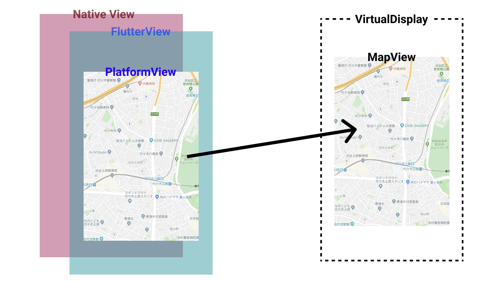

この記事は[Flutter 全部俺 Advent Calendar](https://adventar.org/calendars/4140) 13日目の記事です。


## このアドベントカレンダーについて
このアドベントカレンダーは [@itome](https://twitter.com/itometeam** が全て書いています。

基本的にFlutterの公式ドキュメントとソースコードを参照しながら書いていきます。誤植や編集依頼はTwitterにお願いします。

## PlatformViewとは
Flutterは、AndroidやiOSなどの各PlatformのViewを使わずに、自前でGPUを使ったレンダリングをすることによって、
ハイパフォーマンスでプラットフォームごとの解離が少ない描画を実現しています。

しかしその仕組みのためネイティブのUIを一切使うことができないという制約がFlutterを採用する上で大きな障壁になっていました。

一般的なアプリを構成する要素の多くはFlutterのデフォルトWidgetとして提供されており、
自前での実装もある程度は容易なため困らないことも少なくありませんが、`WebView`や`MapView`など、
内部でさらにレンダリングが必要になるような複雑なViewは、Flutter上で独自実装をすることが現実的でなく、
Flutterを業務で使う際に大きな障壁になっていました。

そんな中、`1.0`の正式リリースとともに発表されたのが`PlatformView`です。現在では、`PlatformView`が追加されたことで、
`MapView`や`WebView`なども公式のプラグインを使って実装することができます。

筆者も最初勘違いしていたのですが、`PlatformView`という名前のWidgetがあるわけではありません。
Android用に`AndroidView`、iOS用に`UiKitView`がそれぞれ別に用意されています。

*※`PlatformView`は2019年12月現在Developer Previewです。将来的に大きなAPIの変更の可能性があります*

## どうやって実現されているのか
本アドベントカレンダーの領域から少し出ますが、`flutter/engine`の実装まですこしだけ見てみましょう。

プラットフォームごとに実装がされているので、今回はAndroidの方から見ていきましょう。

ネイティブのUIはFlutterのUI上に直接描画することはできないので、 別の仮想的なディスプレイに表示する必要があります。
このために、AndroidSDKに含まれている`VirtualDisplay`が使われています。

> Represents a virtual display. The content of a virtual display is
> rendered to a Surface that you must provide to DisplayManager#createVirtualDisplay.
>
> https://developer.android.com/reference/android/hardware/display/VirtualDisplay

`VirtualDisplay`は実際に画面上にViewを描画する代わりに`SurfaceView`上に描画します。
`SurfaceView`はGPUを使ったレンダリングができるAndroidのクラスで、
動画再生やカメラのプレビューなどによく使われるものです。

`VirtualDisplay`は`PlatformViewsController`クラスに管理されています。このクラスは
Flutter側からタッチ処理の受け渡しなども担当しています。

FlutterのDart側では、`PlatformView`内で`RenderAndroidView`という`RenderObject`が
`VirtualDisplay`に描画された画面をFlutter上にレンダリングしています。

さらに内部では`TextureLayer`というクラスがネイティブの`Surface`をIDを使って
直接参照してその内容を取得しているため、
Android側からFlutterへ向けて画面の内容が渡されるというよりも、Androidにある画面をFlutterが勝手に
見に行って同じものを描画していると言った方がイメージに近いです。

`TextureLayer`の描画は非同期で行われています。

図にすると以下のようになります。



内部実装は以上のようになっています。ネイティブに一度仮想的に描画してからFlutter側にコピーして再描画するため
パフォーマンスや描画の即応性は低いです。ドキュメントにも、Flutterのみで完結できる場合は
なるべく`PlatformView`を使わない方が良い旨が書いてあります。

## `PlatformView`を自分で実装してみる
`PlatformView`を直接使うよりも、`MapView`や`WebView`などの用意されたプラグインを使う場合の方が
多いですが、今回は仕組みを理解するために自分で実装してみましょう。以下の記事を参考にしました。

> Flutter PlatformView: How to create Widgets from Native Views
> https://medium.com/flutter-community/flutter-platformview-how-to-create-flutter-widgets-from-native-views-366e378115b6

`PlatformView`はネイティブの機能へのアクセスが必要なため、`Flutter Plugin`としてプロジェクトを作りましょう。

```txt
$ flutter create --template=plugin -i swift -a kotlin platform_view_sample
```

まずはAndroid側のコードを実装していきます。今回はAndroidの`TextView`をFlutterで使ってみることにします。
(先述したとおり本来は`Text`などFlutterで用意でされているものは`PlatformView`を使うべきではありません。
今回はあくまでサンプルのためなので注意してください。)

<br/>

まず、`PlatformView`を継承したViewを作りましょう。本来は`getView`メソッドと`dispose`メソッドを
`override`するだけでいいですが、`MethodChannel`を使って`setText`を呼び出す実装も追加しています。
こうすることで、Flutter側のコードから動的に値を書き換えることができるようになります。
(`MethodChannel`については[14日目の記事](https://itome.team/blog/2019/12/flutter-advent-calendar14)で紹介します。)

```kotlin
import android.content.Context
import android.view.View
import android.widget.TextView
import io.flutter.plugin.common.BinaryMessenger
import io.flutter.plugin.common.MethodCall
import io.flutter.plugin.common.MethodChannel
import io.flutter.plugin.platform.PlatformView


class FlutterTextView(
    context: Context,
    messenger: BinaryMessenger,
    id: Int
) : PlatformView, MethodChannel.MethodCallHandler {
    private val textView: TextView = TextView(context);

    init {
        MethodChannel(messenger, "plugins.team.itome/textview_$id").also {
            it.setMethodCallHandler(this)
        }
    }

    override fun getView(): View = textView

    override fun onMethodCall(call: MethodCall, result: MethodChannel.Result) {
        when (call.method) {
            "setText" -> {
                textView.text = call.arguments as String
                result.success(null)
            }
            else -> result.notImplemented()
        }
    }

    override fun dispose() {
    }
}
```

次に、`PlatforViewFactory`を継承したクラスで、作った`PlatformView`を返すように実装します。

```kotlin
import android.content.Context
import io.flutter.plugin.common.BinaryMessenger
import io.flutter.plugin.common.StandardMessageCodec
import io.flutter.plugin.platform.PlatformView
import io.flutter.plugin.platform.PlatformViewFactory

class TextViewFactory(
    private val messanger: BinaryMessenger
) : PlatformViewFactory(StandardMessageCodec.INSTANCE) {
    override fun create(context: Context?, viewId: Int, args: Any?): PlatformView =
        FlutterTextView(context, messanger, viewId)
}
```

最後に自動生成されている`~Plugin.kt`ファイルで、プラグインの登録を行います。

```kotlin
import androidx.annotation.NonNull
import io.flutter.embedding.engine.plugins.FlutterPlugin
import io.flutter.plugin.common.PluginRegistry.Registrar

class PlatformViewSamplePlugin : FlutterPlugin {
    companion object {
        @JvmStatic
        fun registerWith(registrar: Registrar) {
            registrar
                .platformViewRegistry()
                .registerViewFactory(
                    "plugins.team.itome/textview", TextViewFactory(registrar.messenger())
                )
        }
    }

    override fun onAttachedToEngine(@NonNull flutterPluginBinding: FlutterPlugin.FlutterPluginBinding) {
        flutterPluginBinding.platformViewRegistry
            .registerViewFactory(
                "plugins.team.itome/textview",
                TextViewFactory(flutterPluginBinding.binaryMessenger)
            )
    }

    override fun onDetachedFromEngine(binding: FlutterPlugin.FlutterPluginBinding) {
    }
}
```

`registerWith`メソッドと`onAttachedToEngine`メソッドに全く同じような実装をしていますが、これはFlutterの
破壊的変更によるもので、v1.12以前は`registerWith`、それ以降は`onAttachedToEngine`が呼ばれます。
しばらくは移行措置として両方に全く同じ実装をすることが推奨されているようです。

これでAndroid側の実装は終わりです。Flutter側でAndroidのVewを表示する実装をしていきましょう。

```dart
import 'dart:async';

import 'package:flutter/foundation.dart';
import 'package:flutter/material.dart';
import 'package:flutter/services.dart';

class TextView extends StatefulWidget {
  const TextView(this.text, {Key key}) : super(key: key);

  final String text;

  @override
  State<StatefulWidget> createState() => _TextViewState();
}

class _TextViewState extends State<TextView> {
  _TextViewController _controller;

  @override
  Widget build(BuildContext context) {
    if (defaultTargetPlatform == TargetPlatform.android) {
      return AndroidView(
        viewType: 'plugins.team.itome/textview',
        onPlatformViewCreated: _onPlatformViewCreated,
      );
    }
    return Text(
        '$defaultTargetPlatform is not yet supported by the text_view plugin');
  }

  void _onPlatformViewCreated(int id) {
    _controller = _TextViewController(id);
    _controller.setText(widget.text);
  }
}

class _TextViewController {
  _TextViewController(
    int id,
  ) : _channel = MethodChannel('plugins.team.itome/textview_$id');

  final MethodChannel _channel;

  Future<void> setText(String text) async {
    assert(text != null);
    return _channel.invokeMethod('setText', text);
  }
}
```

シンプルに`AndroidView`をラップしただけのWidgetです。`AndroidView`の`onPlatformViewCreated`で
`MethodChannel`に指定したIDが取得できるので、これを使って`MethodChannel`経由で`setText`を呼び出しています。

プラグインの作成はこれで完了です。実際に使ってみましょう。

```dart
import 'package:flutter/material.dart';
import 'package:platform_view_sample/text_view.dart';

void main() => runApp(MyApp());

class MyApp extends StatelessWidget {
  @override
  Widget build(BuildContext context) {
    return MaterialApp(
      home: Scaffold(
        body: Container(
          alignment: Alignment.center,
          child: SizedBox(
            height: 48,
            child: TextView("Hello this is Android Text View"),
          ),
        ),
      ),
    );
  }
}
```

実際に動かしてみると以下のようになります。



Androidの`TextView`を使って`"Hello this is Android Text View"`の部分は表示されています。

今回は`TextView`を例にしたためありがたみがあまりないですが、そのほか自作の複雑なCustomWidgetなどが
ある場合は重宝します。まだDeveloperPreviewの段階ですが、Flutterの可能性を大きく広げる機能だと思っているので
これからが楽しみです。

<br>

>
> **12日目: FlutterのThemeを理解する**
> https://itome.team/blog/2019/12/flutter-advent-calendar-day12
>
> **14日目: FlutterでAndroid/iOSのネイティブのAPIを使う**
> https://itome.team/blog/2019/12/flutter-advent-calendar-day14
