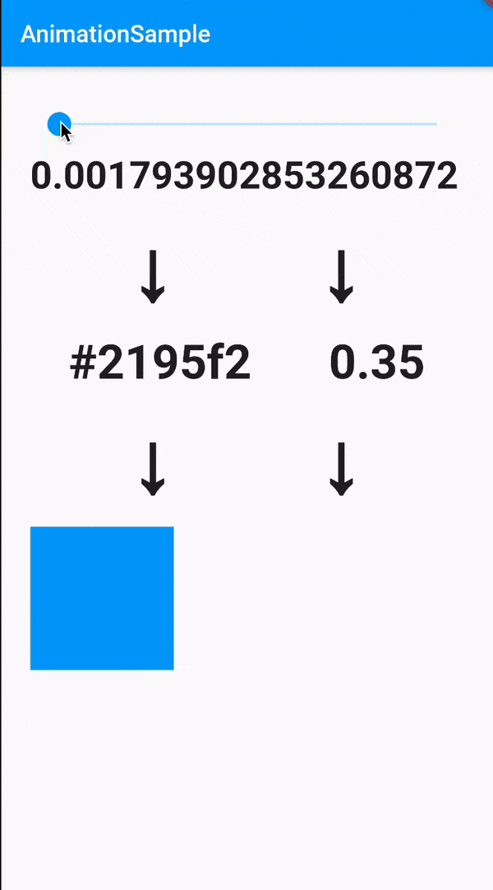

この記事は[Flutter 全部俺 Advent Calendar](https://adventar.org/calendars/4140) 15日目の記事です。


## このアドベントカレンダーについて
このアドベントカレンダーは [@itome](https://twitter.com/itometeam) が全て書いています。

基本的にFlutterの公式ドキュメントとソースコードを参照しながら書いていきます。誤植や編集依頼はTwitterにお願いします。

## Flutterのアニメーション

Flutterは、複雑なアニメーションもフレーム落ちを気にすることなく宣言的に実装できるように作られています。
しかしその代償として、初学者にとっては理解しづらい概念もいくつか必要になっており、基礎的な部分の理解が難しい領域でもあると思います。

`AnimatedOpacity`などの`Animated`系Widgetや`SlideTransition`などの`Transition`系Widgetも用意されているので、
細かいことを気にせずに実装することも可能ではありますが、せっかくなので基本的なところから一つ一つ理解していきましょう。

## アニメーションのイメージ
具体的なクラスを見る前にアニメーションの大枠のイメージを掴んでおきましょう。
用語の詳しい説明は後にするので、ざっくりと理解できれば大丈夫です。

Flutterの一般的なアニメーションは以下の流れで考えるとわかりやすいです。

- 連続的な数値の変化(通常は`0.0`~`1.0`)
- その数値の変換(数値から色へ、数値から別の数値へなど)
- 変換された値のWidgetへの適用

### 連続的な数値の変化
まずは、アニメーションの起点として連続的な値の変化が必要です。
最もわかりやすいのは時間経過に合わせて値を変化させていくパターンですが、
必ずしもそれだけに限定されません。例えばユーザーによる画面のドラッグやスクロール量の変化などもアニメーションの起点になります。
連続的に変化する値は`AnimtionController`クラスを使って実装します。詳しくは後述します。

今回は例として、`Slider`の値をアニメーションの起点にしてみましょう。`Slider`の下の`Text`には`AnimationController`の
現在の数値を表示するようにします。

ここでの数値の変化幅は`0.0`~`1.0`にするのが一般的です。`0.0`~`100.0`など、任意の値にしても問題はないですが、
大きな値がほしい場合は次の手順で値の変換をするほうがきれいに実装することができます。



## 値を変換する
`0.0`から`1.0`までの値をそのままWidgetに渡して使うこともできますが、複雑に変化する値を扱うのには不向きです。
`Tween`クラスを使うことで、数値を対応する別の値に変換することができます。
`Tween`クラスを継承した自作クラスを使うこともできますが、デフォルトでも`ColorTween`や`CurveTween`が用意されています。`

`ColorTween`を使って`0.0`~`1.0`の値を色に変換してみましょう。
`Slider`の変化に合わせて色の情報が変わっているのがわかります。



## 変換された値をWidgetに適用する
最後に変換された値をWidgetに適用していきます。
`ColorTween`で作った`Animation`の現在の値(色情報)をセットするだけですが、
そのままでは色情報が変わったときに再描画をすることができません。そこで、`AnimatedBuilder`Widgetを使って
アニメーションに変更があったことをWidget側で検知できるようにします。

これで`Slider`の値に合わせて色が変わるアニメーションを実装することができました。



ここまでのコードは以下

```dart
import 'package:flutter/material.dart';

void main() => runApp(MyApp());

class MyApp extends StatefulWidget {
  MyAppState createState() => MyAppState();
}

class MyAppState extends State<MyApp> with SingleTickerProviderStateMixin {
  AnimationController _controller;
  Animation<Color> _color;

  @override
  void initState() {
    super.initState();
    _controller = AnimationController(
      duration: const Duration(milliseconds: 300),
      vsync: this,
    );
    _color = ColorTween(
      begin: Colors.blue,
      end: Colors.red,
    ).animate(_controller);
  }

  @override
  Widget build(BuildContext context) {
    return MaterialApp(
      title: 'Flutter Demo',
      home: Scaffold(
        appBar: AppBar(title: Text('AnimationSample')),
        body: Padding(
          padding: const EdgeInsets.all(24),
          child: Column(
            children: <Widget>[
              AnimatedBuilder(
                animation: _controller,
                builder: (context, _) {
                  return Slider(
                    value: _controller.value,
                    onChanged: (value) => _controller.value = value,
                  );
                },
              ),
              AnimatedBuilder(
                animation: _controller,
                builder: (context, _) {
                  return Text(
                    _controller.value.toString(),
                    maxLines: 1,
                    style: const TextStyle(
                      fontSize: 32,
                      fontWeight: FontWeight.bold,
                    ),
                  );
                },
              ),
              Padding(
                padding: const EdgeInsets.symmetric(
                  vertical: 8,
                  horizontal: 24,
                ),
                child: const Text(
                  '↓',
                  style: TextStyle(
                    fontSize: 72,
                    fontWeight: FontWeight.bold,
                  ),
                ),
              ),
              AnimatedBuilder(
                animation: _color,
                builder: (context, child) {
                  return Text(
                    '#${_color.value.value.toRadixString(16).substring(2)}',
                    maxLines: 1,
                    style: const TextStyle(
                      fontSize: 56,
                      fontWeight: FontWeight.bold,
                    ),
                  );
                },
              ),
              Padding(
                padding: const EdgeInsets.symmetric(
                  vertical: 8,
                  horizontal: 24,
                ),
                child: const Text(
                  '↓',
                  style: TextStyle(
                    fontSize: 72,
                    fontWeight: FontWeight.bold,
                  ),
                ),
              ),
              AnimatedBuilder(
                animation: _color,
                builder: (context, child) {
                  return Container(
                    color: _color.value,
                    height: 120,
                  );
                },
              ),
            ],
          ),
        ),
      ),
    );
  }
}
```

## アニメーションの応用

ここまでに紹介したパターンでさまざまな応用ができます。

| もともとのアニメーション                                | スライダーの値を`0.5`~`0.1`のScaleに変換               | 時間経過で値を変更(1秒間でアニメーション)               |
|---------------------------------------------------------|--------------------------------------------------------|---------------------------------------------------------|
|  |  |  |
| スライダーの値を左からのOffsetに変換                    | Offsetに変換時に`CurveTween`を使ってバウンス効果を追加    | スライダーの値を色とOffsetのアニメーションに変換して同時に適用                      |
|            |  ||

## Flutterのアニメーションに必要なクラスを理解する

アニメーションの実装の大まかなイメージはつかめたと思うので、アニメーションに必要なクラスや概念の説明をしていきます。

### `Animation` class
Flutterのアニメーションの基本となるクラスです。現在の値とアニメーションの状態(終了したかアニメーション中かなど)だけを持ちます。
`Listenable`を継承しているので値の変更を監視することはできますが、このクラスは値を保持するだけなので、
時間経過に合わせて値を変更したり外から値を変更するためには`AnimationController`を使う必要があります。

`Animation`は抽象クラスなので、インスタンス化する時は後述する`AnimationController`を使うか、`Tween`クラスから生成することになります。

### `AnimationController` class
自分の値を動的に変更できる`Animation`のサブクラスです。外から現在の値を渡す方法と、
指定された`Duration`で自動的にアニメーションを動かす方法の二種類でアニメーションを管理することができます。

自動でアニメーションする場合は`forward`で`0.0`~`1.0`で値が変化し、`reverse`で`1.0`~`0.0`で値が変化します。

```dart
...
AnimationController _controller = AnimationController(
  duration: const Duration(milliseconds: 300),
  vsync: this,
);
...

_controller.forward() // Value changes from 0.0 to 1.0 in 3000 millis
```

### SchedulerBinding class
アニメーションはパラパラ漫画のようにWidgetを更新していくことで実現されていますが、どれくらいの頻度でWidgetを更新すればいいでしょうか。
デバイスの画面には固有のfps(frame per second)があるので、画面のフレームが再描画されるのと同じタイミングでWidgetの更新をするのが
効果的なはずです。しかしfpsはデバイスによってさまざまで、一般的な60fps以外にiPadのように120だったり90だったり、はたまた30だったりします。

これらのデバイスの違いを吸収するために、デバイスのフレームの変更を検知してくれるのが`SchedulerBinding`クラスです。

`SchedulerBinding`クラスはアプリ全体に一つだけのシングルトンクラスで、デバイスのフレーム更新時に`scheduleFrameCallback`で
登録されたリスナーに変更を通知します。

### Ticker
`SchedulerBinding`は常にデバイスのフレーム更新を通知するので、全てのアニメーションが毎回それに反応するとパフォーマンスの悪化につながります。
特にスクロールされて画面から外れたWidgetや、画面遷移で前の画面として残っているWidgetがアニメーションをすることは避けるべきです。
そのため、`SchedulerBinding`は一度`Ticker`に更新を通知し、実際にWidgetのアニメーションを行うかは`Ticker`が決めることで、
無駄なアニメーションが走ることを避けています。

`Ticker`クラスは`start` `stop` `muted`メソッドを持っていて、
`SchedulerBinding`からフレームが更新された通知が送られてきたときに`start`されていた
場合にのみWidgetに次のフレームのアニメーションを指示します。

実際には単体で使うことはなく、`TickerProvider`を介して`AnimationController`に渡すことがほとんどです。
`AnimationController`に渡す`vsync: `パラメーターは実は`TickerProvider`を渡すためのものです。

`TickerProvider`を自分で作ることもほとんどのケースでないと思います。

`AnimationController`を保持している`State`クラスに`SingleTickerProviderStateMixin`をmixinすると、
その`State`クラスが`TickerProvider`になるので、`AnimationController`には`this`を渡すだけで済みます。

```dart
var _controller = AnimationController(vsync: this, ...);
```

`Ticker`の管理は`SingleTickerProviderStateMixin`がよしなにやってくれるので、
画面外での無駄なアニメーションをこれだけで防ぐことができます。

ちなみに`SingleTickerProviderStateMixin`は`State`が複数ある場合に対応していないので、その場合は`TickerProviderStateMixin`を使いましょう。

### 'Animatable' class
`Animation`クラスと違いが分かりづらいですが、全く別のクラスです。
`Animation`クラスの`double`値を別の値に変換するためにつかいます。

### `Tween` class
`Animatable`を継承したクラスで、`ColorTween`のようにさらに継承して使います。
初期値と最後の値を決めて自動的に中間の値を補完してアニメーションしてくれます。

[明日の記事](https://itome.team/blog/2019/12/flutter-advent-calendar-day16)では、
これらの基本の道具を使って応用的なアニメーションを作っていきます。

<br/>

> **14日目: FlutterでAndroid/iOSのネイティブのAPIを使う** :
>
> https://itome.team/blog/2019/12/flutter-advent-calendar-day14
>
> **16日目: Flutterのアニメーションを理解する(後編)** :
>
> https://itome.team/blog/2019/12/flutter-advent-calendar-day16
