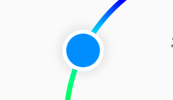
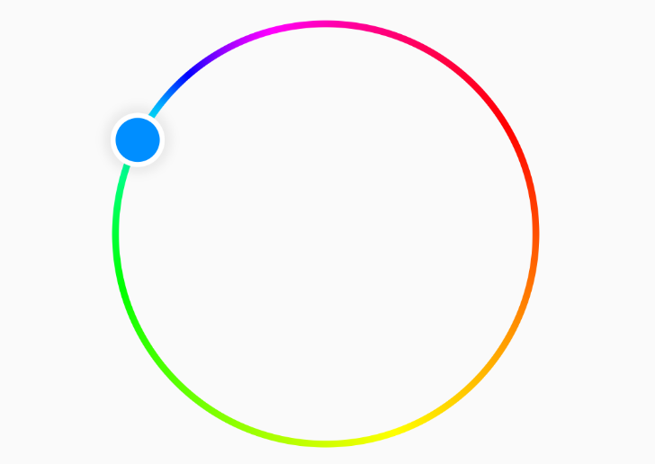
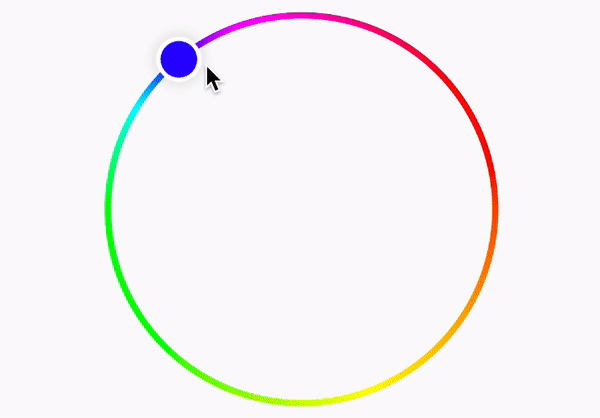
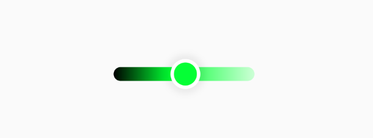

この記事は[Flutter 全部俺 Advent Calendar](https://adventar.org/calendars/4140) 1日目の記事です。


## このアドベントカレンダーについて
このアドベントカレンダーは [@itome](https://twitter.com/itometeam) が全て書いています。

基本的にFlutterの公式ドキュメントとソースコードを参照しながら書いていきます。誤植や編集依頼はTwitterにお願いします。

## Flutterのアニメーションを実際に使ってみる
本来17日目は「FlutterのAnimatedWidgetを使いこなす」というタイトルで`Animated`系Widgetを紹介しようと考えていましたが、
それはmonoさんの以下の記事に譲ることにして、
実際のアプリに必要なアニメーションの実装をカラーピッカーを例にしながらみていくことにしましょう。

## 作るもの


円状のカラーピッカーを作ります。周りの環で色相を、中のスライダーで輝度を調整します。
分類としてはHSLカラーピッカーですが、彩度の調整には対応していません。

今回作ったカラーピッカーはMITライセンスでライブラリとして公開しているので、
ソースコードは下のリンクから見ることができます。

> https://github.com/itome/flutter_circle_color_picker

## ハンドルを作る



この部分を作ります。タッチしている間に少し小さくなるアニメーションは後から入れるので、形だけの`StatelessWidget`にします。
中央の色だけ外から指定できるようにしておきましょう。

```dart
class _Thumb extends StatelessWidget {
  const _Thumb({Key key, this.size, this.color}) : super(key: key);

  final double size;

  final Color color;

  @override
  Widget build(BuildContext context) {
    return Container(
      width: size,
      height: size,
      decoration: BoxDecoration(
        shape: BoxShape.circle,
        color: Color.fromARGB(255, 255, 255, 255),
        boxShadow: [
          BoxShadow(
            color: Color.fromARGB(16, 0, 0, 0),
            blurRadius: 4,
            spreadRadius: 4,
          )
        ],
      ),
      alignment: Alignment.center,
      child: Container(
        width: size - 6,
        height: size - 6,
        decoration: BoxDecoration(
          shape: BoxShape.circle,
          color: color,
        ),
      ),
    );
  }
}
```

## 色相ピッカーを作る



まずは`CustomPaint`を使って背景の輪っかを描画します。

```dart
class _CirclePickerPainter extends CustomPainter {
  const _CirclePickerPainter(
    this.strokeWidth,
  );

  final double strokeWidth;

  @override
  void paint(Canvas canvas, Size size) {
    Offset center = Offset(size.width / 2, size.height / 2);
    double radio = min(size.width, size.height) / 2 - strokeWidth;

    const sweepGradient = SweepGradient(
      colors: const [
        Color.fromARGB(255, 255, 0, 0),
        Color.fromARGB(255, 255, 255, 0),
        Color.fromARGB(255, 0, 255, 0),
        Color.fromARGB(255, 0, 255, 255),
        Color.fromARGB(255, 0, 0, 255),
        Color.fromARGB(255, 255, 0, 255),
        Color.fromARGB(255, 255, 0, 0),
      ],
    );

    final sweepShader = sweepGradient.createShader(
      Rect.fromLTWH(0, 0, radio, radio),
    );

    canvas.drawCircle(
      center,
      radio,
      Paint()
        ..style = PaintingStyle.stroke
        ..strokeWidth = strokeWidth * 2
        ..shader = sweepShader,
    );
  }

  @override
  bool shouldRepaint(CustomPainter oldDelegate) => true;
}
```

アニメーションとは関係ないので詳しい説明は割愛しますが、`SweepGradient`をつかって描画処理を書いた`CustomPainter`を
`CustomPaint`Widgetに渡して実装しています。

つぎに先ほど作ったハンドル部分を、円周上で動かすアニメーションを実装していきます。

ドラッグは`GestureDetector`で取得できますが、そのままでは円運動に変換しづらいので、
中心からの座標をラジアンに変換します。

そのため、`AnimationController`の最大値は`2 * pi`(ラジアンを単位とした円周の長さ)にしておきましょう。

```dart
...
AnimationController _hueController;

@override
void initState() {
  _hueController = AnimationController(
    vsync: this,
    lowerBound: 0,
    upperBound: 2 * pi,
  );
}
```

最終的にはハンドルをドラッグに合わせて移動させるようなアニメーションにしたいので、
ラジアンの値を左上からの`Offset`にしたいです。

そこで、`0.0`~`2 * pi`の`double`を受け取って`Offset`を返すような`Tween`を自作しましょう。

```dart
class _CircleTween extends Tween<Offset> {
  _CircleTween(this.radius)
      : super(
          begin: _radiansToOffset(0, radius),
          end: _radiansToOffset(2 * pi, radius),
        );

  final double radius;

  @override
  Offset lerp(double t) => _radiansToOffset(t, radius);

  static Offset _radiansToOffset(double radians, double radius) {
    return Offset(
      radius + radius * cos(radians),
      radius + radius * sin(radians),
    );
  }
}
```

`Tween`の自作は`Tween`を継承したクラスを作って`lerp`メソッドを実装するだけです。
今回はラジアンに対して`Offset`を作るような関数になります。位置を割り出すにはラジアンの他に
円の半径も必要なので、それはコンストラクタで最初に受け取るようにします。

実際の計算は三角関数を使えば簡単に計算できます。三角関数久々につかいました。

ここで作った`_CircleTween`を先ほどのラジアンの`AnimationController`に接続します。

```dart
Animation<Offset> _offset;

@override
void initState() {
  ...
  _offset = _CircleTween(
    minSize / 2 - widget.thumbSize / 2,
  ).animate(_hueController);
}
```

あとは、アニメーションを`Positioned`Widgetに適用すれば、ドラッグに合わせてハンドルが動くようになります。

```dart
...
AnimatedBuilder(
  animation: _offset,
  builder: (context, child) {
    return Positioned(
      left: _offset.value.dx,
      top: _offset.value.dy,
      child: child,
    );
  },
  child: AnimatedBuilder(
  ),
),
...
```



## 輝度スライダーを作る

Flutterにはカスタマイズ可能な`Slider`Widgetがすでに用意されていますが、今回は自分で作ります。

とは言っても先ほどと同様に、`GestureDetector`ドラッグの位置を検知して`Offset`を移動させるようなアニメーションを作るだけです。



```dart
...
class _LightnessSliderState extends State<_LightnessSlider>
    with TickerProviderStateMixin {
  AnimationController _lightnessController;
  AnimationController _scaleController;

  @override
  Widget build(BuildContext context) {
    return GestureDetector(
      onPanStart: _onPanStart,
      onPanUpdate: _onPanUpdate,
      onPanEnd: _onPanEnd,
      child: SizedBox(
        width: widget.width,
        height: widget.thumbSize,
        child: Stack(
          alignment: Alignment.centerLeft,
          children: <Widget>[
            Container(
              width: double.infinity,
              height: 12,
              margin: EdgeInsets.symmetric(
                horizontal: widget.thumbSize / 3,
              ),
              decoration: BoxDecoration(
                borderRadius: BorderRadius.all(Radius.circular(6)),
                gradient: LinearGradient(
                  stops: [0, 0.4, 1],
                  colors: [
                    HSLColor.fromAHSL(1, widget.hue, 1, 0).toColor(),
                    HSLColor.fromAHSL(1, widget.hue, 1, 0.5).toColor(),
                    HSLColor.fromAHSL(1, widget.hue, 1, 0.9).toColor(),
                  ],
                ),
              ),
            ),
            AnimatedBuilder(
              animation: _lightnessController,
              builder: (context, child) {
                return Positioned(
                  left: _lightnessController.value *
                      (widget.width - widget.thumbSize),
                  child: ScaleTransition(
                    scale: _scaleController,
                    child: _Thumb(
                      size: widget.thumbSize,
                      color: HSLColor.fromAHSL(
                        1,
                        widget.hue,
                        1,
                        _lightnessController.value,
                      ).toColor(),
                    ),
                  ),
                );
              },
            ),
          ],
        ),
      ),
    );
  }

  @override
  void initState() {
    super.initState();
    _lightnessController = AnimationController(
      vsync: this,
      value: widget.initialLightness,
    )..addListener(() => widget.onChanged(_lightnessController.value));
    _scaleController = AnimationController(
      vsync: this,
      value: 1,
      lowerBound: 0.9,
      upperBound: 1,
      duration: Duration(milliseconds: 50),
    );
  }

  void _onPanStart(DragStartDetails details) {
    _scaleController.reverse();
    _lightnessController.value = details.localPosition.dx / widget.width;
  }

  void _onPanUpdate(DragUpdateDetails details) {
    _lightnessController.value = details.localPosition.dx / widget.width;
  }

  void _onPanEnd(DragEndDetails details) {
    _scaleController.forward();
  }
}
```

ハンドルはドラッグしている間小さくなってほしいので、`ScaleTransition`用の`AnimationController`もつかっています。

```
    _scaleController = AnimationController(
      vsync: this,
      value: 1,
      lowerBound: 0.9,
      upperBound: 1,
      duration: Duration(milliseconds: 50),
    );
```

## 組み合わせる
ここまでに作った2つのスライダーを組み合わせて一つのWidgetにします。

```dart
class _CircleColorPickerState extends State<CircleColorPicker>
    with TickerProviderStateMixin {
  AnimationController _lightnessController;
  AnimationController _hueController;

  Color get _color {
    return HSLColor.fromAHSL(
      1,
      _hueController.value,
      1,
      _lightnessController.value,
    ).toColor();
  }

  @override
  Widget build(BuildContext context) {
    return SizedBox(
      width: widget.size.width,
      height: widget.size.height,
      child: Stack(
        children: <Widget>[
          _HuePicker(
            initialHue: widget.initialHue,
            size: widget.size,
            strokeWidth: widget.strokeWidth,
            thumbSize: widget.thumbSize,
            onChanged: (hue) {
              _hueController.value = hue * 180 / pi;
            },
          ),
          AnimatedBuilder(
            animation: _hueController,
            builder: (context, child) {
              return AnimatedBuilder(
                animation: _lightnessController,
                builder: (context, _) {
                  return Center(
                    child: Column(
                      mainAxisSize: MainAxisSize.min,
                      children: <Widget>[
                        Text(
                          '#${_color.value.toRadixString(16).substring(2)}',
                          style: TextStyle(
                            fontSize: 24,
                            fontWeight: FontWeight.bold,
                            color: Theme.of(context).textTheme.caption.color,
                          ),
                        ),
                        const SizedBox(height: 16),
                        Container(
                          width: 64,
                          height: 64,
                          decoration: BoxDecoration(
                            color: _color,
                            shape: BoxShape.circle,
                            border: Border.all(
                              width: 3,
                              color: HSLColor.fromColor(_color)
                                  .withLightness(
                                    _lightnessController.value * 4 / 5,
                                  )
                                  .toColor(),
                            ),
                          ),
                        ),
                        const SizedBox(height: 16),
                        AnimatedBuilder(
                          animation: _hueController,
                          builder: (context, _) {
                            return _LightnessSlider(
                              initialLightness: widget.initialLightness,
                              width: 140,
                              thumbSize: 26,
                              hue: _hueController.value,
                              onChanged: (lightness) {
                                _lightnessController.value = lightness;
                              },
                            );
                          },
                        ),
                      ],
                    ),
                  );
                },
              );
            },
          ),
        ],
      ),
    );
  }

  @override
  void initState() {
    super.initState();
    _hueController = AnimationController(
      vsync: this,
      value: widget.initialHue,
      lowerBound: 0,
      upperBound: 360,
    )..addListener(_onColorChanged);
    _lightnessController = AnimationController(
      vsync: this,
      value: widget.initialLightness,
      lowerBound: 0,
      upperBound: 1,
    )..addListener(_onColorChanged);
  }

  void _onColorChanged() {
    widget.onChanged?.call(_color);
  }
}
```

これで完成です。カラーピッカーのような複雑な挙動でも、アニメーションを使うことで簡単に実装することができました。

今回作ったカラーピッカーはFlutter Packageにも登録しているので、使いたい場合はこちらからインストールしてください。

> https://pub.dev/packages/flutter_circle_color_picker

<br/>

> **16日目: Flutterのアニメーションを理解する(後編)** :
>
> https://itome.team/blog/2019/12/flutter-advent-calendar-day15
>
> **18日目: Flutterのアクセシビリティを理解する** :
>
> https://itome.team/blog/2019/12/flutter-advent-calendar-day17
