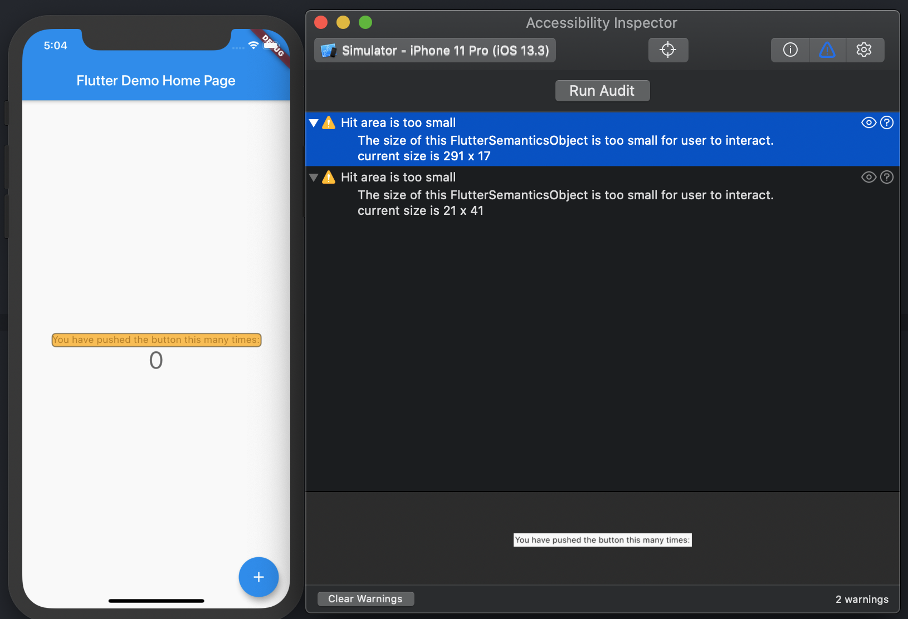

この記事は[Flutter 全部俺 Advent Calendar](https://adventar.org/calendars/4140) 1日目の記事です。


## このアドベントカレンダーについて
このアドベントカレンダーは [@itome](https://twitter.com/itometeam) が全て書いています。

基本的にFlutterの公式ドキュメントとソースコードを参照しながら書いていきます。誤植や編集依頼はTwitterにお願いします。

## アクセシビリティとはなにか
そもそもアクセシビリティという言葉が聞き慣れないという人もいると思うので、まずはアクセシビリティそのものについて軽く触れます。

[ウェブアクセシビリティ基盤委員会](https://waic.jp/knowledge/accessibility/)のサイトによると、
アクセシビリティは以下のように説明されています。

> ## ウェブアクセシビリティとは
>
> ウェブのアクセシビリティを言い表す言葉がウェブアクセシビリティです。
> ウェブコンテンツ、より具体的にはウェブページにある情報や機能の利用しやすさを意味します。
>
> さまざまな利用者が、さまざまなデバイスを使い、さまざまな状況でウェブを使うようになった今、
> あらゆるウェブコンテンツにとって、ウェブアクセシビリティは必要不可欠な品質と言えます。

これはWebサイトのアクセシビリティについての説明ですが、アプリも例外ではありません。
障害を持っている人もそうでない人もあらゆる人が使えるアプリにするためにはアクセシビリティについて
知ることが不可欠です。

Flutterの開発元であるGoogleもアクセシビリティに関する取り組みをしていて、Google I/Oでも
いくつかアクセシビリティに関するセッションが持たれています。



## Flutterでアプリを作るときに何をするべきか

さて、アクセシビリティとその重要性についてはこれまでに書いた通りですが、実際にアプリを開発するときに、
何をすればアクセシビリティを高めることができて、どのような指標でそれを測ればいいでしょうか？

まず、アプリを作るときに気をつけるべきことは例えば以下のようなことです。

- スクリーンリーダーに対応しているかどうか
- 文字やアイコンの色と背景色のコントラストが一定以上あるか
- 文字のサイズが小さすぎないか
- 文字のサイズが設定から変えられたときにレイアウトが崩れないかどうか

これらの項目は、FlutterのデフォルトのWidgetを使っていれば何も考えずとも達成されていることが多いです。
しかし、一部のケースや自作のWidgetをつかっている場合などは、別途対応が必要になることもあります。

## Flutterのスクリーンリーダー対応
Android/iOSはそれぞれ目が見えない人でもスマホを操作できるように、スクリーンリーダー(画面上のコンテンツを読み上げる機能)
を備えています。AndroidではTalkback、iOSではVoiceOverです。

Flutterでこれに対応するためには、`Semantics`Widgetを使います。`Semantics`Widgetで読み上げ対象にしたいWidgetを
囲うことで、スクリーンリーダーの挙動をコントロールできます。

例えばFlutter標準の`RawMaterialButton`や`Text`Widgetの内部では以下のように`Semantics`Widgetが使われています。

```dart
/// button.dart
    
    ...
    return Semantics(
      container: true,
      button: true,
      enabled: widget.enabled,
      child: _InputPadding(
        minSize: minSize,
        child: result,
      ),
    );
    ...
```

```dart
/// text.dart 
      
      ...
      result = Semantics(
        textDirection: textDirection,
        label: semanticsLabel,
        child: ExcludeSemantics(
          child: result,
        ),
      );
      ...
```

`Semantics`Widgetは実際に読み上げられる文字列を指定する`label`以外にも、ボタンかどうかや、子Widgetを持つかどうかなどを
指定して、スクリーンリーダーのコントロールをすることができます。

また、`Semantics`Widget以外にも、複数のWidgetを一つの読み上げにまとめる`MergeSemantics`やWidgetを読み上げの対象から
はずす`ExcludeSemantics`もあります。

標準のWidgetは基本的に適切な読み上げが設定されているので、開発者が気にすることはありませんが、例えば画像やアイコンのように
読み上げが設定されていなかったり適切な読み上げにならない場合もあるので、実際にスクリーンリーダーを有効化して自分のアプリを
試してみることが重要です。

## Flutterアプリのアクセシビリティを測定する
スクリーンリーダー対応は開発時に気をつけたりコードレビューに組み込んだりすることである程度は網羅性をあげられますが、
文字色のコントラスト比などは、目で見て確認することもコード上で確認することも難しいです。また、気をつけていてもうっかり
見落としてしまう部分もあります。

そのようなケースに対応するために、Android/iOSの両方でツールが用意されており、
Flutterアプリもそれらを使ってチェックをすることができます。

## ユーザー補助検証ツール
Androidでは、ユーザー補助検証ツールというアプリを使うことでアクセシビリティに関する問題点をチェックすることができます。



実際に使っている様子は以下です。スクリーンリーダーに対応できていない部分などが指摘されています。
(サンプルにしているのはFlutterのサンプルとして有名な
[history of everything](https://github.com/2d-inc/HistoryOfEverything)というアプリです。)



## Xcode Accessibility Inspector

iOSでは、Xcodeについている**Accessibility Inspector**を使うことでアクセシビリティに関する検証ができます。
Xcodeから`Xcode > Open DevTool > Accessibility Inspector`を選択することで実行でき、以下のようなエラーレポートを見ることができます。



## おわりに
Googleの発表によると、世界の潜在的なアプリユーザーの15%は何らかの障害を抱えているそうです。また障害を持たない人でも、
画面が見づらい屋外や手が塞がっている時など、アクセシビリティの支援機能を使った方が便利な場合もあります。

アクセシビリティに対応することで、ユーザーの満足度をあげられるだけでなく、+15%の潜在的なユーザーに立直することもできるかもしれません。

この記事で紹介した方法を使ってFlutterアプリ全体がもっとアクセシブルなものになれば嬉しいです。

<br/>

> **17日目: Flutterのアニメーションを使いこなしてカラーピッカーを実装する** :
>
> https://itome.team/blog/2019/12/flutter-advent-calendar-day17
>
> **19日目: FlutterのInternationalization対応** :
>
> https://itome.team/blog/2019/12/flutter-advent-calendar-day19
