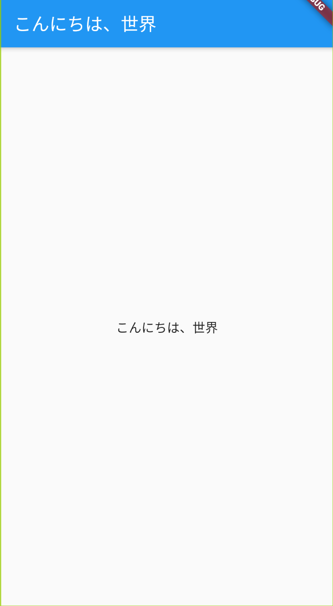
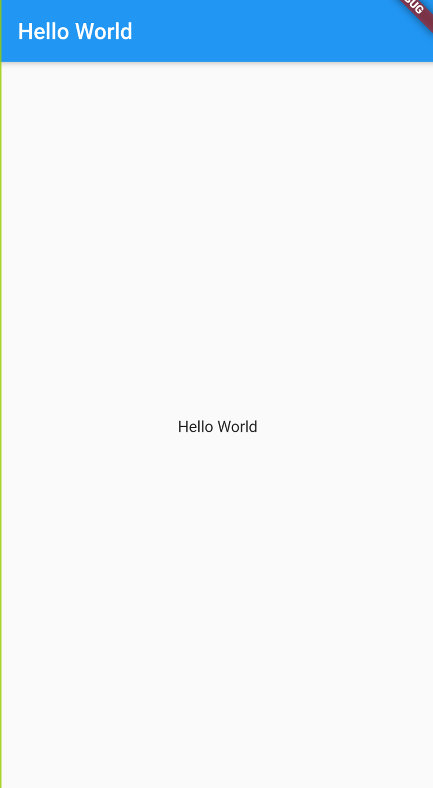

この記事は([Flutter 全部俺 Advent Calendar])(https://adventar.org/calendars/4140) 1日目の記事です。


## このアドベントカレンダーについて
このアドベントカレンダーは [@itome](https://twitter.com/itometeam) が全て書いています。

基本的にFlutterの公式ドキュメントとソースコードを参照しながら書いていきます。誤植や編集依頼はTwitterにお願いします。

## アプリの国際化
アプリの国際化とは、OSの設定に合わせて表示言語を変えられるようにすることで、多言語の人が使えるようにすることです。

## `flutter_localizations`
Flutter単体では国際化に対応していないので、`flutter_localizations`というパッケージを使って国際化します。

### `Localized`クラスを用意する

クラス名は何でもいいですが、最終的に`Localized.of(context).title`のような呼び出し方で頻繁に使うので、
短くてわかりやすいクラス名がいいです。

```dart
class Localized {
  Localized(this.locale);

  final Locale locale;

  static Localized of(BuildContext context) {
    return Localizations.of<Localized>(context, Localized);
  }

  static Map<String, Map<String, String>> _localizedValues = {
    'en': {
      'title': 'Hello World',
    },
    'ja': {
      'title': 'こんにちは、世界',
    },
  };

  String get title {
    return _localizedValues[locale.languageCode]['title'];
  }
}
```

文字列リソースに関しては、一旦`Map`で管理することにします。ここは後から改善します。

次に作った`Localized`クラスを`LocalizationsDelegate`クラスに渡せるようにします。

```dart
class SampleLocalizationsDelegate extends LocalizationsDelegate<Localized> {
  const SampleLocalizationsDelegate();

  @override
  bool isSupported(Locale locale) => ['en', 'ja'].contains(locale.languageCode);

  @override
  Future<Localized> load(Locale locale) async => Localized(locale);
  

  @override
  bool shouldReload(SampleLocalizationsDelegate old) => false;
}
```

`locad`メソッドで先ほど作った`Localized`クラスを返すのと、`isSupported`でサポートされた言語かどうかを
返すようにすればOKです。

最後に`SampleLocalizationsDelegate`を`MaterialApp`の`localizationsDelegates: `に渡します。

```dart
    return MaterialApp(
      onGenerateTitle: (BuildContext context) => Localized.of(context).title,
      localizationsDelegates: [
        const SampleLocalizationsDelegate(),
        GlobalMaterialLocalizations.delegate,
        GlobalWidgetsLocalizations.delegate,
      ],
      supportedLocales: [
        const Locale('en', ''),
        const Locale('ja', ''),
      ],
      home: ...,
    );
```

`SampleLocalizationsDelegate`以外に`GlobalMaterialLocalizations.delegate`と
`GlobalWidgetsLocalizations.delegate`を渡していますが、これはデフォルトのWidgetの
多言語対応のためのものです。日付のフォーマットやコンテキストメニューなどの多言語化のために必要なものなので、
追加しておいた方がいいです。

あとは、`MaterialApp`以下のWidgetで以下のようにアクセスするだけです。

```dart
      home: Scaffold(
        appBar: AppBar(
          title: Text(Localized.of(context).title),
        ),
        body: Center(
          child: Text(Localized.of(context).title),
        ),
      ),
```

これで設定から言語を切り替えるとアプリの言語も切り替わるようになりました。

| 日本語 | 英語 |
| ---    | ---  |
|  |  |

これで当初の目的であった多言語化対応はできましたが、文字列のリソースを`Map`で管理するのは、
型安全でなく、定義し忘れたときにランタイムでエラーが起こってしまいます。

普段日本語や英語の環境でデバッグしているなかで、ロシア語設定にしたときだけアプリが落ちたりするのは、
どう考えてもデバッグしづらいです。

そこで、これらのリソースをうまく管理する方法を考えてみましょう。

## 文字列のリソースを管理する
Flutterの多言語対応で調べると、ArbやJsonなどの外部リソースに言語ごとの文字列を設定しておいて、
そこから読み込み、もしくはコード生成を行っている例がほとんどだと思います。

それぞれのやり方に関しては以下のページを見るとわかりやすいです。

> [Dart/Flutter での多言語対応あれこれ](https://link.medium.com/6ksGnyUai2)
>
> Arbを使ってコード生成をする`intl_translation`が紹介されています。
>
> [eazy_localization](https://github.com/aissat/easy_localization)
>
> Jsonを読み込んで多言語対応するパッケージです。

これらのやり方はもちろん有効でカバーできる用途も多いですが、コード生成を複数回する必要があったり
型安全性が損なわれてしまったりと、まだ改善できそうな点も多い印象があります。

そこで今回はDartのコードだけで文字列を管理するようにします。

まず各言語の文字列を定義する`Message`クラスを用意します。

```dart
class Message {
  Message({
    @required this.title,
    @required this.greeting,
    @required this.counter,
  });

  final String title;
  final String greeting;
  final String Function(int) counter;

  factory Message.of(Locale locale) {
    switch(locale.languageCode) {
      case 'ja': return Message.ja();
      case 'en': return Message.en();
      default: return Message.ja();
    }
  }

  factory Message.ja() => Message(
    title: "こんにちは",
    greeting: "ようこそ",
    counter: (count) => "$count回クリックされました",
  );

  factory Message.en() => Message(
    title: "Hello",
    greeting: "Welcome",
    counter: (count) => "Clicked $count times",
  );
}
```

ここでは使いたいリソース名と、各言語向けの`factory`コンストラクタを用意しています。
文字列の中に数字などの変数を外部から注入したいときは、関数型で定義します。

次に、作った`Message`クラスに合わせてさきほどの`Localized`クラスを修正します。

```dart
class Localized {
  Localized(Locale locale): this.message = Message.of(locale);

  final Message message;

  static Message of(BuildContext context) {
    return Localizations.of<Localized>(context, Localized).message;
  }
}
```

さきほどまでは`Localized.of(context)`で`Localized`クラス自身を返していましたが、
代わりに`Message`クラスを返すようにしておきます。

あとは同様に各Widgetから表示したい文字列を取得するだけです。

```dart
      home: Scaffold(
        appBar: AppBar(
          title: Text(Localized.of(context).title),
        ),
        body: Center(
          child: Text(Localized.of(context).greeting),
        ),
      ),
```

手作り感があって若干不安になりますが、実装方法としては`Theme`の仕組みと全く同じです。
筆者はこの方法で問題なく開発ができています。

多言語対応は割とニッチな内容で、いまだにデファクトスタンダードがない状態ですが、
特に問題がなければ今回のようにシンプルな方法で実装して、チームのスケールや
連携方法についての問題があったときに、Arbを使ったDartコードの生成をしていくのが
よさそうだなと思っています。

<br>

> **18日目: Flutterのアクセシビリティを理解する** :
>
> https://itome.team/blog/2019/12/flutter-advent-calendar-day18
>
> **20日目: Flutterのテスト** :

> https://itome.team/blog/2019/12/flutter-advent-calendar-day20

