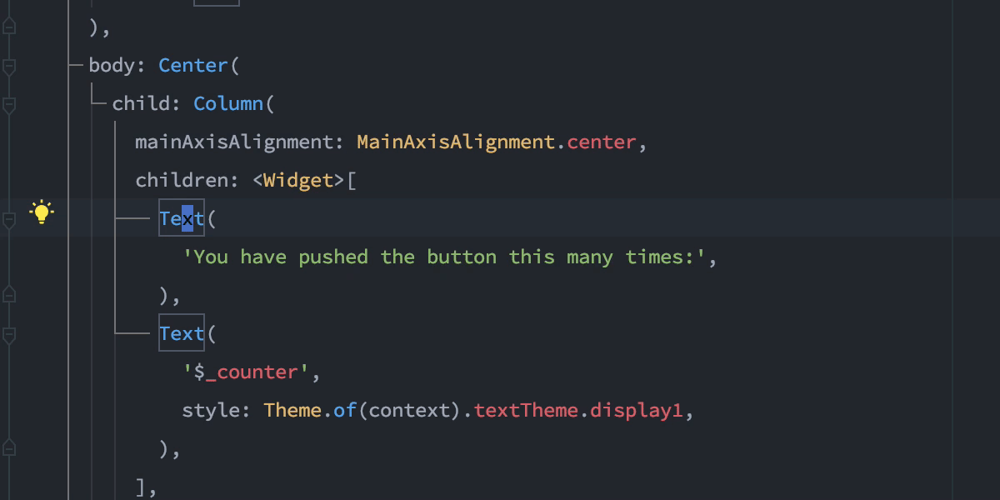
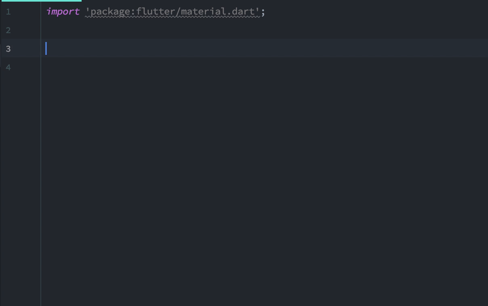
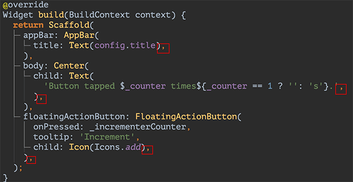

この記事は[Flutter 全部俺 Advent Calendar](https://adventar.org/calendars/4140) 2日目の記事です。

## このアドベントカレンダーについて
このアドベントカレンダーは [@itome](https://twitter.com/itometeam) が全て書いています。

基本的にFlutterの公式ドキュメントとソースコードを参照しながら書いていきます。誤植や編集依頼はTwitterにお願いします。

## Flutterの開発環境
Flutterには開発を効率化させるツールが多く用意されています。あまり目立たない便利機能も多いので、探してみると役に立つものがたくさんあると思います。
今回は自分が特に使っているものも含め、できるだけ網羅的に紹介していきます。

## エディタ
公式の推奨エディタはAndroid StudioとVisual Studio Codeですが、他の選択肢もあります。
バックエンドは全て [dart_analysis_server](https://github.com/dart-lang/sdk/tree/master/pkg/analysis_server) なので、補完、エラー表示、QuickFixなどの基本的な機能はどれを使っても同じです。

- Android Studio

Flutterプラグインを入れることで開発環境をセットアップすることができます。
他のエディタにはない機能も多いので、特に事情がなければAndroid Studioを選んでおくのがいいです。
たとえば、AndroidStudioにはWidgetの再ビルドをWidgetごとに監視できるGUIがついています。

- Visual Studio Code

Visual Studio Codeにも公式のFlutterのプラグインがあります。

https://marketplace.visualstudio.com/items?itemName=Dart-Code.flutter

- その他のエディタ

dart_analysis_serverはLanguage Server Protocolに対応しているので、Language Server Protocolクライアントが実装されているエディタであれば問題なく書くことができます。
筆者はEmacsの[lsp-mode](https://github.com/emacs-lsp/lsp-mode)にDart用のパッチを当てて使っています。

### エディタ共通の機能
#### QuickFix

Widgetで囲む、Widgetを削除する、Widgetの親子関係を入れ替えるなどの頻繁に行う編集を自動化してくれます。

#### Snippet

StatefulWidget, StatelessWidgetなどのテンプレートを補完することができます。

## DevTool

https://flutter.dev/docs/development/tools/devtools

ブラウザでFlutterのさまざまなデバッグができるパッケージです。Android StudioとVisual Studio CodeのFlutterパッケージに同梱されているものを使う以外に、コマンドラインからもインストールできます。
大きく分けて以下の6つの機能があります。

- Flutter Inspector

Widgetツリーの可視化、Repaint Rainbowの表示切り替え、Baselineの表示切り替えなどができます。Repaint Rainbowを使って無駄な再描画が走っていないか確かめることが多いです。

- Timeline

Flutterの画面描画を時系列に見ることができます。Dart、engineがそれぞれどれくらい時間を使っているかをみることができます。

- Memory

メモリの使用量を時系列に見ることができます。

- Performance

CPUの利用率などを時系列に見ることができます。

- Debugger

ソースコードにBreakPointをつけてデバッグができます。

- Logging

Flutterアプリのログを確認することができます。GCやフレーム作成のタイミングもロギングされるのでコマンドラインで見るよりも高機能で、さらにグラフィカルなためわかりやすいです。

## Analyzer

https://github.com/dart-lang/sdk/tree/master/pkg/analyzer

Dartのフォーマット、文法をチェックしてくれるLinterです。プロジェクトのルートに `analysis_options.yaml` を置くことで、プロジェクトごとに制約の強さや無効化するルールを指定することができます。
筆者は基本的に `analysis_options.yaml` の設定を強めに設定して、プロジェクト内で品質のブレが出ないようにしています。特につけるべきところに `const` をつけていないと警告が出るようにしておくと、
Flutterの最適化が聞きやすいので、パフォーマンスにも貢献してくれます。

## dart_style

https://github.com/dart-lang/dart_style

Dartのフォーマッタです。 `dartfmt` コマンドでコードの整形ができます。各エディタの整形機能や `dart_analysis_server` のLSPでも使われているので、エディタをセットアップすればすぐにつかうことができます。
また、Analyzerと連携して動くので、 `analysis_options.yaml` の設定に合わせてフォーマットしてくれます。

公式のドキュメントにもありますが、関数の実引数や配列の最後にコンマをつけると、フォーマッタが読みやすく整形してくれるのでおすすめです。

https://flutter.dev/docs/development/tools/formatting#using-trailing-commas

 

> **1日目: Flutterとはなにか** :
>
> https://itome.team/blog/2019/12/flutter-advent-calendar-day1
>
> **3日目: すぐにFlutterを始めたい人のためのDart入門(前編)** :

> https://itome.team/blog/2019/12/flutter-advent-calendar-day3
