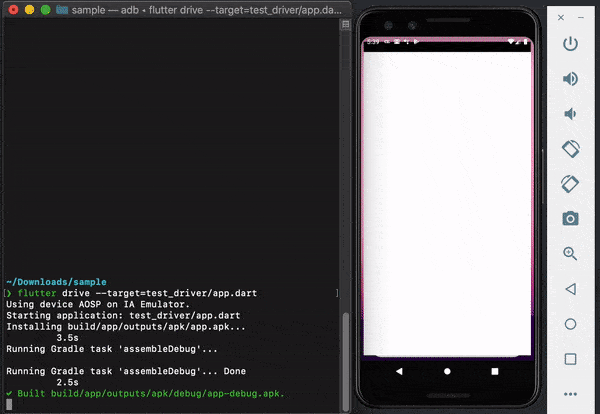

この記事は[Flutter 全部俺 Advent Calendar](https://adventar.org/calendars/4140) 20日目の記事です。


## このアドベントカレンダーについて
このアドベントカレンダーは [@itome](https://twitter.com/itometeam) が全て書いています。

基本的にFlutterの公式ドキュメントとソースコードを参照しながら書いていきます。誤植や編集依頼はTwitterにお願いします。

## Flutterのテストの種類

Flutterには大きく分けて、`Unit Text`、`Widget Test`、`Integration Test`が用意されています。

それぞれの特徴は以下の通りです。([公式ドキュメント](https://flutter.dev/docs/testing)より)

|              | Unit Test (単体テスト) | Widget Test (UIテスト) | Integration Test (統合テスト) |
|--------------|------------------------|------------------------|-------------------------------|
| 信頼性       | 低い                   | 高い                   | 最も高い                      |
| コスト       | 低い                   | 高い                   | 最も高い                      |
| 外部への依存 | 少ない                 | UnitTestより多い       | 最も多い                      |
| 実行速度     | 早い                   | 早い                   | 遅い                          |

### 単体テスト
一般的にはFlutterSDKを必要とせず、プレーンなDartのみで動くUIと切り離されたテストです。
APIの呼び出しなどの通信はモックしてテストを行います。

### Widgetテスト
FlutterのWidgetを仮想的に操作しながら行うテストです。Widget版の単体テストで、
あるWidgetが正しく動くかを保証するために行います。

### 統合テスト
アプリ全体が意図した通りに動くことを確認するためのテストです。コマンドラインで完結する他のテストと違い
実際にエミュレーターなどでアプリを立ち上げて行います。

あらかじめ定義しておいたテストスクリプトに合わせて、
仮想的に任意のWidgetをクリックしたり表示されている文字列をテストしたりすることで、より網羅的で統合的な
アプリを行うことができます。

人の手で行うデバッグをできるだけ自動化しようとするものです。

## どのテストをどれだけ行えばいいか
Flutterには以上のように複数の種類のテストが用意されていますが、どのテストをどれくらい行えばいいのか、
また、どのようなケースに対してテストを用意すればいいのかは悩ましいところです。

元も子もないことを言ってしまえば、全てのテストを網羅的にかければテストの信頼性を最大化することができますが、
テストにそこまでの時間をかけることは現実的ではありませんし、
テストを書くこと自体が目的化してしまうようなことは避けるべきです。

開発体制やその他の状況によって理想的なテスト設計は微妙に違ってくることを前置きとした上で
筆者の推奨するテスト設計は以下のようなものです。

- 状態管理に関してはWidgetからできるだけ切り離した上で網羅的にUnit Testを書く。
- Widgetテストは固有の機能を持つ汎用的なカスタムWidgetに関しては書く。
既存のWidgetを組み合わせただけのWidgetに対してはテストを書かない。
- 統合テストは必要になるまで書かない。ログインや決済などアプリの重要な機能や外部依存が強い機能に関して必要あれば書く。

テストのカバレッジとしては`Unit Test > Widget Test >>> Integration Test`の順で小さくなっていきます。

基本的にUnit Testでほとんどのテストができることが重要です。そのためテストの設計だけでなく、アプリケーション全体の
設計からテスト容易性に気をつけておくことが重要です。Flutterアプリの設計に関しては21日目から23日目の記事で重点的に
扱っていきます。

既存のWidgetを組み合わせただけのWidgetに対するテストは有効なテストにならないことが多いです。
これは、多くのWidgetはコンストラクタから渡されたものを表示するだけの`StatelessWidget`で、テストケースが
自明なものになりやすいからです。
逆に再利用可能なWidgetに関しては様々なユースケースを想定する必要があるので、
テストのコストパフォーマンスが大きくなりやすい傾向があります。

統合テストに関しては、よくテストされた部分の組み合わせであればあるほど効果が薄くなります。
もちろんOSのバージョンによる違いや、OSから提供されているAPIへアクセスする機能など、
統合テストでしかカバーできない範囲があることは事実なので、そういったケースに限り部分的に導入することはあります。

個人的には[Firebase Test Lab](https://firebase.google.com/docs/test-lab/?hl=ja)のFlutterサポートに
期待しています。複数のバージョンのOSで全自動の実機テストを行ってくれて、スクリーンショットも出してくれるので、
統合テストに期待する多くのケースに対応できそうです。

## テストの書き方

テストは`<projectRoot>/test`ディレクトリに書いていきます。
テストファイルの名前は`<対象のファイル名>_test.dart`とします。

あとは`main`関数にテストを書いていきます。

```dart
void main() {
  test('Counter value should be incremented', () {
    final counter = Counter();

    counter.increment();

    expect(counter.value, 1);
  });
}
```

`$ flutter test`を実行することで`test`関数に渡されたテストが実行されます。

`expect`関数で実際の値と意図した値が同じかどうかをテストすることができ、
`expect`関数の第二引数には実際の値以外にさまざまな`matcher`を渡すことができます。

よく使うmatcherは以下の通りです。

- `allOf()`: 全ての条件をクリアすればPass

```dart
void main() {
  test(".split() splits the string on the delimiter", () {
    expect("foo,bar,baz", allOf([
      contains("foo"),
      isNot(startsWith("bar")),
      endsWith("baz")
    ]));
  });
}
```

- `equals()`: 緩い等価性の比較(`==`)。`equals`を使わず直接値を指定した場合は厳密な比較(`===`)になる。
- `completes`: `Future`が終了しているかどうか

全てのmatcherは以下の記事にまとまっています。

> Dartのmacher一覧
>
> https://qiita.com/akinobu-tani/items/7e27b1f5281b7e897d3c 

## Widgetテストの書き方
Widgetテストも基本はUnit Testと同じですが、Widgetを操作するための関数が多く用意されています。

Widgetテストを書くにあたってはFlutter自体のソースコードを見るのが一番参考になります。
例として、`Align`Widgetのテストは以下のように書かれています(省略しています)。

```dart
  testWidgets('Align control test (RTL)', (WidgetTester tester) async {
    await tester.pumpWidget(Directionality(
      textDirection: TextDirection.rtl,
      child: Align(
        child: Container(width: 100.0, height: 80.0),
        alignment: AlignmentDirectional.topStart,
      ),
    ));

    expect(tester.getTopLeft(find.byType(Container)).dx, 700.0);
    expect(tester.getBottomRight(find.byType(Container)).dx, 800.0);

    await tester.pumpWidget(Directionality(
      textDirection: TextDirection.ltr,
      child: Align(
        child: Container(width: 100.0, height: 80.0),
        alignment: Alignment.topLeft,
      ),
    ));

    expect(tester.getTopLeft(find.byType(Container)).dx, 0.0);
    expect(tester.getBottomRight(find.byType(Container)).dx, 100.0);
  });
```

Widgetテストは`testWidget`関数という特別な関数でテストを実行します。
この関数は引数に`WidgetTester`を渡してくれるので、これを使っていきます。

`tester.pumpWidget`関数に対象のWidgetを渡すことで、内部でWidgetの実行(描画はしない)をしてくれます。
あとは、`terster`からWidgetの様々な情報が取得できるので、Widgetの内部が期待した状態になっているか
を確認することができます。


## 統合テストの書き方
統合テストはこれまでのテストとすこし様子が違います。`$ flutter create`で作成したアプリの雛形をテストしてみましょう。

`$ flutter create sample`でアプリを作ったら`flutter_driver`を依存に追加します。

```txt
dev_dependencies:
  flutter_driver:
    sdk: flutter
  test: any
```

テストを追加していきます。統合テストは`test_driver`ディレクトリ以下にテストファイルを追加していきます。
`test_driver/app_test.dart`に次のようなテストを用意しました。

```dart
import 'package:flutter_driver/flutter_driver.dart';
import 'package:test/test.dart';

void main() {
  FlutterDriver driver;

  setUpAll(() async => driver = await FlutterDriver.connect());

  tearDownAll(() => {
    if (driver != null) driver.close()
  });

  test('start at 0', () async => {
    expect(await driver.getText(find.byValueKey('count')), "0");
  });

  test('increment', () async => {
    await driver.tap(find.byValueKey('increment_button'));
    expect(await driver.getText(find.byValueKey('count')), "1");
  });
}
```

`FlutterDriver`というクラスを使ってFlutterアプリのタップ操作やテキストの監視をしています。
ボタンをタップしたときにカウンターが反応することを確かめるシンプルなテストです。

`find.byValueKey('count)`でWidgetで取得できるように、本体のアプリのWidgetに`Key`を指定しておきましょう。

```dart
Text(
  '$_counter',
  key: Key('count'),
  style: Theme.of(context).textTheme.display1,
),
```

次に`test_driver/app.dart`ファイルを作成して、テストで起動するためのアプリを実装します。

とはいっても`FlutterDriver`による操作を有効化した後、対象のアプリを立ち上げるだけです。

```dart
import 'package:flutter_driver/driver_extension.dart';
import 'package:counter_app/main.dart' as app;

void main() {
  // This line enables the extension.
  enableFlutterDriverExtension();

  // Call the `main()` function of the app, or call `runApp` with
  // any widget you are interested in testing.
  app.main();
}
```

これで、以下のコマンドを実行すると、エミュレーター上で自動テストが走ります。
(わかりやすいように200ミリ秒ごとに合計5回タップするようにしています。)

```txt
$ flutter drive --target=test_driver/app.dart
```




<br>

> **19日目: FlutterのInternationalization対応** :
>
> https://itome.team/blog/2019/12/flutter-advent-calendar-day19
>
> **21日目: Flutterのアプリ設計(Bloc)** :

> https://itome.team/blog/2019/12/flutter-advent-calendar-day21
