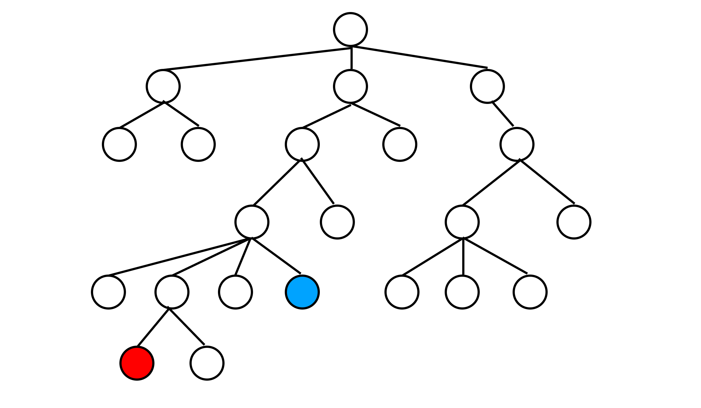
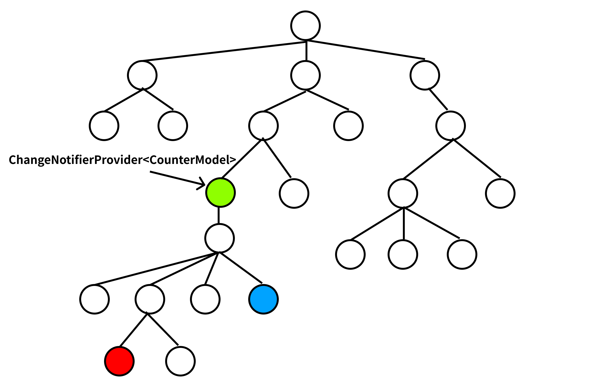
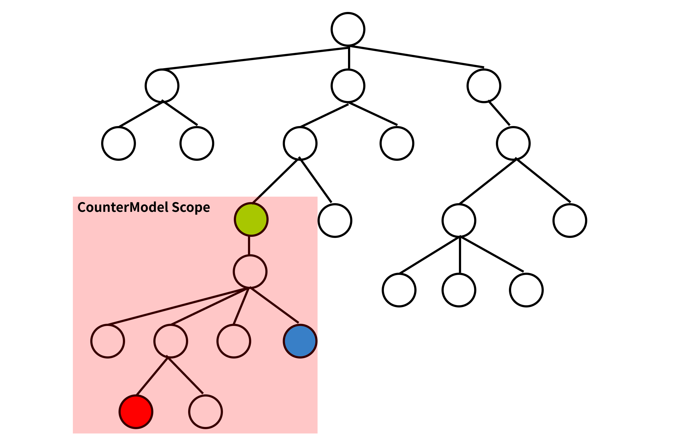

この記事は[Flutter 全部俺 Advent Calendar](https://adventar.org/calendars/4140) 1日目の記事です。


## このアドベントカレンダーについて
このアドベントカレンダーは [@itome](https://twitter.com/itometeam) が全て書いています。

基本的にFlutterの公式ドキュメントとソースコードを参照しながら書いていきます。誤植や編集依頼はTwitterにお願いします。

## Flutterアプリの設計
今日から3日間は、Flutterのスタンダードな設計について紹介していきます。

Flutterは他の開発環境に比べて若いため、設計に関する議論もまだ活発に行われているとは言いづらい状況ですが、
最近は公式の推奨やコミュニティの活発化によっていくつかのスタンダードなパターンが出てきました。

このアドベントカレンダーではその中からBlocパターン、Redux、MobXの3つをピックアップして紹介します。

これらの記事ではFlutterの`BuildContext`、`InheritedWidget`、`Provider`パッケージの理解を前提としています。
[6日目の記事](https://itome.team/blog/2019/12/flutter-advent-calendar-day6)と
[7日目の記事](https://itome.team/blog/2019/12/flutter-advent-calendar-day7)を先に読んでおくとわかりやすいと思います。

## Scoped Modelパターン

今日はBlocパターンの紹介をしますが、Blocパターンを理解するために、導入として
[7日目の記事](https://itome.team/blog/2019/12/flutter-advent-calendar-day7)でも`Provider`パッケージの
利用例として紹介したScoped Modelパターンについて触れていきます。

Scoped Modelは状態管理のためのオブジェクトを`Provider`によってFlutterのWidgetツリーに紐づけることで、
`Provider`以下のWidgetから状態の変更と状態が変更されたときの再描画をできるようにする設計です。

たとえば以下のようなWidgetツリーがあるとします。



青い丸で表されたWidgetを押すと、赤い丸で表されたWidgetに表示されている数字が増えるようなアプリを作るために、
カウントを管理するようなクラスを用意しておきます。この状態管理のためのクラスが、Scoped Modelの`Model`にあたります。

```dart
class CounterModel extends ChangeNotifier {
  int count = 0;

  void increment() {
    count++;
    notifyListeners();
  }
}
```

このクラスは、自身の持つ`count`の値が変更されたことを通知できるように、`ChangeNotifier`を実装しています。

さて、作成した状態管理クラスを青Widgetと赤Widgetで共有する必要がありますが、
Flutterにはそのための機能がデフォルトで用意されていました。そう、`InheritedWidget`です。



新たに追加された緑色の丸が`InheritedWidget`です。
`CounterModel`クラスを保持する`InheritedWidget`(図では`Provider`パッケージを使った`ChangeNotifierProvider`)を
Widgetツリーの上流に挟み込むことによって、それ以下のWidget全てから、共通の`CounterModel`を取得することができるようになります。

赤丸のWidgetで、`CounterModelProvider`から`CounterModel`を取り出して、`CounterModel`の変更通知を受け取れるように
しておきます。

```dart
class CounterText extends StatelessWidget {
  @override
  Widget build(BuildContext context) {
    return Text(
      Provider.of<CounterModel>(context).count.toString(),
      style: Theme.of(context).textTheme.display1,
    );
  }
}
```

青丸のボタンは、押されたときに`CounterModel`の`increment`メソッドを呼ぶだけです。

```dart
child: Consumer<CounterModel>(
  builder: (_, model, __) {
    return FlatButton(
      onPressed: model.increment,
      child: Icon(Icons.add),
    );
  }
),
```

これで、簡単なカウンターの状態管理をScoped Modelによって行うことができるようになりました。

ちなみに、`CounterModel`を取得できるのは、`InheritedWidget`の仕様から緑丸のWidgetより下流のWidgetのみでした。

つまり、`CounterModel`は以下の図の塗りつぶされた部分に閉じているということになります。



これが、**Scoped(スコープ付きの) Model**という名前の由来です。

## Scoped Modelの問題点
Scoped ModelはFuchsiaのソースコードでも使われていて、十分実用的な設計パターンですが、以下のような問題点があります。

- 一つのModelに複数の状態を持たせたときに、無関係なWidgetの再描画が走ってしまう。
- (第一の問題点を避けるために、)Modelが細分化しやすく、管理しづらい

今回のサンプルでは、状態が`count`変数だけだったので、問題になりませんでしたが、例えば
`count1`、`count2`、`count3`の3変数を管理しなければいけない場合を想定してください。

```dart
class CounterModel extends ChangeNotifier {
  int count1 = 0;
  int count2 = 0;
  int count3 = 0;

  void increment1() {
    count1++;
    notifyListeners();
  }

  void increment2() {
    count2++;
    notifyListeners();
  }

  void increment3() {
    count3++;
    notifyListeners();
  }
}
```

このときに、`increment1`を呼ぶと、`count2`と`count3`を使っているWidgetは値が更新されていないにもかかわらず再描画されてしまいます。
なぜなら、`CounterModel`全体が一つの`ChangeNotifier`であるため、「`count1`が更新された」ということを伝える手段がなく、
単に「`CounterModel`の中の変数のどれかが変更された」としか伝えられないからです。

それを解決するためにScoped Modelで実装する際には`Model`をできるだけ細分化することになりますが、細分化されすぎた状態は混乱を招きます。
そもそも、状態管理のスコープは描画の都合から切り分けて考えたいものです。

## Blocパターンによる改善
このような問題を解決するために導入するのがBlocパターンです。
Blocパターンでは、`CounterModel`全体を`ChangeNotifier`にする代わりに、各変数を`Stream`で囲みます。

```dart
class CounterModel extends ChangeNotifier {
  int count1 = 0;
  int count2 = 0;
  int count3 = 0;
}
```

```dart
class CounterModel {
  Stream<int> count1 = Stream.value(0);
  Stream<int> count2 = Stream.value(0);
  Stream<int> count3 = Stream.value(0);
}
```

実は、Scoped ModelパターンとBlocパターンの根幹の違いはここだけです。
`CouterModel`自体を`ChangeNotifier`とするのではなく、それぞれの変数を別の`Stream`とすることで、
それぞれの状態変更が別々に監視できるようになりました。

Dartの`Stream`クラスは送出専用なので、新しく値を流すことができません。
そのため実際には以下の3パターンのいずれかを併用します。

### `StreamController`を使うパターン

```dart
class CounterModel {
  final StreamController controller1 = StreamController<int>();
  final StreamController controller2 = StreamController<int>();
  final StreamController controller3 = StreamController<int>();

  Stream<int> get count1 => controller1.stream;
  Stream<int> get count2 => controller2.stream;
  Stream<int> get count3 => controller3.stream;
}
```

`StreamController`クラスは送出のための`Stream`と、値を送り出すための`Sink`クラスを持っているので、
値を更新することができます。

### `RxDart`パッケージを使うパターン
Android/iOSアプリを作っているとおなじみのRxがDart向けにも用意されています。
`StreamController`は現在の値(最後に送出した値)を保持できないので、
「現在の値を1増やす」という操作ができません。

`StreamController`の代わりに`RxDart`の`BehaviourSubject`を使うことで
値の保持ができるようになります。

それ以外は`StreamController`を使った例と変わりません。

### `async*`を使ったパターン
`async*`と`yield`を併用することによって`Stream`を作ることができます。
詳しくは[4日目の記事](https://itome.team/blog/2019/12/flutter-advent-calendar-day4/#async-await)を読んでください。

<br>

値を受け取るWidget側も少しだけ変更が必要です。値が`Stream`から流れてくるので、それを受け取るために
`StreamBuilder`を使います。

```dart
class CounterText extends StatelessWidget {
  @override
  Widget build(BuildContext context) {
    return StreamBuilder<int>(
      stream: Provider.of<CounterModel>(context).count1,
      initialData: 0,
      builder: (context, snapshot) {
        return Text(
          snapshot.data.toString()
          style: Theme.of(context).textTheme.display1,
        );
      }
    )
  }
}
```

これだけの変更でScoped ModelからBlocパターンに変更することができました。
もともとの概念がとても近い設計であることがよくわかります。

`Provider`を使って`Model`を提供する設計は、Blocパターンに限らず多くの設計パターンで
重要なアイデアになるので、Flutter開発において必須の知識です。この機会に是非慣れておきましょう。


<br>

> **20日目: Flutterのテスト** :
>
> https://itome.team/blog/2019/12/flutter-advent-calendar-day20
>
> **22日目: Flutterのアプリ設計(Redux)** :

> https://itome.team/blog/2019/12/flutter-advent-calendar-day22
