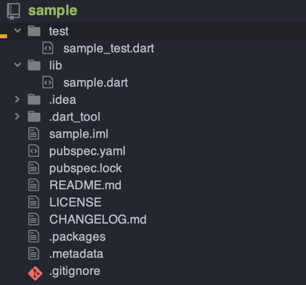
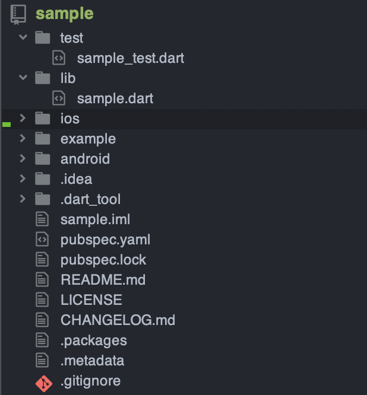
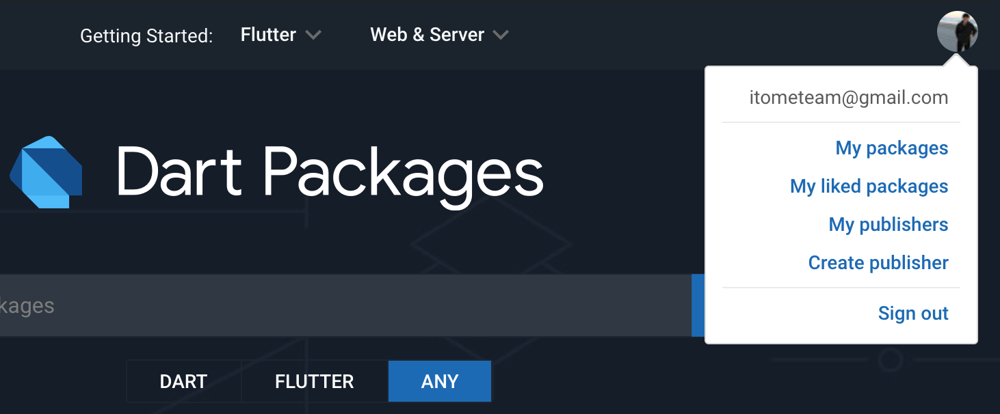
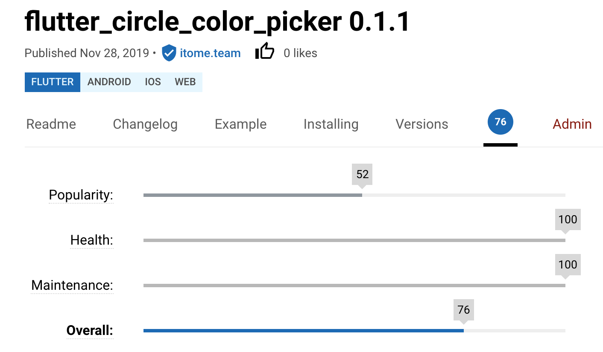
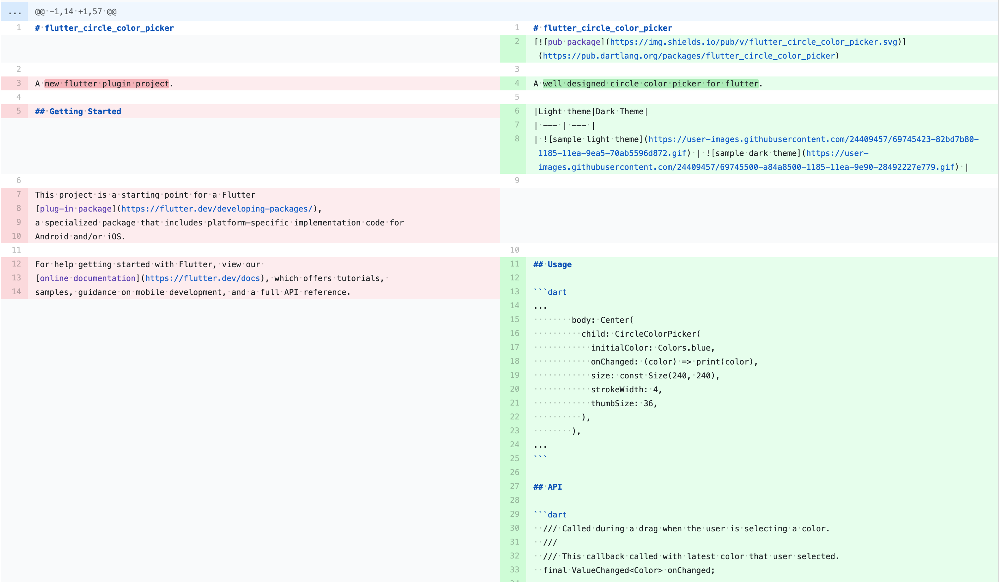
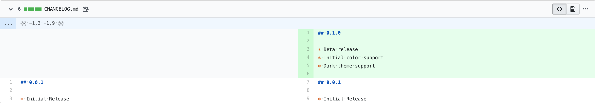
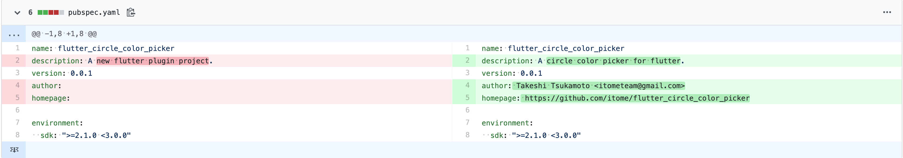
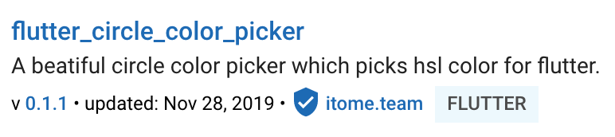
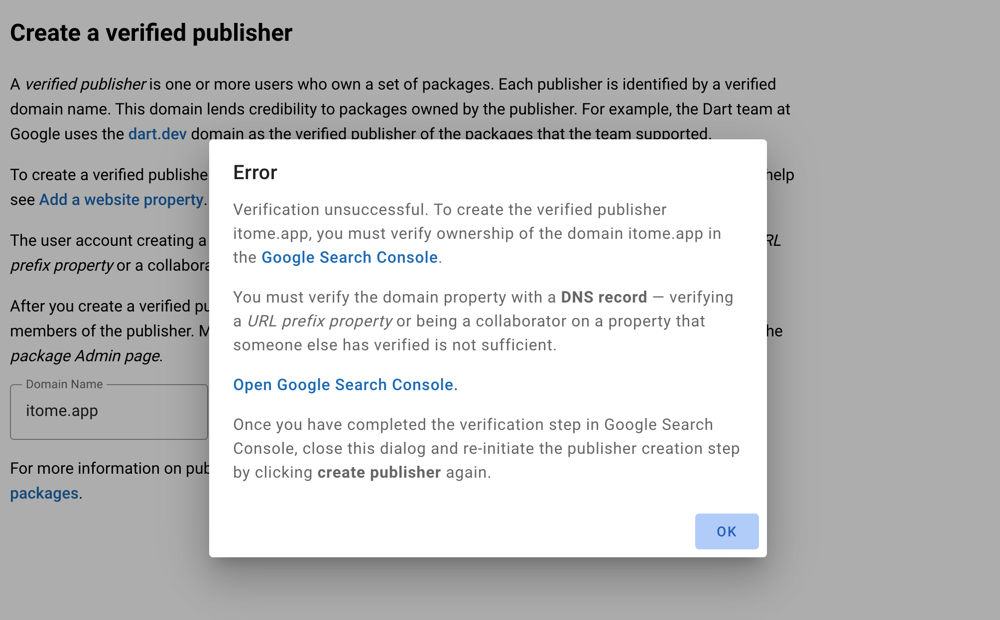
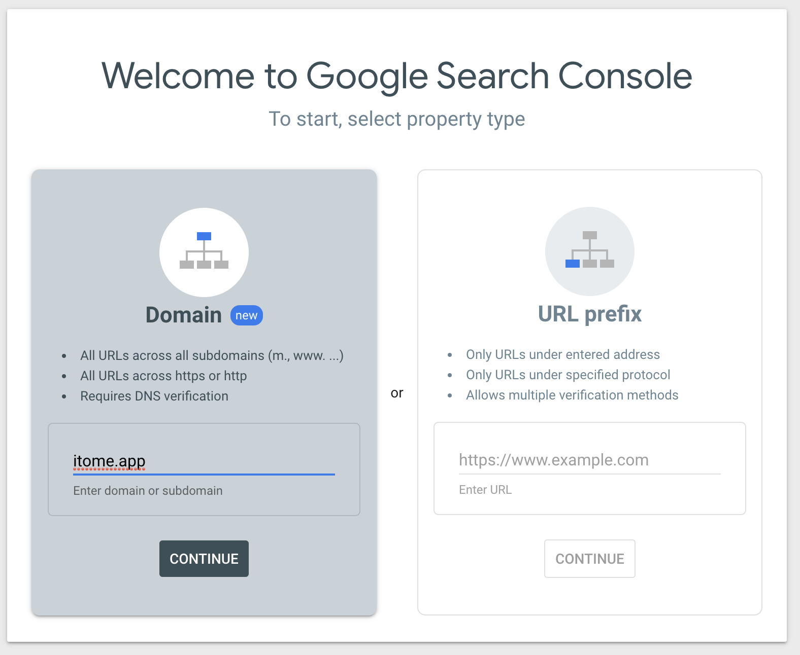

この記事は[Flutter 全部俺 Advent Calendar](https://adventar.org/calendars/4140) 24日目の記事です。


## このアドベントカレンダーについて
このアドベントカレンダーは [@itome](https://twitter.com/itometeam) が全て書いています。

基本的にFlutterの公式ドキュメントとソースコードを参照しながら書いていきます。誤植や編集依頼はTwitterにお願いします。

## 自作パッケージを作ることの意義
Flutterでパッケージ(他の言語でいうライブラリ)を作るのはとても簡単です。
パッケージ化することで、自分が関わっている複数のプロジェクトで共通の処理を再利用できたり、Flutterコミュニティに
資産を還元することができたりします。特に後者に関してはFlutterのような発展途上のフレームワークにとって最も重要なことです。

シンプルな実装やニッチなユースケースでも、どこかに同じような課題を抱えている人は必ずいますし、
パッケージができるだけ多く存在すること自体がコミュニティにとっていい影響を与えます。積極的にコードをパッケージ化していきましょう。

## パッケージの種類
Flutterのパッケージには大きく分けて2種類あります。`package`と`plugin`です。パッケージの種類の中に`package`があるのが
ややこしいですが、そういうものだと思って飲み込んでください。

- **`package`**
Dartのみで書かれた一般的なパッケージ。HTTP通信用のクラスなど、Flutter用に限らず様々な種類がある。

- **`plugin`**
Dartで書かれたコードに加えて、Android/iOSなどのネイティブAPIにアクセスするライブラリ。
`example`プロジェクトが用意されていて実際にアプリを動かしながら作ることができるので、
FlutterのWidgetを提供するパッケージも`package`ではなくこちらの雛形で作る。

## パッケージの作り方

パッケージ作成の最も簡単な始め方は、`flutter`コマンドの雛形から作り始めることです。
`package`と`plugin`で少し作り方が違うので別々に紹介します。

### `package`の場合

以下のコマンドでプロジェクトの雛形が作られます。

```txt
$ flutter create --template=package sample
```

作られたプロジェクトを開くと、以下のようなディレクトリ構成になっているはずです。



パッケージの実装は`lib/sample.dart`に書いていきます。ファイル名はプロジェクト名と同じにします。

`lib/sample.dart`には以下のような実装がサンプルとして書いてあります。

```dart
library sample;

/// A Calculator.
class Calculator {
  /// Returns [value] plus 1.
  int addOne(int value) => value + 1;
}
```

1行目はパッケージを作るためのキーワードなのでそのままにしておいて、
あとは自由に共通化したいDartのコードを書いていくだけです。

コードの動作確認はテストコードで行うことになるので、`test/sample_test.dart`に書いておきましょう。

`package`の準備はこれだけで、あとは公開するだけです。

### `plugin`の場合

以下のコマンドでプロジェクトの雛形が作られます。

```txt
$ flutter create --template=plugin sample
```



`plugin`はネイティブのAPIにアクセスするためプロジェクト構成が少し複雑です。

`lib`と`test`ディレクトリは先ほど説明した`package`にあるものと全く同じだと考えていいです。

`android`/`ios`ディレクトリは、通常のプロジェクトと同じでそれぞれのプラットフォームのプロジェクトが丸ごと入っています。
ここに、Android/iOSのネイティブAPIを使うコードを書いて、`lib/sample.dart`にDartとのブリッジを書くのが
`plugin`の基本的な作り方です。

ネイティブAPIにアクセスするコードの書き方については、[13日目の記事](https://itome.team/blog/2019/12/flutter-advent-calendar-day13)と
[14日目の記事](https://itome.team/blog/2019/12/flutter-advent-calendar-day14)を読んでください。

さて、これで`plugin`を実装することができましたが、テストコードで動作検証ができる`package`に対して、
ネイティブのAPIへのアクセスが必要となる`plugin`はコードだけで検証することはできません。

そこで、`plugin`の雛形には`example`プロジェクトが用意されています。`example`ディレクトリ以下は通常の
Flutterプロジェクトなので、そこで`plugin`のコードをインポートして実際にアプリを動かしながら開発をしていきます。

```txt
$ cd example
$ flutter run
```

## パッケージを公開する

さて、パッケージの実装が終わったら後は公開するだけです。まずは最短で公開してみましょう。

### ライセンス文を追加する
パッケージを公開するためにライセンス文が必須です。雛形の`LICENSE`ファイルは空欄になっているので、
各自適切なライセンス文を貼付しましょう。dartでは[BSD license](https://opensource.org/licenses/BSD-3-Clause)が推奨されていますが、
必ず内容を自分で確認しましょう。

### Googleアカウントを用意する
DartのパッケージはGoogleアカウントに紐づいて`pub.dev`に公開されます。そのためGoogleアカウントが必要です。

### `pub.dev`に公開する

あとは以下のコマンドで`pub.dev`にアップロードされます。
初回は認証のためにターミナルの指示に従ってurlを開いてGoogleログインをする必要があります。

```txt
flutter pub publish
```

アップロードが終わったら`pub.dev`にログインして、`My packages`に追加されていることを確認しましょう。



## パッケージのスコアをあげる

パッケージを公開すると、`pub.dev`に以下のように専用のページが作られます。

> https://pub.dev/packages/flutter_circle_color_picker

そのページのタブの一つにスコアがあります(下の画像の「76」部分)。



このスコアはパッケージのメンテナンス状況やユーザー数、ドキュメント充実度などによって自動で算出されている値で、
これが高いとユーザーに安心して使ってもらいやすくなります。

この値を上げて行きましょう。

### `README.md`を書く
プロジェクトの雛形に`README.md`ファイルがあるので、そこにパッケージのドキュメントを書きましょう。このファイルはGitHubだけでなく、
`pub.dev`のページにも表示されるので、ここが充実しているかはユーザーにとっても大きな指標になります。



> https://github.com/itome/flutter_circle_color_picker/commit/30c08d5b5f43fdf28e2740280ae9e3b050bc7aa4

### `CHANGELOG.md`を書く
バージョンごとの差分を書く`CHANGELOG.md`も指標になります。こちらも`README.md`と同様に書いておきます。



> https://github.com/itome/flutter_circle_color_picker/commit/0f3625cad2934e5b28b92ae07302e8e3af29e32c

### `pubspec.yaml`を書く
`pubspec.yaml`の情報は`pub.dev`に表示されるので、きちんと書いておきましょう。



> https://github.com/itome/flutter_circle_color_picker/commit/f5ce89ac1b047dec68dccd33d308bec6ae8ed272

### `verified publisher`になる
`pub.dev`に登録されているパッケージの作成者ははこれまで`pubspec.yaml`の`author`として書いてある人が登録されていましたが、
最近`author`の項目が非推奨になり、代わりに`verified publisher`という仕組みを使うことが推奨されるようになりました。

`verified publisher`は、認証された独自ドメインをユーザーに紐づけることによって、オーナーの信頼性をより高くする仕組みです。
有料のドメインは誰でも無料で取得できるGmailアドレスよりも取得が難しいのでハードルは上がりますが、その代わり公式の認証を受けることができます。

`verified publisher`になると、パッケージの作成者欄に公式のマークと登録したドメイン名が表示されます。
TwitterやInstagramの公式マークのようなものですね。



公式の認証というとかなり大仰に聞こえますが、独自ドメインさえ持っていれば誰でも取得できます。

まず、`pub.dev`にログインして、以下のページに自分のドメインを入力します。

> https://pub.dev/create-publisher

すると、以下のようにエラーが出ると思います。要約するとGoogleがこのドメインの所有権が自分にあることを確認できていない旨が書かれています。



指示に従って`Google Search Console`を開きます。開いたページの左の欄に自分のドメインを打ち込むと、
DNSの設定をするための手順が表示されるので、ドメインのホストサイトでTXTレコードの編集を行います。

このとき、`Google Search Console`にログインしているアカウントが
`pub.dev`に登録しているGoogleアカウントと同じであることを必ず確認してください。



これで完了です。しばらくするとDNSの設定がGoogle Search Consoleに反映されます。
反映が終わったら、先ほどのCreate Publisherページでもう一度ドメインを入力します。

ここでエラーが出なければアカウントとドメインが紐付けられて、晴れてあなたも`verified publisher`です。

## パッケージを公開するときの注意点
パッケージを公開する手順は以上で終わりですが、一点公開前に注意しなければいけないことがあります。
それは、「**一度公開したパッケージは絶対に削除できない**」ということです。

たとえばパッケージ公開を試してみるためだけの`hoge`のような適当な名前のパッケージを公開したら、
それを削除することが一切できなくなります。

`discontinued`というパッケージのメンテナンスをやめるバッジをつけることはできますが、
パッケージのサイトに`DISCONTINUED`と表示されるだけで引き続きダウンロードも閲覧も可能なままです。

また、パッケージをアップデートしても過去のバージョンは全て`pub.dev`からダウンロード可能です。
そのため、秘密の情報などをアップロードしてしまうと取り返しがつかなくなります。

パッケージを公開する前には必ずダブルチェックを行い、公開してはいけない情報が含まれていないか確認しましょう。


## 参考資料

> https://flutter.dev/docs/development/packages-and-plugins/developing-packages
>
> https://dart.dev/tools/pub/publishing


<br>

> **23日目: Flutterのアプリ設計(Mobx)** :
>
> https://itome.team/blog/2019/12/flutter-advent-calendar-day23
>
> **25日目: Flutter for Webを理解する** :

> https://itome.team/blog/2019/12/flutter-advent-calendar-day25
