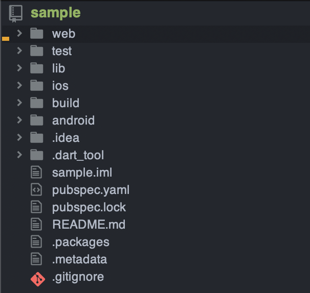
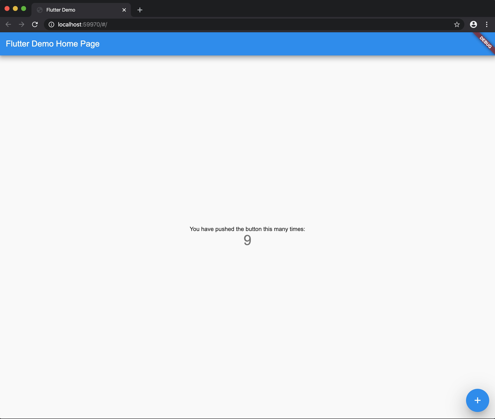

この記事は[Flutter 全部俺 Advent Calendar](https://adventar.org/calendars/4140) 25日目の記事です。


## このアドベントカレンダーについて
このアドベントカレンダーは [@itome](https://twitter.com/itometeam) が全て書いています。

基本的にFlutterの公式ドキュメントとソースコードを参照しながら書いていきます。誤植や編集依頼はTwitterにお願いします。

## Flutter for Web
アドベントカレンダー最終日となる今日は、Android/iOSに次ぐ新しい対応プラットフォームであるWebについてです。

Flutter for WebはFlutterのv1と同時に発表され(そのときはHummingbirdというコードネームで呼ばれていました)、
2019年のGoogle I/OでFlutter for webとしてパブリックプレビューとなりました。

Hummingbird時代は別レポジトリとして進められていましたが、Flutter for Webという名前になったタイミングでFlutter本体に
取り込まれました。そのため、Flutterv1.5.4以降はセットアップなしで始められます。

## Flutter for Webはどうやって動いているのか
詳しくは`engine`の領域ですが、概念だけ説明します。

Android/iOSでは、C++で書かれた共通の`engine`が動いていますが、Webはそれらとは全く別にベースが実装されています。
Webのベース部分はDartで実装されており、そのコードは、dart2jsのトランスパイラでJavascriptに変換されブラウザ上で動作します。

描画にはブラウザの`canvs`が使われており、そこに描画するプロセスはAndroid/iOSと同じです。そのため、Web対応とAndroid/iOS対応の
間の根本的な違いはベースの実装言語が違うことだけです。

それ以外にも`plugin`系ライブラリの対応状況がAndroid/iOSと違ったり、プラットフォーム固有のAPIがJavascriptから提供されていたりと
細かい違いはありますが、それはあくまでプラットフォームごとの対応状況の違いであってAndroid/iOS間の差異と根本的な違いはありません。

つまり、Flutter for WebとはAndroid/iOSで動くアプリを文字通りそのままWebの世界に持ってくる試みです。

これによってアプリとWebの違いを気にすることなくアプリを開発することができるという大きなメリットがありますが、
一方でブラウザ独自の挙動の違いを吸収できていない部分もあります。

例えば、ブラウザでは当然のテキスト選択やTabキーによる要素の移動などがそれにあたります。
また、アプリの挙動をそのまま持ってきているので、PCブラウザでもドラッグしてスクロールできてしまいます。

PCブラウザで見ると、PC上のエミュレーターでネイティブアプリを動かしている感覚に近い操作感になります。
実際にFlutter for Webで書かれた以下のサイトを触ってみてください。

> https://flutter.github.io/samples/

## 動かしてみる
実際にFlutter for Webを動かしてみましょう。

現在Flutter for Webを動かすには`beta`チャンネルに切り替えた上でWebサポートを有効化する必要があります。

```txt
$ flutter channel beta
$ flutter upgrade
$ flutter config --enable-web
```

Webサポートを有効化すると`$ flutter device`コマンドに`Chrome`が追加されます。

```txt
$ flutter devices
3 connected devices:

AOSP on IA Emulator • emulator-5554 • android-x86    • Android 9 (API 28) (emulator)
Chrome              • chrome        • web-javascript • Google Chrome 79.0.3945.88
Web Server          • web-server    • web-javascript • Flutter Tools
```

Webサポートを有効化した状態で通常の`$ flutter create`を実行してみます。

```txt
$ flutter create sample
```

すると、通常のAndorid/iOSに加えてWebサポートもされたプロジェクトが作られます。



ちなみに、Webサポートを有効化した状態で以下のコマンドを実行することで、
既存のFlutterプロジェクトにWebサポートを追加することができます。

```txt
$ flutter create .
```

早速デバイスにchromeを指定してアプリを走らせてみます。

```txt
$ flutter run -d chrome
```

Chromeの新しいウィンドウが立ち上がっておなじみのカウンターアプリが表示されます。



あとはAndroid/iOSと同様に開発を進められます。

## Flutter for Webの制限
Flutter for Webには、まだかなり多くの制限があります。

- `Text`Widgetがデフォルトでselectableでない。

`SelectableText`を使う必要があります。

- `Platform channel`が使えない。

Dartから直接JavascriptのAPIにアクセスすることができるので、そもそも`Platform channel`を使う必要がありません。
ただ、Android/iOS向けのpluginと実装が分かれてしまうので、公式のパッケージなども分化してしまっているのが現状です。
例えば、`url_launcher`はWebサポートが`url_launcher_web`パッケージに分かれています。
せっかくのクロスプラットフォームなのでここもシームレスに扱えるようになってほしいです。

- `Hot Reload`が効かない

全て`Hot Restart`になってしまいます。

- ブラウザの進むボタンに対応していない

- `Platform.isWeb`でWebかどうかを判定できない。

`kIsWeb`という定数を使う必要があるそうです。

## Flutterのこれから

> https://flutter.dev/docs/development/platform-integration/web#is-the-web-version-of-flutter-ready-for-production

公式のドキュメントにもあるとおり、Flutter for WebはまだProduction Readyではありません。
実際に筆者が開発をしてみても、確かにまだまだProduction環境に投入できる状態ではありませんでした。

しかし、FlutterのWebサポートは現在かなり活発に開発が進んでいて、
昨日できなかったことが今日できるようになるようなことも多くあります。

このまま開発が進んでいけば来年中にでも、簡単なアプリであれば実戦投入できるようになるかもしれません。

Flutterは、Android/iOS/Webだけでなく、MacOS、Windows、果てはFuchsiaまで、
さまざまなプラットフォームをサポートしようとしています。

開発元がGoogleという巨大Web企業で、コミュニティも正式リリース以降大きな盛り上がりをみせています。

私たち開発者が夢に見る`Write once, Run everywhere`の地平に、
Flutterと共にたどり着くことができる未来を楽しみにしています。

<br>

>
> **24日目: Flutterの自作パッケージを作る** :

> https://itome.team/blog/2019/12/flutter-advent-calendar-day24
