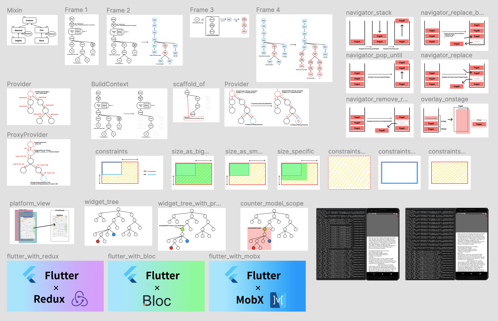

この記事は[Flutter 全部俺 Advent Calendar](https://adventar.org/calendars/4140) 26日目の記事です。

## Flutter 全部俺 Advent Calendarについて
タイトルそのまんまなんですが、[@itome](https://twitter.com/itometeam)によるFlutterのAdvent Calendarです。

記事一覧をこのページの一番下に置いているので、興味がある人は読んでみてください。

基本的に1記事1テーマですが、前後の記事を引用しているところがあるので順番に読んでもらえるのが一番わかりやすいと思います。

## 書こうと思ったきっかけ
2018年にFlutterの正式リリースが発表されてから、Flutterへの注目度が高くなっていて、
調べれば入門記事には事欠かなくなりました。

一方で、入門を超えて実践レベルの知識は、(特に日本語では)まだあまり多くなく、網羅されてはいない印象でした。

そこで、Flutterを触ってみてこれから本格的に使っていこうとする人が
読めば、それだけで実践的なアプリを開発できるような記事をまとめて書きたいなと思っていました。

そんな折にちょうどいいタイミングで12月になったので、Advent Calendarに乗っかったという経緯です。

もしこの記事を読んでFlutterに興味を持ってくれた人がいたら、
すぐに自分のAdvent Calendarを読み始めるよりも以下のCodelabを2本やってからのほうが理解が早いと思います。

> Write Your First Flutter App, part 1
>
> https://codelabs.developers.google.com/codelabs/first-flutter-app-pt1/#0
>
> Write Your First Flutter App, part 2
>
> https://codelabs.developers.google.com/codelabs/first-flutter-app-pt2/#0

## 書き方
11月から書き始めたので、だいたい2ヶ月かかりました。2/3くらいは完全に自分の時間で書いたのですが、
12月から社内のDXを改善するチームでFlutterの社内推進を兼務することになったので、もう1/3はその時間を使って書きました。

図はFigmaをぽちぽちやって作りました。

最終的に、作った画像は31枚、サンプルアプリは23個、総文字数は27万文字くらいでした。
文字数には半分くらいコードが入っていますが、書店にあるような技術書が15万文字くらいらしいので、
一冊弱くらい書いたと思うと自分でも意外と頑張ったなと思います。

## 感想
量が多かったのでそれなりに大変でしたが書いてよかったです。

技術ブログを書くハードルがだいぶ下がったので、
時間の都合で詳しく書ききれなかった部分から少しずつ継続的に書いていければいいなと思っています。

また、せっかく書いたんだから再編集して製本して技術書展に出したらどうかと同僚に勧められたので、
もし時間があったら本にするかもしれないです。技術書展のノリがあまりわかっていないので、詳しい人がいたら教えてください。

## 記事一覧
- **12月01日** [Flutterとはなにか](https://itome.team/blog/2019/12/flutter-advent-calendar-day1)
- **12月02日** [Flutterのツールを使いこなして開発効率を上げる](https://itome.team/blog/2019/12/flutter-advent-calendar-day2)
- **12月03日** [すぐにFlutterを始めたい人のためのDart入門(前編)](https://itome.team/blog/2019/12/flutter-advent-calendar-day3)
- **12月04日** [すぐにFlutterを始めたい人のためのDart入門(後編)](https://itome.team/blog/2019/12/flutter-advent-calendar-day4)
- **12月05日** [FlutterのWidgetが画面に描画されるまでを理解する](https://itome.team/blog/2019/12/flutter-advent-calendar-day5)
- **12月06日** [FlutterのBuildContextとInheritedWidgetを理解する](https://itome.team/blog/2019/12/flutter-advent-calendar-day6)
- **12月07日** [FlutterのProviderパッケージを使いこなす](https://itome.team/blog/2019/12/flutter-advent-calendar-day7)
- **12月08日** [Flutterのパフォーマンスを改善する](https://itome.team/blog/2019/12/flutter-advent-calendar-day8)
- **12月09日** [FlutterのBoxConstraintsを理解する](https://itome.team/blog/2019/12/flutter-advent-calendar-day9)
- **12月10日** [FlutterのNavigationとRoutingを理解する](https://itome.team/blog/2019/12/flutter-advent-calendar-day10)
- **12月11日** [Flutterを既存のAndroid/iOSアプリに組み込む](https://itome.team/blog/2019/12/flutter-advent-calendar-day11)
- **12月12日** [FlutterのThemeを理解する](https://itome.team/blog/2019/12/flutter-advent-calendar-day12)
- **12月13日** [FlutterのPlatformViewを理解する](https://itome.team/blog/2019/12/flutter-advent-calendar-day13)
- **12月14日** [FlutterでAndroid/iOSのネイティブのAPIを使う](https://itome.team/blog/2019/12/flutter-advent-calendar-day14)
- **12月15日** [Flutterのアニメーションを理解する(前編)](https://itome.team/blog/2019/12/flutter-advent-calendar-day15)
- **12月16日** [Flutterのアニメーションを理解する(後編)](https://itome.team/blog/2019/12/flutter-advent-calendar-day16)
- **12月17日** [Flutterのアニメーションを使いこなしてカラーピッカーを実装する](https://itome.team/blog/2019/12/flutter-advent-calendar-day17)
- **12月18日** [Flutterのアクセシビリティを理解する](https://itome.team/blog/2019/12/flutter-advent-calendar-day18)
- **12月19日** [FlutterのInternationalization対応](https://itome.team/blog/2019/12/flutter-advent-calendar-day19)
- **12月20日** [Flutterのテスト](https://itome.team/blog/2019/12/flutter-advent-calendar-day20)
- **12月21日** [Flutterのアプリ設計(Bloc)](https://itome.team/blog/2019/12/flutter-advent-calendar-day21)
- **12月22日** [Flutterのアプリ設計(Redux)](https://itome.team/blog/2019/12/flutter-advent-calendar-day22)
- **12月23日** [Flutterのアプリ設計(Mobx)](https://itome.team/blog/2019/12/flutter-advent-calendar-day23)
- **12月24日** [Flutterの自作パッケージを作る](https://itome.team/blog/2019/12/flutter-advent-calendar-day24)
- **12月25日** [Flutter for Webを理解する](https://itome.team/blog/2019/12/flutter-advent-calendar-day25)
