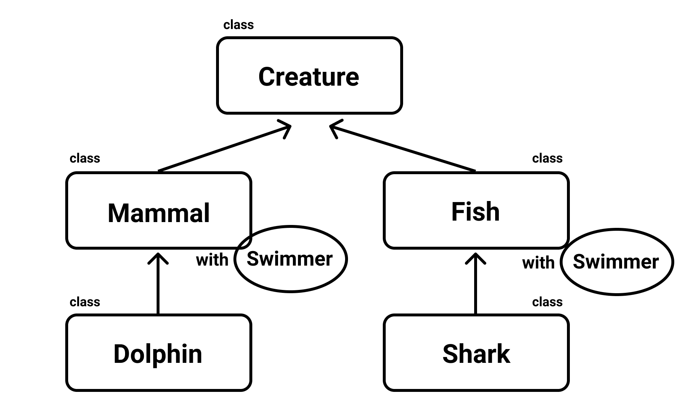

この記事は[Flutter 全部俺 Advent Calendar](https://adventar.org/calendars/4140) 3日目の記事です。

## このアドベントカレンダーについて
このアドベントカレンダーは [@itome](https://twitter.com/itometeam) が全て書いています。

基本的にFlutterの公式ドキュメントとソースコードを参照しながら書いていきます。誤植や編集依頼はTwitterにお願いします。

## Dartについて
DartはGoogleがJavascriptの持っている根本的な問題を解決するために作った言語です。
もともとは完全にJavascriptを置き換える目的で、専用のDartVM上で動く言語として作られていました。

> "We have decided not to integrate the Dart VM into Chrome."
> http://news.dartlang.org/2015/03/dart-for-entire-web.html

しかし、結果的にその試みはうまく行かず、ChromeにDartVMが統合されことはありませんでした。
その後は他のAltJS言語と同様に、Javascriptへトランスパイルする方針に切り替えられました。

FlutterではAndroid/iOS版ではDartVMが、Web版ではJavascriptへのトランスパイラが使われています。

## Flutterを書くためのDart言語入門
すぐにFlutterを始めるためのDartのチュートリアルです。Flutterで頻出の文法を中心に紹介します。

## 関数
CやJavaと同じように返り値の型を先に書きます。

```dart
Widget build(BuildContext context) {
  return ...
}
```

### 名前付き引数

```dart
Widget calculate({int a, int b}) {
  return ...
}

calculate(a: 1, b: 2);
```

引数のリストを `{}` で囲むことで、名前付き引数を定義できます。通常の引数と名前付き引数の併用も可能です。

名前付き引数のみオプショナルです。
また、名前付き引数は実引数の順番を気にせずに呼び出すことができ、デフォルト引数を指定することもできます。

名前付き引数を名前を指定せずに呼び出したり、通常の引数を名前付きで呼び出したりすることはできません。

```dart
void func(
  int hoge,  // 通常の引数。呼び出し元は必ず第一引数に指定する。
  {
    int fuga, // 名前付き引数。
    @required int foo // 名前付き引数。指定しなければ警告が出る。
    int bar = 2, //名前付き引数。指定されなければ2が入る。
  }
) {
  ...
}

func(1, foo: 2); // fugaは指定しなくてもいい
```

通常の引数と名前付き引数の使い分けを表にするとこのような感じになります。

|  | 名前をつけずに呼び出し | 名前をつけて呼び出し | 呼び出し側の指定 | デフォルト引数 |
| ---- | ---- | ---- | ---- | ---- |
| 通常の引数 | ⭕ | ❌ | 必須 | ❌ |
| 名前付き引数 | ❌ | ⭕ | オプショナル | ⭕ |

## 型
すべての型は `Object` を継承していて、KotlinやSwiftのような `nullable/nonnul` の区別はありません。
似たような概念に `dynamic` がありますが、これは「なんの型なのかわからない」という状態を表すものです。

数値型は `int` と `double` のみです。以前は `double` の引数に `int` を代入することはできなかったのですが、
Dart2.1以降は暗黙的に変換されるようになりました。
そのためFlutterのサンプルやテンプレートには実引数に `.0` をつけていることが多いですが、
2.1以降のバージョンを使っている人は `int` でそのまま指定できます。

```dart
  child: SizedBox(
    width: 24.0,
    height: 24.0,
    child: Container(...),
  )
```

**↓ Dart2.1以降**


```dart
  child: SizedBox(
    width: 24,
    height: 24,
    child: Container(...),
  )
```

## 高階関数
Flutterではコールバックの定義などで高階関数を多用します。 `BuildContext` を受け取って `Widget` を返す関数は以下のように定義します。

```dart
Widget Function(BuildContext) builder = (context) => Container();
```

これでもコードとしては正しいですが、返り値前置の構文のせいでで型が見づらいのでFlutterのソースコードでは事前に `typedef` されていることがほとんどです。

```dart
typedef WidgetBuilder = Widget Function(BuildContext context);

WidgetBuilder builder = (context) => Container();
```

呼び出し側はJavascriptと同じような構文です。

```dart
builder: (context) {
  return Container();
},
```

返り値のみの関数であればアロー関数も使うことができます

```dart
builder: (context) => Container(),
```

## 変数の宣言

型推論してくれるので初期値から型が明らかなときは `var` で宣言できます。

```dart
var a = 1; // int a = 1; と同じ。
```

### final

再代入不可能な変数の宣言には `final` を使います。 
`final` は参照先の変更はできるため、 `List<T>` を `final` で宣言しても要素の追加や削除はできるので注意が必要です。

```dart
final int a = 1; // 型推論を使って final a = 1; とも書ける。 

final list = [1];
list.add(1); // 参照先の内部の変更は可能
```

### const

コンパイル時定数の宣言には `const` を使います。 `final` のように再代入不可能であると同時に参照先の内部の変更もできません。
また、ある型のインスタンスを `const` で宣言するためには、その型のコンストラクタに `const` が指定してある必要があります。
そのため `final` よりも制約がつよいですが、
Flutterでは `const` 修飾子がついているWidgetに関しては再描画の処理をしないという最適化が行われているため、
つけられるときは積極的につけたほうがいいです。 
2日目の記事の `dartanalyzer` を使うことで、 `const` をつけるべきところを指摘してくれるので有効活用しましょう。

```dart
// FlutterのCenterWidgetの定義、コンストラクタがconst指定してある
class Center extends Align {
  /// Creates a widget that centers its child.
  const Center({ Key key, double widthFactor, double heightFactor, Widget child })
    : super(key: key, widthFactor: widthFactor, heightFactor: heightFactor, child: child);
}
```

```dart
...
  // canst指定して初期化することで無駄な再描画を減らす
  child: const Center(
    child: Text(...),
  ),
...
```

## getter/setter

以下のように書くことで、setter/getterを定義することができます。

```dart
int _a = 1;

int get a => _a;

int set a(value) {
  _a = value;
}
```

## クラス

クラスは他の言語と同じようにフィールド、メソッドの定義ができます。インスタンス化は `new` をつけてもつけなくても同じ結果が得られます。
( `new` をつけないコンストラクタはDart2以降に追加された機能です。古いサンプルなどは `new` を使っているところも多いですが、新しく書く場合は `new` をつけないほうが推奨されています。)

```dart
class Rectangle {
  const Rectangle(
    this.height,
    this.width,
    this.x,
    this.y,
  )
  
  final int height;
  final int width;
  final int x;
  final int y;
}

final rect = Rectangle(height: 100, width: 100, x: 0, y: 0);
```

明示的なインターフェース宣言はなく、クラスの定義のときに暗黙的にインターフェースが作成されます。

### コンストラクタ

コンストラクタはJavaと同じようにクラス名と同名の関数です。

```dart
class Dog {
  String name;

  Dog(String name) {
    this.name = name;
  }
}
```

フィールドの初期化は省略して以下のように書くことができます。

```dart
class Dog {
  String name;

  Dog(this.name);
}
```

finalなフィールドはコンストラクタのbodyで初期化できないため、Initializerという機能を使います。
コロンに続いて、コンマ区切りの初期化処理を書くことができます。

```dart
class Dog {
  String name;
  final Owner owner;

  Dog(this.name): owner = Owner('John');
}
```

フィールドがすべてfinalであれば、 `const constructor` が作成できます。これによって、呼び出し側がconst宣言できるようになります。

```dart
class Dog {
  final String name;
  final Owner owner;

  const Dog(this.name): owner = Owner('John');
}
```

名前付きのコンストラクタも作ることができます。

```dart
class Dog {
  String name;
  final Owner owner;

  Dog(this.name): this.owner = Owner('John');
  
  Dog.pochi(): this.name = 'Pochi',
               this.owner = Owner('John');
}
```

別のコンストラクタにリダイレクトするには、Initializerの最後に呼び出します。

```dart
class Dog {
  String name;
  final Owner owner;

  Dog(this.name): this.owner = Owner('John');
  
  Dog.pochi(): this.name = 'Pochi',
               this.owner = Owner('John');
               
  Dog.taro(String name): this(name);
}
```

### factory
Dartはファクトリデザインパターンを言語レベルでサポートしています。factoryを使って以下のようにSingletonを表現できます。

```dart
class Application {
  static Application _app;
  
  factory Application(){
    _app ??= Application._(); // 後述のnull-aware演算子。_appがnullなときだけ右辺が代入される。
    return _app;
  }
  
  Application._();
}
```


### 継承
クラスの継承は `extends` 、インターフェースの継承は `implements` で行います。コンストラクタは継承されません。
Dartのクラスは暗黙的なインターフェースも作成するので、 
classから `extends` も `implements` も行うことができます。

```dart
class A {
  int foo = 0;
  void bar() {
  }
}

class B extends A { // Aの実装を引き継ぐ
}

class C implements A { // Aのインターフェースしか引き継がない。superクラスの呼び出しは不可。
}
```

### Mixin
Dartの継承はMixin-basedです。Mixinはフィールドやメソッドなどの機能のまとまりをclassに適用して拡張する仕組みです。 

Mixinを使える言語はそんなに多くないので、概念に馴染みがない人が多いと思うので、図を使って説明します。

下の図は生物の分類を継承関係で表したものです、生物の中には泳げるものもいますが、
泳げるという性質は魚だけでなく、イルカ(Dolphin)のような一部の哺乳類(Mammalian)にも当てはまります。



この場合、泳ぐという機能を継承関係で共通化しようとすると、共通のsuperクラスであるCreature(生物)に `swim` を実装することになりますが、
もちろん泳ぐことができないのCreatureもいるので、このアプローチは不適切です。

ここでMixinの出番です。 `swim` というメソッドを実装した `Swimmer` mixinを定義してDolphinとSharkにMixinします。
このとき重要なのは、Mixinはsuperクラスに対して行われることです。
つまり、「DolphinにSwimmerという機能を追加する」わけではなく、「Swimmerという機能を追加した『泳げる哺乳類』をDolphinが継承する」ということです。

以上のことをDartのコードで表現すると以下のようになります。

```dart
mixin Swimmer {
  void swim() { ... }
}

class Creature {}

class Mammal extends Creature {}

class Fish extends Creature {}

class Dolphin extends Mammal with Swimmer {}

class Shark extends Fish with Swimmer {}
```

Flutterアプリを作っていて、mixinを活用することはあまりありませんが、Animationの `vsync` を実装してくれる `SingleTickerProviderStateMixin` などで見ることがあります。

## Enum
Enumは他の言語に比べてほとんど機能を持っていません。メソッドもフィールドもない純粋な列挙型です。

```dart
enum Color {
  Blue, Red, Black,
}
```

#### 4日目の記事につづきます。

<br>

> **2日目: Flutterのツールを使いこなして開発効率を上げる** :
>
> https://itome.team/blog/2019/12/flutter-advent-calendar-day2
>
> **4日目: すぐにFlutterを始めたい人のためのDart入門(後編)** :
> https://itome.team/blog/2019/12/flutter-advent-calendar-day4
