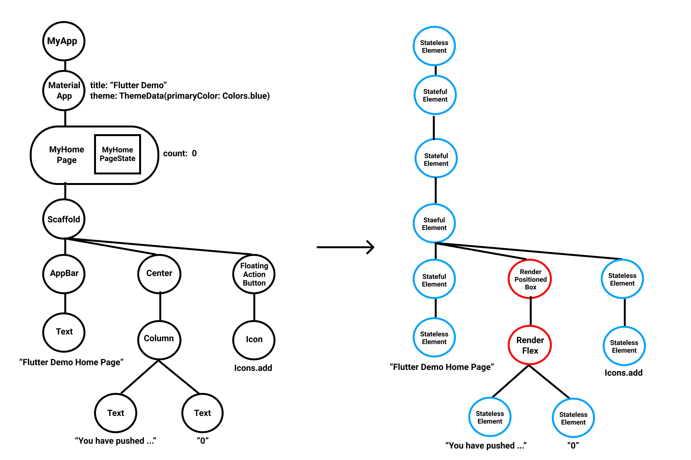

この記事は[Flutter 全部俺 Advent Calendar](https://adventar.org/calendars/4140) 5日目の記事です。

## このアドベントカレンダーについて
このアドベントカレンダーは [@itome](https://twitter.com/itometeam) が全て書いています。

基本的にFlutterの公式ドキュメントとソースコードを参照しながら書いていきます。誤植や編集依頼はTwitterにお願いします。

## Flutterの画面が描画されるまで
Flutterの画面はWidgetツリーを `runApp` 関数に渡すことで描画されますが、実際に画面に描画されるまでの間にさまざまな最適化が行われています。
この記事では、FlutterのWidgetが実際に描画されるまでを追いかけていきます。
BoxConstraintsやSliverWidgetなどは後日の記事に任せて、Flutterアプリ作成時にデフォルトで表示されるカウンターアプリを参考にしながら説明していきます。


#### サンプルアプリのソースコード

```dart
import 'package:flutter/material.dart';

void main() => runApp(MyApp());

class MyApp extends StatelessWidget {
  @override
  Widget build(BuildContext context) {
    return MaterialApp(
      title: 'Flutter Demo',
      theme: ThemeData(
        primarySwatch: Colors.blue,
      ),
      home: MyHomePage(title: 'Flutter Demo Home Page'),
    );
  }
}

class MyHomePage extends StatefulWidget {
  MyHomePage({Key key, this.title}) : super(key: key);

  final String title;

  @override
  _MyHomePageState createState() => _MyHomePageState();
}

class _MyHomePageState extends State<MyHomePage> {
  int _counter = 0;

  void _incrementCounter() {
    setState(() {
      _counter++;
    });
  }

  @override
  Widget build(BuildContext context) {
    return Scaffold(
      appBar: AppBar(title: Text(widget.title)),
      body: Center(
        child: Column(
          mainAxisAlignment: MainAxisAlignment.center,
          children: <Widget>[
            Text(
              'You have pushed the button this many times:',
            ),
            Text(
              '$_counter',
              style: Theme.of(context).textTheme.display1,
            ),
          ],
        ),
      ),
      floatingActionButton: FloatingActionButton(
        onPressed: _incrementCounter,
        tooltip: 'Increment',
        child: Icon(Icons.add),
      ), // This trailing comma makes auto-formatting nicer for build methods.
    );
  }
}
```

## Widget
どのドキュメントにも書かれているのですでに飽き飽きしている方も多いと思いますが、Flutterは「すべてがWidget」で構成されています。
他のフレームワークではViewのプロパティになるようなもの(例えば、OpacityやPadding)でも、Flutterでは一つのWidgetになっています。

概念単位でWidgetを分けていくやり方は、
Viewのプロパティを追加する方法に比べて、一つ一つのソースコードを小さく保つことができるメリットがあります。
このことを常に意識しておくと、既存のWidgetの意図が読みやすくなるだけでなく、
自分で新しいWidgetをつくるときのインターフェースをよりFlutterらしく使いやすいものにすることができます。

Widgetは、自身のレイアウトに必要な情報と子Widgetの情報のみを持っているシンプルなクラスで、それ自身はMutableな状態を持つことができません。
(状態を持ちたい場合は後述する `StatefulWidget` の `State` クラスに任せます。)

サンプルアプリのWidgetツリーを図にすると以下のようになります。


Widgetは軽量なオブジェクトなので、Widgetツリーを再生成すること自体のコストはほとんどかかりません。

## Element
`Widget` は `createElement` メソッドで、 `Element` を生成します。 `Element` はAndroidやiOSのViewのイメージに近く、
Viewの状態を直接管理していて、独自のライフサイクルを持ち、画面へのレンダリングも管理しています。
(実際に描画を行うのは `RenderObject` クラスに移譲しています。)

つまりFlutterは、従来のモバイルのViewの概念(Flutterでは `Element` )から
軽量なオブジェクトである `Widget` を分離することによって宣言的なAPIと描画のパフォーマンスを両立させていると言えます。

`Element` は実際の描画を `RenderObject` に移譲していますが、 `RenderObject` を直接使わず
他の `Element` を組み合わせることで描画を実現しているものがあります。
前者が `RenderObjectElement` で後者が `ComponentElement` です。

`ComponentElement` を作る代表的な `Widget` は `StatefulWidget` や `StatelessWidget` です。

以上のことを踏まえて `Widget` ツリーを `Element` ツリーに置き換えたものが以下の図です。



赤い丸で表されている `Element` が `RenderObjectElement` で青い丸が `ComponentElement` です。
多くのWidgetが `StatelessWidget/StatefulWidget` を継承しているためほとんどが `ComponentElement` です。

`Text` Widgetが `StatelessElement` になっているのは、内部で `RichText` を呼び出しているためです。
`ComponentElement` は表示の際に `RenderObjectElement` が出てくるまで再起的に子Elementを展開するので、
それに合わせて `Text` Widgetを展開してみましょう。 

`Text` Widgetの `build` メソッドは以下のようになっています。(見やすさのために簡易化しています)

```dart
@override
Widget build(BuildContext context) {
  return Semantics(
    textDirection: textDirection,
    label: semanticsLabel,
    child: ExcludeSemantics(
      child: RichText(
        ...
      ),
    ),
  );
}
```

よって `Text` Widgetは以下のように展開されます。


これを先ほどの `Element` ツリーに適用してみましょう 


`ComponentWidget` はこのような置き換えを繰り返して最終的に `Element` ツリーはすべて `RenderObjectElement` 
で構成されるようになります。

## RenderObject
上のような手順で作られた `RenderObjectElement` は、実際の描画をするために、 `RenderObject` を作成します。
`RenderObject` がどうやってレンダリングをしているかは、それぞれの `Widget` ごとにさまざまですが、例として `Text` Widgetを
表示するための `RenderParagraph` では、 `TextPainter` クラスを使って描画を行っています。 `TextPainter` クラスは
`dart:ui` パッケージを通してFlutter Engineに文字を描画する指示を送っています。

今回はFlutter Framework内の「画面に表示されるまで」の紹介だったので `RenderObject` まで紹介しましたが、
実際に開発をしていて `RenderObject` が必要になることはまれです。
