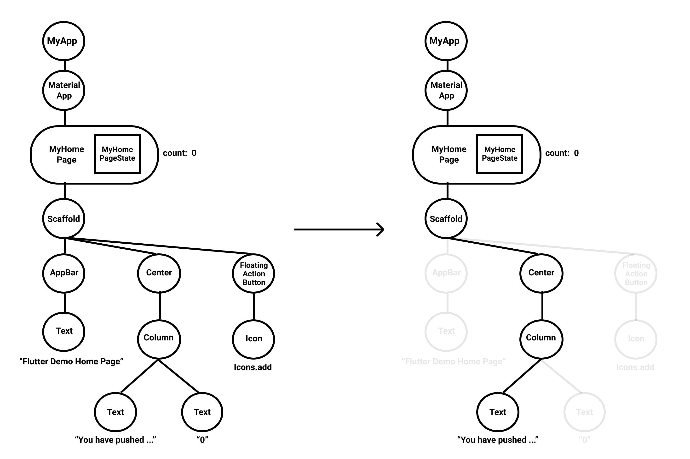
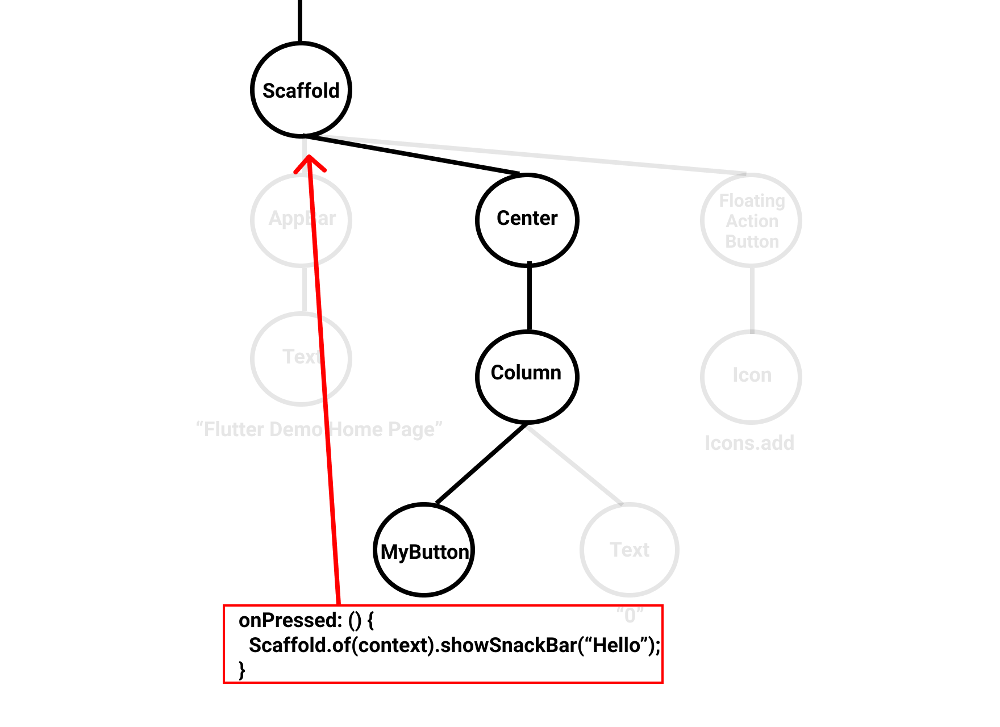

この記事は[Flutter 全部俺 Advent Calendar](https://adventar.org/calendars/4140) 6日目の記事です。


## このアドベントカレンダーについて
このアドベントカレンダーは [@itome](https://twitter.com/itometeam) が全て書いています。

基本的にFlutterの公式ドキュメントとソースコードを参照しながら書いていきます。誤植や編集依頼はTwitterにお願いします。


## BuildContextとは何か
Flutterを使っていると避けて通れない `BuildContext` ですが、抽象的な概念なので、なんとなく使ってしまっている人も多いと思います。
`BuildContext` が現れる箇所として、代表的なものは

- `StatelessWidget` の `build` メソッドの仮引数
- `StatefulWidget` の `State` の `build` メソッドの仮引数
- `Theme.of(context)` や `Scaffold.of(context)`
- `context.size` でWidgetのサイズを取得

`BuildContext` を理解することで、これらの機能がどうやって実現されているも理解することができます。

## BuildContextのイメージをつかむ
Flutterの `Widget` は子 `Widget` は引数で受け取るため、子Widgetを参照することはできます。
一方で、親 `Widget` はそうはいきません。なぜなら、自分の親 `Widget` がなんであるかは、実際にレイアウトされるまでわからないからです。

しかし、自分の親についてわかった方が便利なことがあります。
例えば、親の状態を参照してそれによって自分の表示を変更したり、親が持っている自分のサイズ情報を取得したりすることです。

ここまで書くと勘の良い人なら気づくかもしれませんが、 `BuildContext` は実は親Widgetそのものです。(実際には親Widgetに対応するElement)

`BuildContext` から親の `Widget` が取得できるということは、その親の `BuildContext` からさらにその親、そこからさらにそのまた親・・・という風に
自分の祖先が再起的に取得することができます。つまり、「自分がどのような祖先の流れの中にいるのか」という情報が `BuildContext` というわけです。



左のような `Widget` ツリーがあったときに、 `Text` Widgetの `BuildContext` は右のようになります。ここで注意しなければいけないのは、 
`BuildContext` はあくまで直系の祖先だけのことを指し、それ以外のWidget(例えば、 `AppBar` など)は参照できないということです。

## BuildContextの実装

`BuildContext` のドキュメントには以下のように書いてあります。

> BuildContext objects are actually Element objects. The BuildContext interface is used to discourage direct manipulation of Element objects.
>
> (BuildContextは実はElementです。BuildContextというAPIは、Elementを直接操作されることを防ぐために使われています。)
>
> https://api.flutter.dev/flutter/widgets/BuildContext-class.html

<br/>

上でも書いた通り、 `BuildContext` の実体は親の `Element` です。
実際に `BuildContext` が `StatelessWidget` の `build` メソッドに渡されるところを見てみましょう。

`StatelssWidget` は `createElement` メソッドで `StatelessElement` という `Element` を返しています。

```dart
abstract class StatelessWidget extends Widget {
  /// Initializes [key] for subclasses.
  const StatelessWidget({ Key key }) : super(key: key);

  /// Creates a [StatelessElement] to manage this widget's location in the tree.
  ///
  /// It is uncommon for subclasses to override this method.
  @override
  StatelessElement createElement() => StatelessElement(this);
  ///
  /// コメント省略
  ///
  @protected
  Widget build(BuildContext context);
}
```

`StatelessElement` は `build` 関数で自分を作った `Widget` の　`build` 関数を読んでいます。
ここで `BuildContext` 引数に自身( `this` )を渡しています。

```dart
/// An [Element] that uses a [StatelessWidget] as its configuration.
class StatelessElement extends ComponentElement {
  /// Creates an element that uses the given widget as its configuration.
  StatelessElement(StatelessWidget widget) : super(widget);

  @override
  StatelessWidget get widget => super.widget;

  @override
  Widget build() => widget.build(this);

  @override
  void update(StatelessWidget newWidget) {
    super.update(newWidget);
    assert(widget == newWidget);
    _dirty = true;
    rebuild();
  }
}
```

## BuildContextの使われ方
`BuildContext` のもっともメジャーな使われ方は、 `Theme.of(context)` や、 `Scaffold.of(context)` などで
親 `Widget` (もしくは親の持っているフィールド)のインスタンスを取得することです。

たとえば `Scaffold.of(context)` のイメージは以下のようになります。



画像のサンプルでは、末端の `MyButton` のクリックイベントに合わせて、
`Scaffold` の `showSnackBar` メソッドを呼び出しています。
このように、実行時に親の `Widget` のインスタンスを使いたいときに `BuildContext` を使うことができます。

このときに注意しないといけないのは、どの `Widget` の `BuildContext` を使っているかということです。
たとえば上の画像のサンプルを実装するときに、以下のように書くとエラーになります。

```dart
class _MyHomePageState extends State<MyHomePage> {
  ...
  @override
  Widget build(BuildContext context) {
    return Scaffold(
      appBar: AppBar(title: Text(widget.title)),
      body: Center(
        child: Column(
          mainAxisAlignment: MainAxisAlignment.center,
          children: <Widget>[
            MyButton(
              onPressed: () {
                Scaffold.of(context).showSnackBar("Hello");
              }
            ),
            Text(
              '$_counter',
              style: Theme.of(context).textTheme.display1,
            ),
          ],
        ),
      ),
      ...
    );
  }
}
```

`Scaffold` は `MyButton` の祖先にいるので、一見正しいコードのように思えますが、 
`Scaffold.of(context)` に渡している `BuildContext` は `build` 関数に渡されたもの、つまり `_MyHomePageState` のものです。
`MyHomePage` Widgetの祖先には `Scaffold` がいないので、エラーになってしまいます。

これを修正するには、 `MyButton` を自作の `StatelessWidget` でラップするか、 `Builder` Widgetを使う必要があります。
`Builder` Widgetを使って修正すると以下のようになります。


```dart
class _MyHomePageState extends State<MyHomePage> {
  ...
  @override
  Widget build(BuildContext context) {
    return Scaffold(
      appBar: AppBar(title: Text(widget.title)),
      body: Center(
        child: Column(
          mainAxisAlignment: MainAxisAlignment.center,
          children: <Widget>[
            Builder(
              builder: (context) => MyButton(
                onPressed: () {
                  Scaffold.of(context).showSnackBar("Hello");
                }
              ),
            ),
            Text(
              '$_counter',
              style: Theme.of(context).textTheme.display1,
            ),
          ],
        ),
      ),
      ...
    );
  }
}
```

`Builder` Widgetを間に挟むことによって、 `BuildContext` が `Builder` Widgetのものになりました。
`Scaffold` は　`Builder` の祖先にあたるので、 `Scaffold.of(context)` で問題なく取得できるようになります。

## `Theme.of(context)` を自分で実装してみる
自分で `Theme.of(context)` のように子孫から取得できる `Widget` を実装したいときは `InheritedWidget` を使います。
最近は[7日目のの記事](https://itome.team/blog/2019/12/flutter-advent-calendar-day7)で紹介する
`InheritedWidget` をラップした `Provider` パッケージを使うことが多いので、最低限の紹介に止めます。

### ancestorStateOfType
`InheritedWidget` について紹介する前に、 `BuildContext.ancestorStateOfType` を見てみましょう。
`ancestorStateOfType` は `Scaffold.of(context)` メソッドないで使われています。
このメソッドは祖先の `StatefulWidget` の `State` にアクセスしたいときに便利ですが、
計算量が `O(N)` であるというデメリットがあります。 `BuildContext` を親からその親へと順々に辿っていくので、
`Widget` のネストが深くなればなるほど、取得に時間がかかってしまうのです。

### InheritedWidget
`ancestorStateOfType` のデメリットを解消するために使われる `Widget` が `InheritedWidget` です。
`InheritedWidget` は子孫 `Widget` から
`BuildContext.inheritFromWidgetOfExactType` を使って `O(1)` で取得できます。

つまり `Theme.of(context)` は `MaterialApp` などで設置した `InheritedWidget` から、
`BuildContext.inheritFromWidgetOfExactType` を使って `Theme` を取得する単なるラッパーメソッドです。

`InheritedWidget` を使って子孫からのアクセスをさせる `Widget` は慣習的に
`of(BuildContext context)` メソッドを提供するようになっています。

先にも書いた通り、 `Flutter` 公式で、この機能をラップした `Provider` パッケージが提供されているので、
理由がない限りそちらを使う方がいいでしょう。
