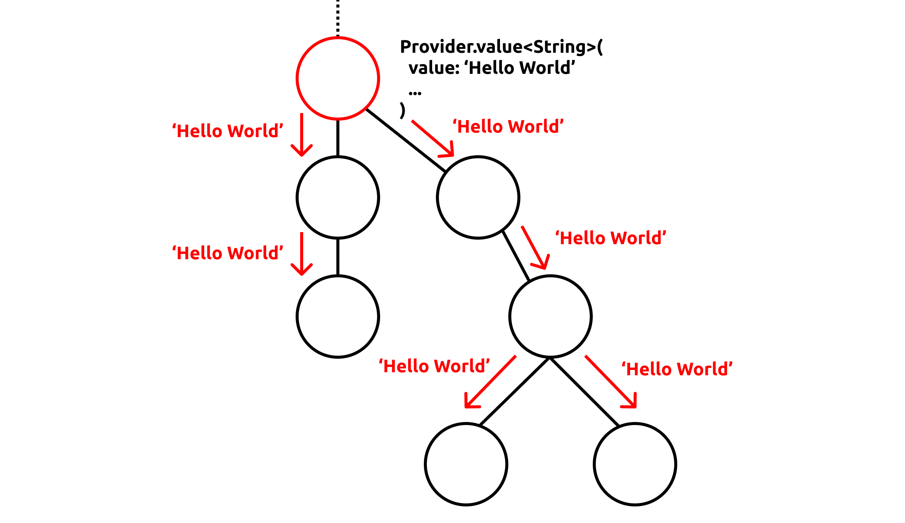
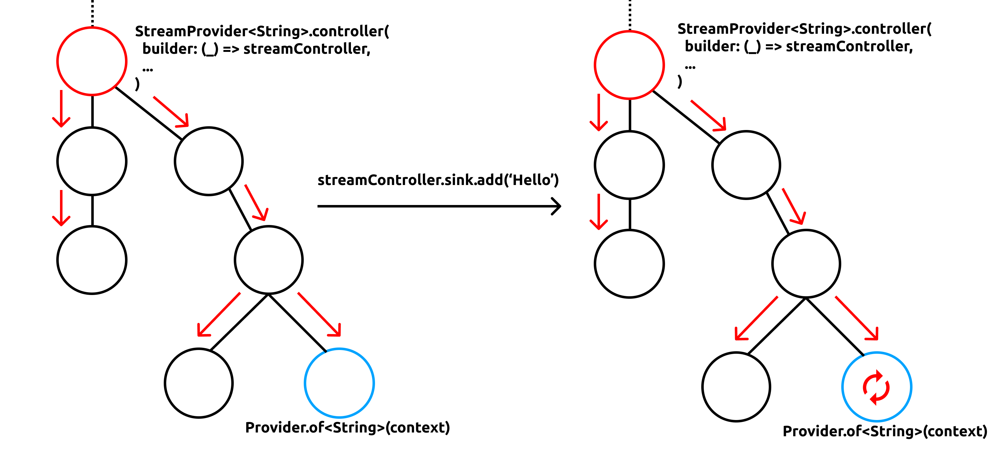
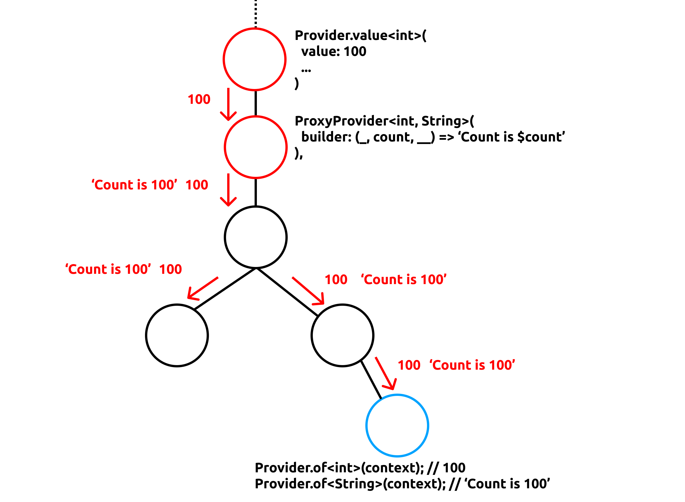
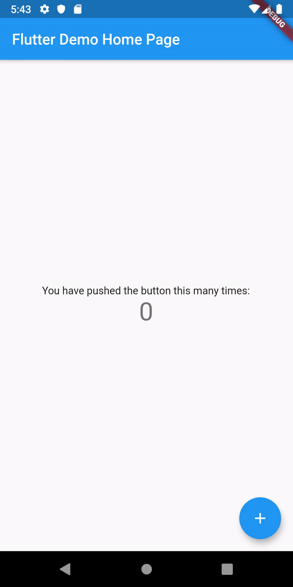

この記事は[Flutter 全部俺 Advent Calendar](https://adventar.org/calendars/4140) 7日目の記事です。


## このアドベントカレンダーについて
このアドベントカレンダーは [@itome](https://twitter.com/itometeam) が全て書いています。

基本的にFlutterの公式ドキュメントとソースコードを参照しながら書いていきます。誤植や編集依頼はTwitterにお願いします。

## Providerパッケージ
[6日目の記事](https://itome.team/blog/2019/12/flutter-advent-calendar-day6)で
紹介した `InheritedWidget` のラッパーライブラリです。

今回のアドベントカレンダーで唯一標準パッケージでないパッケージの紹介ですが、状態管理とDIに関してデファクトスタンダードと言えるライブラリなのでピックアップしました。

### インストール方法
`pubspec.yaml` に以下を追加して、 `$ flutter pub get`
```dart
dependencies:
  provider: ^3.1.0+1
```

## `Provider.value<T>()` `Provider.of<T>()`
Providerパッケージの最も基本的でわかりやすい使い方は、 `Provider.value<T>()` と `Provider.of<T>()` の組み合わせです。

```dart
Provider<String>.value(
  value: 'Hello World',
  child: MaterialApp(
    home: Home(),
  )
)
```

```dart
class Home extends StatelessWidget {
  @override
  Widget build(BuildContext context) {
    return Text(
      /// Don't forget to pass the type of the object you want to obtain to `Provider.of`!
      Provider.of<String>(context)
    );
  }
}
```

`Widget` ツリーの中に `Provider.value()` を挟んでおくことで、それ以下の `Widget` から値を取得できるようになります。
図にすると以下のようなイメージです。



## `Provider.of(context)` で値の変更を監視
`Provider` の中には後述する `StreamProvider` のように提供する値が動的に変化するものがあります。
`Provider.of(context)` はそのような動的な値の変化を自動的に監視して、 `Widget` ツリーをリビルドしてくれます。
リビルドは、`Provider.of(context)` に渡した `BuildContext` のスコープで行ってくれるので、最低限しか行われません。



値を監視したくないときには `Provider.of(context, listen: false)` とします。

また、 `Provider.of(context)` は内部では `InheritedWidget` の `inheritFromWidgetOfExactType` メソッドを使っているため、
`initState` より後でしか呼ぶことができません。一方 `Provider.of(context, listen: false)` は
`InheritedWidget` の `ancestorInheritedElementForWidgetOfExactType` を使っているので `initState` でも使うことができます。


## `MultiProvider`
`Provider` を複数使いたいときは以下のようになります。

```dart
Provider<Foo>.value(
  value: foo,
  child: Provider<Bar>.value(
    value: bar,
    child: Provider<Baz>.value(
      value: baz,
      child: someWidget,
    )
  )
)
```

これは明らかに冗長で無駄なネストが入ってしまうので、複数の `Provider` に対応した `MutliProvider` が提供されています。

```dart
MultiProvider(
  providers: [
    Provider<Foo>.value(value: foo),
    Provider<Bar>.value(value: bar),
    Provider<Baz>.value(value: baz),
  ],
  child: someWidget,
)
```

## `StreamProvider` `StreamBuilder.controller()`
`Stream` に流れる値によって動的に値が変わる `Provider` です。

```dart
StreamProvider<int>(
  builder: (context) => countStream,
  initialData: 0,
  child: ...
)
```

`StreamProvider.controller()` を使うことで、 `StreamController` を使うことができます。

```dart
StreamProvider<int>(
  builder: (context) => countStreamController,
  initialData: 0,
  child: ...
)
```

`Stream` に明示的に値を流したい時はこちらを使います。

## `FutureProvider`

指定した `Future` のタスクが終了すると、値を動的に変更する `Provider`　です。下のサンプルコードは `Provider.of<String>(context)` が
1秒後に `''` から `'Hello World'` へ変更されます。

```dart
FutureProvider<String>(
  builder: (context) async {
    await Future.delayed(const Duration(seconds: 1));
    return 'Hello World';
  },
  initialData: '',
  child: ...
)
```

## `FutureProvider`

指定した `Future` のタスクが終了すると、値を動的に変更する `Provider`　です。下のサンプルコードは `Provider.of<String>(context)` が
1秒後に `''` から `'Hello World'` へ変更されます。

```dart
FutureProvider<String>(
  builder: (context) async {
    await Future.delayed(const Duration(seconds: 1));
    return 'Hello World';
  },
  initialData: '',
  child: ...
)
```

## `ListenableProvider` `ChangeNotifierProvider` `ValueListenableProvider`
`ChangeNotifier` 系のクラスの変更を監視できる `Provider` です。

```dart
class CountNotifier extends ValueNotifier<int> {
  CountNotifier() : super(0);

  void increment() => value++;
}

ValueNotifierProvider<int>(
  builder: (_) => CountNotifier(),
  child: ...
)
```

## `ProxyProvider`
祖先にある `Provider` から提供されている値を変換した値をさらに提供する `Provider` です。図にすると以下のような感じです。



## 実際の開発での使い方
前述した通り`Provider` パッケージの使い方は大きく分けて、 **DI** と **状態管理** です。
これらの機能は別々に使うこともできますが、多くの場合組み合わせて使われます。つまり、「状態管理をするクラスをDIする」という形で使われることが多いです。

パッケージのドキュメントの冒頭にも以下のように書いてあります。

> A mixture between dependency injection (DI) and state management, built with widgets for widgets.
>
> (このパッケージは) DIと状態管理の混ぜ合わせで、WidgetのためのWidgetによって作られています。

また、 `Provider` は通常の `StatefulWidget` を使った状態管理に比べてリビルドの範囲を抑えられるため、アプリのパフォーマンス改善にも使うことができます。

`Provider` を使ったパフォーマンス改善は[8日目の記事](https://itome.team/blog/2019/12/flutter-advent-calendar-day8)で紹介します。

今回はFlutterの `scoped_model` を `Provider` パッケージを使って実装してみましょう。作るアプリはFlutterのボイラープレートと全く同じです。

```dart:main.dart
import 'package:flutter/material.dart';
import 'package:provider/provider.dart';

void main() => runApp(MyApp());

class CounterModel extends ChangeNotifier {
  int count = 0;

  void increment() {
    count++;
    notifyListeners();
  }
}

class MyApp extends StatelessWidget {
  @override
  Widget build(BuildContext context) {
    return MaterialApp(
      title: 'Flutter Demo',
      theme: ThemeData(primarySwatch: Colors.blue),
      home: ChangeNotifierProvider<CounterModel>(
        builder: (_) => CounterModel(),
        child: Scaffold(
          appBar: AppBar(title: Text('Flutter Demo Home Page')),
          body: Center(
            child: Column(
              mainAxisAlignment: MainAxisAlignment.center,
              children: <Widget>[
                Text(
                  'You have pushed the button this many times:',
                ),
                CounterText(),
              ],
            ),
          ),
          floatingActionButton: Consumer<CounterModel>(
            builder: (_, model, __) {
              return FloatingActionButton(
                onPressed: model.increment,
                tooltip: 'Increment',
                child: Icon(Icons.add),
              );
            }
          ), // This trailing comma makes auto-formatting nicer for build methods.
        ),
      ),
    );
  }
}

class CounterText extends StatelessWidget {
  @override
  Widget build(BuildContext context) {
    return Text(
      Provider.of<CounterModel>(context).count.toString(),
      style: Theme.of(context).textTheme.display1,
    );
  }
}
```

状態管理するクラスは `CounterModel` です。`count` をフィールドに持ち、
`increment` メソッドが呼ばれると `count` を1上げて変更を外部に通知します。

```dart
class CounterModel extends ChangeNotifier {
  int count = 0;

  void increment() {
    count++;
    notifyListeners();
  }
}
```

次に `ChangeNotifierProvider` を使って `CounterModel` を子孫 `Widget` から取得できるようにします。
```dart
      ...
      home: ChangeNotifierProvider<CounterModel>(
        builder: (_) => CounterModel(),
        child: Scaffold(
      ...
```

`CounterText` を定義します。 `Provider.of` で取得した `CounterModel` の `count` を表示しています。
`Provider.of` は祖先の `Provider` で定義した値の変更を監視しています。今回の場合は `CounterModel` の
`notifyListeners` が呼ばれたときに変更された値を再描画します。

```dart
class CounterText extends StatelessWidget {
  @override
  Widget build(BuildContext context) {
    return Text(
      Provider.of<CounterModel>(context).count.toString(),
      style: Theme.of(context).textTheme.display1,
    );
  }
}
```

最後に `FloatingActionButton` のクリックイベントで `CounterModel` の `increment` メソッドを呼びだします。
しかし、ここで取得できる `context` は `MyApp` の `build` メソッドに渡されたもので、 `ChangeNotifierProvider` の祖先のものなので、
`Provider.of<CounterModel>(context)` では `CounterModel` を取得できません。

そのようなシチュエーションのために、 `Provider` パッケージには `Cousumer` Widgetが用意されています。
この `Widget` を使うと、その位置で `BuildContext` を再発行してくれるので、正しく `CounterModel` を取得することができます。

```dart
          ...
          floatingActionButton: Consumer<CounterModel>(
            builder: (_, model, __) {
              return FloatingActionButton(
                onPressed: model.increment,
                tooltip: 'Increment',
                child: Icon(Icons.add),
              );
            }
          ), // This trailing comma makes auto-formatting nicer for build methods.
          ...
```

これで、カウンターアプリの完成です。 `Provider` パッケージを正しく使うと、状態管理がわかりやすく、かつパフォーマンスにもすぐれたアプリを作ることができます。


