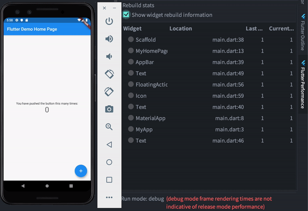
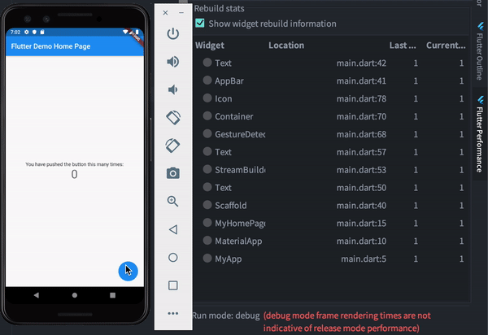

この記事は[Flutter 全部俺 Advent Calendar](https://adventar.org/calendars/4140) 1日目の記事です。


## このアドベントカレンダーについて
このアドベントカレンダーは [@itome](https://twitter.com/itometeam) が全て書いています。

基本的にFlutterの公式ドキュメントとソースコードを参照しながら書いていきます。誤植や編集依頼はTwitterにお願いします。

## Flutterアプリのパフォーマンス
FlutterはGPUを使った描画とさまざまな最適化による差分更新によって、宣言的なレイアウトでありながら高いパフォーマンスを実現しています。
最適化の多くはフレームワークが行ってくれますが、アプリ開発者が気を付けることで、より安定したパフォーマンスと高いユーザー体験をもったアプリを作ることができます。
この記事では、そのようなFlutterアプリのパフォーマンスチューニングのテクニックを紹介します。

なお、本記事で高いパフォーマンスとは、描画が安定して60fps以上を維持していて、コマ落ちがないことを意味します。

## アプリのパフォーマンスを落とす要因
多くのアプリは60fps環境で動いているので、1フレームを描画するのに掛けられる時間は `1000 / 60 (≒ 16)` ミリ秒です。
つまり、1フレームを描画するのに16ミリ秒以上掛かってしまうと、ガクガクして見えるコマ落ちの状態になってしまいます。

コマ落ちを引き起こす要因はいくつもありますが、代表的な原因は以下の3つです。

- 複雑なアニメーション
- 一度に大量のWidgetを更新してしまう
- バックグラウンドでカメラなどの重いタスクが動いている

残念ながらカメラなどのネイティブの重い処理をFlutter側のコードで改善することは難しいです。

アニメーションに関しては、アドベントカレンダーの[15日目](https://itome.team/blog/2019/12/flutter-advent-calendar-day15)と
[16日目](https://itome.team/blog/2019/12/flutter-advent-calendar-day16)で詳しく紹介するので、
今回は2番目の「一度に大量のWidgetを更新してしまう」問題を解決するための方法を見ていきます。

## 測定方法
[2日目の記事](https://itome.team/blog/2019/12/flutter-advent-calendar-day2)で紹介した。
AndroidStudioの `Flutter Performance (View > Tool Windows > Flutter Performance)` ツールを使って再描画されている `Widget` の数を確認することができます。
AndroidStudio以外のエディタを使っている人は、[DevTool](https://flutter.dev/docs/development/tools/devtools/overview)でも確認できます。

## できるだけ `const` を使う
Widgetのコンストラクタに `const` をつけることでそのWidgetの再ビルドを抑制することができます(Widgetをキャッシュした時と同じ状態になります)。

実際に例を見てみましょう。今回もFlutterのテンプレートのカウンターアプリを使います。

```dart
import 'package:flutter/material.dart';

void main() => runApp(MyApp());

class MyApp extends StatelessWidget {
  @override
  Widget build(BuildContext context) {
    return MaterialApp(
      title: 'Flutter Demo',
      theme: ThemeData(
        primarySwatch: Colors.blue,
      ),
      home: MyHomePage(title: 'Flutter Demo Home Page'),
    );
  }
}

class MyHomePage extends StatefulWidget {
  MyHomePage({Key key, this.title}) : super(key: key);

  final String title;

  @override
  _MyHomePageState createState() => _MyHomePageState();
}

class _MyHomePageState extends State<MyHomePage> {
  int _counter = 0;

  void _incrementCounter() {
    setState(() {
      _counter++;
    });
  }

  @override
  Widget build(BuildContext context) {
    return Scaffold(
      appBar: AppBar(
        title: Text(widget.title),
      ),
      body: Center(
        child: Column(
          mainAxisAlignment: MainAxisAlignment.center,
          children: <Widget>[
            Text(
              'You have pushed the button this many times:',
            ),
            Text(
              '$_counter',
              style: Theme.of(context).textTheme.display1,
            ),
          ],
        ),
      ),
      floatingActionButton: FloatingActionButton(
        onPressed: _incrementCounter,
        tooltip: 'Increment',
        child: Icon(Icons.add),
      ), // This trailing comma makes auto-formatting nicer for build methods.
    );
  }
}
```

まずは何も変更を加えないままWidgetのリビルドをみてみます。


`MyHomePage` 以下のすべてのWidgetが再描画されてるのがわかります。

`Text('You have pushed the button this many times:')` に `const`　指定をしてみます。

```dart
-            Text(
-              'You have pushed the button this many times:',
-            ),

+            const Text(
+              'You have pushed the button this many times:',
+            ),
```



変化が少なくてわかりづらいかもしれませんが、46行目の `Text` Widgetが再描画されず、再描画されるWidgetが減っています。

`const` をつけるだけで再描画を抑制することができました。 `const` コンストラクタは、以下の条件を満たすときに使うことができます。

- 対象クラスのフィールドが全て `final` であり、コンストラクタに `const` がついている
- コンストラクタに渡すパラメーターが全て `const` である

Flutterでは多くのWidgetが `const` コンストラクタを持っています。普段から注意しておくことも重要ですが、
`const` 指定できるところで `const` をつけないと警告を出してくれるオプションがあるので、
是非有効にしておきましょう。([2日目の記事](https://itome.team/blog/2019/12/flutter-advent-calendar-day2)参照)

また、 `const` 指定はあくまでそのWidgetより上のWidgetからの変更を受け付けないだけで、そのWidget以下の内部的な変更はできます。
`const` 指定をした上で親Widgetからの変更を子Widgetに伝播させたい場合は、 
`Provider` パッケージなどを使うといいでしょう。([7日目の記事](https://itome.team/blog/2019/12/flutter-advent-calendar-day7/#実際の開発での使い方)の `scoped_model` 参照)

## Stateの影響範囲を末端に押しやる
上のサンプルでは、 `MyHomePage` Widgetの `setState` メソッドを使って状態を変化させていたため、 `MyHomePage` 以下すべてが再描画されていました。
しかし、本来であれば再描画はカウンターの数字の部分だけでいいはずです。

Stateの影響範囲を狭める方法はいろいろありますが、今回は最もメジャーな `StreamBuilder` を使ったやり方を紹介します。

まず、 `_counter` 変数の値を流すための `StreamController<int>` を用意します。

```dart
+  final StreamController<int> _streamController = StreamController();
```

次にカウントを表示する `Text` Widgetを `StreamBuilder` で囲んで、流れてきた値を表示するようにします。

```dart
-                Text(
-                  '$_counter',
-                  style: Theme.of(context).textTheme.display1,
-                ),
                
+                StreamBuilder<int>(
+                  stream: _streamController.stream,
+                  initialData: 0,
+                  builder: (context, snapshot) {
+                    return Text(
+                      '${snapshot.data}',
+                      style: Theme.of(context).textTheme.display1,
+                    );
+                  }
+                ),
```

最後に `_incrementCounter` メソッドを `setState` を使った実装から、 `StreamController` に値を流す実装に変更します。

```dart
-  void _incrementCounter() {
-    setState(() {
-      _counter++;
-    });
-  }

+  void _incrementCounter() {
+    _counter += 1;
+    _streamController.add(_counter);
+  }
```

全体のコードはこのようになります。( `FloatingActionButton` のアニメーションで無駄な再描画が走るのを防ぐために、
`GestureDetector` を使った実装で置き換えています。 )

```dart
import 'dart:async';

import 'package:flutter/material.dart';

void main() => runApp(MyApp());

class MyApp extends StatelessWidget {
  @override
  Widget build(BuildContext context) {
    return MaterialApp(
      title: 'Flutter Demo',
      theme: ThemeData(
        primarySwatch: Colors.blue,
      ),
      home: MyHomePage(title: 'Flutter Demo Home Page'),
    );
  }
}

class MyHomePage extends StatefulWidget {
  MyHomePage({Key key, this.title}) : super(key: key);

  final String title;

  @override
  _MyHomePageState createState() => _MyHomePageState();
}

class _MyHomePageState extends State<MyHomePage> {
  int _counter = 0;
  final StreamController<int> _streamController = StreamController();

  void _incrementCounter() {
    _counter += 1;
    _streamController.add(_counter);
  }

  @override
  Widget build(BuildContext context) {
    return Scaffold(
      appBar: AppBar(
        title: Text(widget.title),
      ),
      body: Stack(
        children: <Widget>[
          Center(
            child: Column(
              mainAxisAlignment: MainAxisAlignment.center,
              children: <Widget>[
                Text(
                  'You have pushed the button this many times:',
                ),
                StreamBuilder<int>(
                  stream: _streamController.stream,
                  initialData: 0,
                  builder: (context, snapshot) {
                    return Text(
                      '${snapshot.data}',
                      style: Theme.of(context).textTheme.display1,
                    );
                  }
                ),
              ],
            ),
          ),
          Align(
            alignment: Alignment.bottomRight,
            child: GestureDetector(
              onTap: _incrementCounter,
              child: Container(
                width: 56,
                height: 56,
                margin: EdgeInsets.all(16),
                decoration: BoxDecoration(
                  color: Theme.of(context).accentColor,
                  shape: BoxShape.circle,
                ),
                child: Icon(Icons.add, color: Colors.white),
              ),
            ),
          )
        ],
      ),
    );
  }
}
```

このコードを実行してみると、 `_counter` の値の変更が、 `StreamBuilder` 以下にしか影響しなくなっているのがわかります。



## `Key` を指定する
`const` が指定できない場合は、 `Key` を使ってWidgetを再利用することができます。
通常のWidgetの場合は `key: GlobalKey()` と指定することでWidgetの再利用が可能です。

```dart
Container(
  key: GlobalKey(),
  child: ...
)
```

`Key` のもう一つメジャーな用途は `ListView` との併用です。 `ListView` のitemに `Key` を指定することで、
スクロール位置を保存したり、 `ListView` を効率的に更新できます。 `ListView` を使う場合は必ず指定するようにしましょう。

## できるだけWidgetツリーの深さを変えない
Widgetツリーの深さを変えた場合は、子Widgetの構成が全く同じだった場合でもWidgetツリーが全て再描画されてしまいます。
そのため、Widgetのパラメータを変更することで対応できる場合は、Widgetツリーの深さを変えるよりも効率的に再描画をすることができます。

例えば以下のような場合です。

```dart
return isTransparent
  ? Opacity(opacity: 0, child: Text('Hello'))
  : Text('Hello')

// こちらのほうがいい
return Opacity(
  opacity: isTransparent ? 0 : 1,
  child: Text('Hello'),
)
```

どうしてもWidgetツリーの深さを変えなければいけない場合は先述した `GlobalKey` を指定するようにしましょう。


## FlutterはなぜReactのようなReconciliationを採用しなかったのか
Flutterのパフォーマンスチューニングの本題とは外れますが、差分更新と聞くとReactの差分更新を
思い浮かべる人が多いと思います。
Reactの差分更新アルゴリズムは、Widgetツリー全体を比較して、一気に差分を計算するアルゴリズムです。

一方でFlutterのReconciliationは、単に各Widgetが自分の子Widgetのリストを再利用するかどうか判断するというものです。

FlutterがReactのような木構造全体を検査する差分更新のアルゴリズムを採用しなかった理由が
公式のドキュメントで触れられています。

> https://flutter.dev/docs/resources/inside-flutter
>
> The child list reconciliation algorithm optimizes for the following cases:
> - The old child list is empty.
> - The two lists are identical.
> - There is an insertion or removal of one or more widgets in exactly one place in the list.
> - If each list contains a widget with the same key, the two widgets are matched.
> 
> 子Widgetのリストを使った差分検知は以下のようなケースで最適化されます。
> - 古い子Widgetリストが空なとき
> - 二つのリストが同一であるとき
> - リストの一箇所だけでWidgetの挿入もしくは削除が行われるとき
> - 二つのリストの中のあるWidgetのKeyが同じとき

ドキュメントに書いてあることをそのまま受け取ると、Widgetの局所的な変更や挿入など、
Flutterで頻出のパターンにより最適化するための選択であったようです。

ただ、Reactの差分検知もFlutterの差分検知も計算量は `O(N)` なので、それ以外に採用を見送った理由がありそうです。
完全に個人的な予想ですが、HTMLライクな構文でViewを構築するため
開発者がそれらの個別の要素に改変を加えたり継承して新しいViewを作ることが難しいReactに対して、
Dartのクラスを使ってWidgetを組み立てるスタイルのFlutterにとっては、Widgetに手を加えて最適化がしやすく、
また実装コストも低い子Widgetのリストを検査するアルゴリズムが最適だったのではないでしょうか。

閑話休題

## パフォーマンスチューニングとの向き合い方
基本的に `const` 指定と、状態変更の影響範囲、 `ListView` のitemへの `Key` 指定に気を付けるだけで十分にパフォーマンスのいいアプリを開発することができます。
それ以外のパフォーマンス改善のテクニックはあくまで必要になったときにできれば十分です。

<br>

> **7日目: FlutterのProviderパッケージを使いこなす** :
>
> https://itome.team/blog/2019/12/flutter-advent-calendar-day7
>
> **9日目: FlutterのBoxConstraintsを理解する** :
> https://itome.team/blog/2019/12/flutter-advent-calendar-day9
