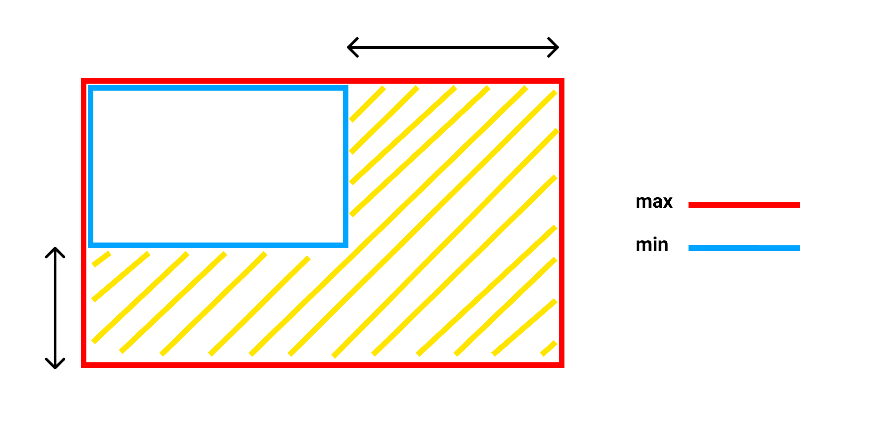
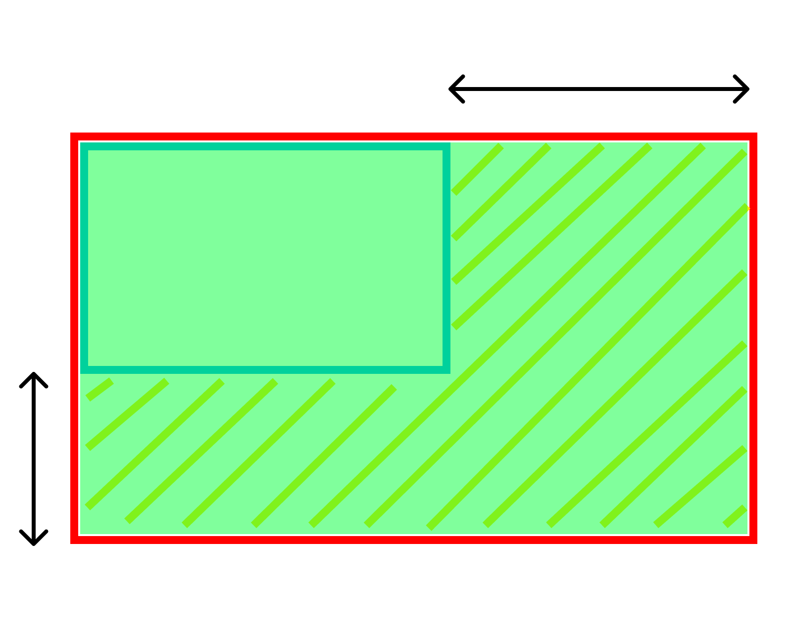
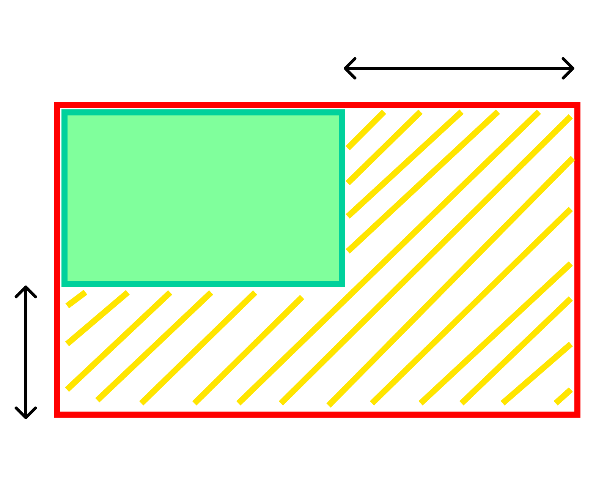
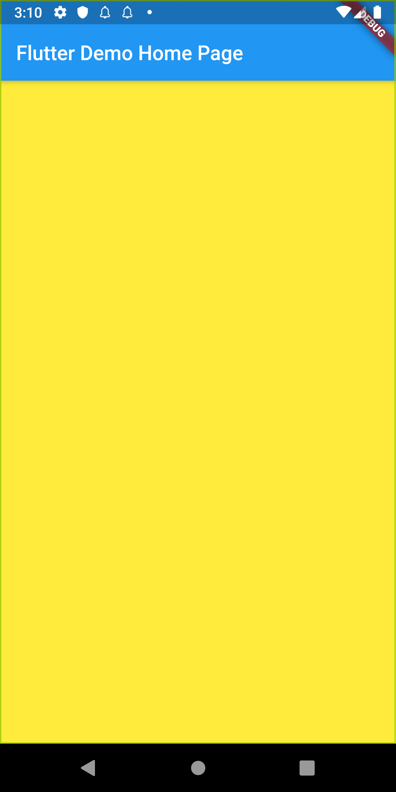
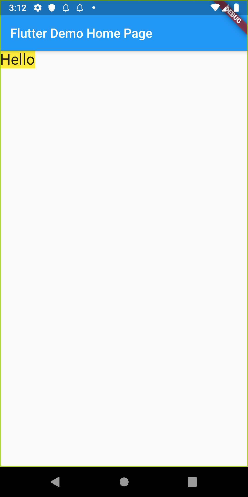
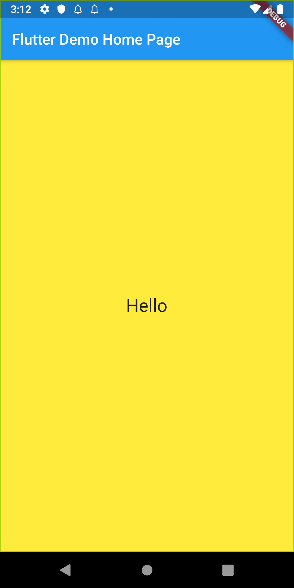
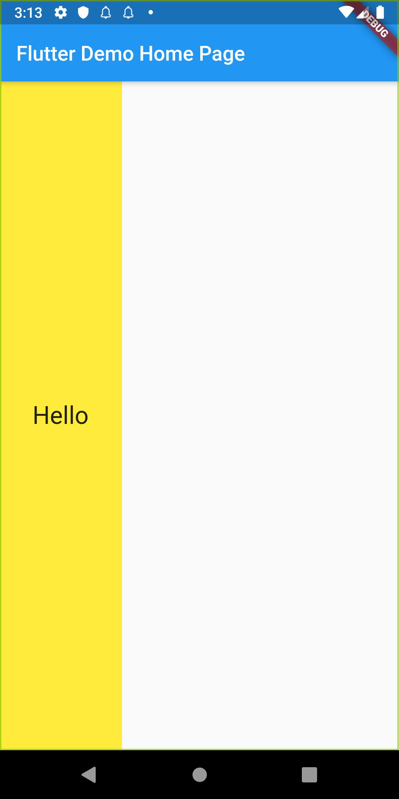

この記事は[Flutter 全部俺 Advent Calendar](https://adventar.org/calendars/4140) 9日目の記事です。

## このアドベントカレンダーについて
このアドベントカレンダーは [@itome](https://twitter.com/itometeam) が全て書いています。

基本的にFlutterの公式ドキュメントとソースコードを参照しながら書いていきます。誤植や編集依頼はTwitterにお願いします。

## BoxConstraintsとは
Flutterをでアプリのレイアウトを実装しているときに、Widgetのサイズを指定することは意外なほど少ないと思います。
これはFlutterのWidgetのサイズが、 `BoxConstraints` という制約ロジックによってほとんど自動的に決まっているからです。

このおかげで、Android/iOSのネイティブアプリのように明示的にサイズを指定しなくてよくなる一方で、
理解できていないと思わぬ落とし穴にはまることもあります。

## ConstraintとSize
Flutterのサイズ計算を理解するためには、 `Constraint` と `Size` をしっかりと分けて理解することが重要です。

まず、 `Constraint` とは、**親から子へ**渡される、幅の最大値・最小値と高さの最大値・最小値のことです。
あるWidgetは親に決められた最小値と最大値の間で、自身の `Size` を決めることになります。
下の画像で斜線部分がWidgetが自身の `Size` を調整できる範囲です。

それでは、この範囲の中でWidgetはどうやって自身の `Size` を決定するのでしょうか。
実は決定方法はWidgetによって異なるのですが、大きく分けると以下の3パターンのどれかになります。

1. できるだけ大きくなろうとするパターン
(`Center` や `ListView` などがこれに該当します。)

2. できるだけ小さくなろうとするパターン
(`Opacity` などがこれに該当します。)

3. 特定のサイズを持つパターン
(`Text` `Image` `SizedBox` などがこれに該当します。)

|  パターン1 |  パターン2  |  パターン3  |
| ---- | ---- | ---- |
|  |    |   |

### `Container` の `Size` の決まり方
多機能な `Container` ですが、多機能なだけに `Size` の決定方法が複雑なので整理しておきましょう。

- `child` を持たない場合 → できるだけ大きくなろうとする
- `child` を持っている場合 → できるだけ小さくなろうとする
- `child` を持っていて、かつ `alignment` が設定されている場合 → できるだけ大きくなろうとする
- `width` か `height` (もしくは両方) が指定されている場合 → 特定のサイズを持つ。ただし片方だけ指定されている場合もう片方はこれまでのルールに従う

| childなし | childあり | child・alignmentあり | width指定あり |
| ---- | ---- | ---- | ---- |
|  |    |   |   |

### `Column` と `Row` の `Size` の決まり方

## SizedBoxの仕組み

## エラーになるパターン
