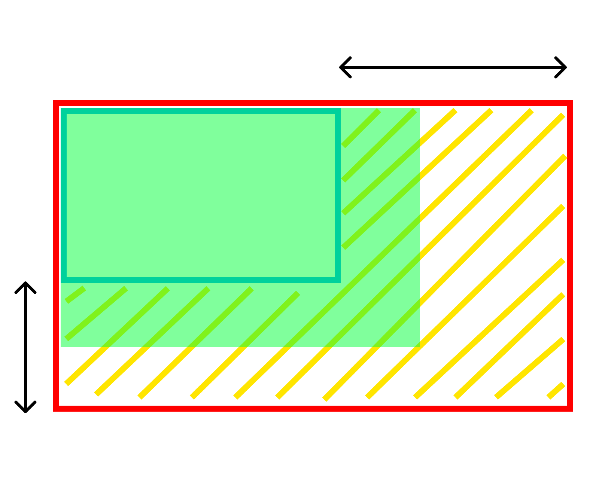

この記事は[Flutter 全部俺 Advent Calendar](https://adventar.org/calendars/4140) 9日目の記事です。

## このアドベントカレンダーについて
このアドベントカレンダーは [@itome](https://twitter.com/itometeam) が全て書いています。

基本的にFlutterの公式ドキュメントとソースコードを参照しながら書いていきます。誤植や編集依頼はTwitterにお願いします。

## BoxConstraintsとは
Flutterをでアプリのレイアウトを実装しているときに、Widgetのサイズを指定することは意外なほど少ないと思います。
これはFlutterのWidgetのサイズが、 `BoxConstraints` という制約ロジックによってほとんど自動的に決まっているからです。

このおかげで、Android/iOSのネイティブアプリのように明示的にサイズを指定しなくてよくなる一方で、
理解できていないと思わぬ落とし穴にはまることもあります。

## ConstraintとSize
Flutterのサイズ計算を理解するためには、 `Constraint` と `Size` をしっかりと分けて理解することが重要です。

まず、 `Constraint` とは、**親から子へ**渡される、幅の最大値・最小値と高さの最大値・最小値のことです。
あるWidgetは親に決められた最小値と最大値の間で、自身の `Size` を決めることになります。
下の画像で斜線部分がWidgetが自身の `Size` を調整できる範囲です。


それでは、この範囲の中でWidgetはどうやって自身の `Size` を決定するのでしょうか。
実は決定方法はWidgetによって異なるのですが、大きく分けると以下の3パターンのどれかになります。

1. できるだけ大きくなろうとするパターン
(`Center` や `ListView` などがこれに該当します。)

2. できるだけ小さくなろうとするパターン
(`Opacity` などがこれに該当します。)

3. `Constraints` に関係なく特定のサイズを持つパターン
(`Text` `Image` `SizedBox` などがこれに該当します。)

|  パターン1 |  パターン2  |  パターン3  |
| ---- | ---- | ---- |
|  |    |   |

<br/>

子に渡す `Constraints` にもいくつかパターンがあります。

1. 最小値が `0` で、最大値が固定値のパターン
( `Container` など多くのWidgetがこれに該当します。)

2. 最小値と最大値がともに固定値のパターン
( `SizedBox` などがこれに該当します)

3. 最小値が `0` で、最大値が無限大のパターン
( `ListView` や `ScrollView` などがこれに該当します。)

`ListView` などの子への `Constraints` の最大値が無限大なのは、スクロールすればいくらでも高さを確保できるためです。

|  パターン1 |  パターン2  |  パターン3  |
| ---- | ---- | ---- |
|  |   |   |

### `Container` の `Size` の決まり方
多機能な `Container` ですが、多機能なだけに `Size` の決定方法が複雑なので整理しておきましょう。

- `child` を持たない場合 → できるだけ大きくなろうとする
- `child` を持っている場合 → できるだけ小さくなろうとする
- `child` を持っていて、かつ `alignment` が設定されている場合 → できるだけ大きくなろうとする
- `width` か `height` (もしくは両方) が指定されている場合 → 特定のサイズを持つ。ただし片方だけ指定されている場合もう片方はこれまでのルールに従う

| childなし | childあり | child・alignmentあり | width指定あり |
| ---- | ---- | ---- | ---- |
|  |    |   |   |


### `Column` と `Row` の `Size` の決まり方
`Flex` クラスを継承した `Column` と `Row` も `Size` の決定方法が特殊です。具体的には以下のケースになります。

- `MainAxis` の決定方法( `Column` なら高さ、 `Row` なら幅)
  - 親からの `Constraints` で、最大値が設定されていて、 `MainAxisSize.min` が指定されている場合 →
  できるだけ小さくなろうとする
  - 親からの `Constraints` で、最大値が設定されていて、 `MainAxisSize.max` が指定されている場合 →
  できるだけ大きくなろうとする
  - 親からの `Constraints` で、最大値が設定されていない場合 → できるだけ小さくなろうとする
- `CrossAxis` の決定方法( `Column` なら幅、 `Row` なら高さ)
  - 常にできるだけ小さくなろうとする
  
`Column` の例では、以下のようになります。

| 最大値あり・ `MainAxisSize.min` | 最大値あり・ `MainAxisSize.max` | 最大値なし・ `MainAxisSize.min` | 最大値なし・ `MainAxisSize.max` |
| ---- | ---- | ---- | ---- |
|  |   |   |   |

## エラーになるパターン
最後にWidgetのサイズが決まらずにエラーになるパターンを紹介します。

### `ListView` の子要素に、 `Container(height: double.infinity)` など、できるだけ大きくなろうとするWidgetを置いた場合。

最大値が設定されていない `Constraints` に対して、できるだけ大きくなろうとする
Widgetをレイアウトしようとするためにエラーが起こるパターンです。

TikTokのように子要素が画面いっぱいに広がる `ListView` を作りたいときなどに
ハマってしまいがちで、多くの場合 `PageView` を使うことで解決できます。

### `Column` の子要素に `Column` をレイアウトして、さらにその子要素に `Expanded` を置いた場合

```dart
...
      body: Column(
        children: <Widget>[
          Column(
            children: <Widget>[
              Expanded(child: Text('Hello')),
            ],
          ),
        ],
      ),
...
```

以下のようなエラーメッセージが表示されます。

```txt
RenderFlex children have non-zero flex but incoming height constraints are unbounded.
```

Flutterの初心者の人がよくつまづいているエラーで、実際筆者自身もハマりました。
上のケースに比べてわかりづらいので、遭遇した場合は落ち着いて
`Constraints` と `Size` の関係を整理するようにしましょう。

まず外側の `Column` は内側の `Column` に対して最大値なしの `Constraints` を渡します。
したがって先述のルールにより、内側の `Column` は子要素の `Expanded` に合わせて
できるだけ小さくなろうとします。
一方、 `Expanded` は「空いているスペースを埋めようとする」Widgetです。

以上の条件を合わせると、 `Expanded` が内側の `Column` を埋めようと大きくなり、
それに合わせて内側の `Column` 自体も大きくなってしまいます。
しかし、内側の `Column` には最大値が与えられていないので、結果として `Expanded` が
空いている無限大のスペースを埋めようとしてエラーになってしまうのです。

このエラーは同じ方向にWidgetを並べるWidgetをネストしたときに起こるものなので、
Widgetの関係を整理して、ネストをなくすことで解決できます。

<br>

> **8日目: Flutterのパフォーマンスを改善する** :
>
> https://itome.team/blog/2019/12/flutter-advent-calendar-day8
>
> **10日目: FlutterのNavigationとRoutingを理解する** :
>
> https://itome.team/blog/2019/12/flutter-advent-calendar-day10
